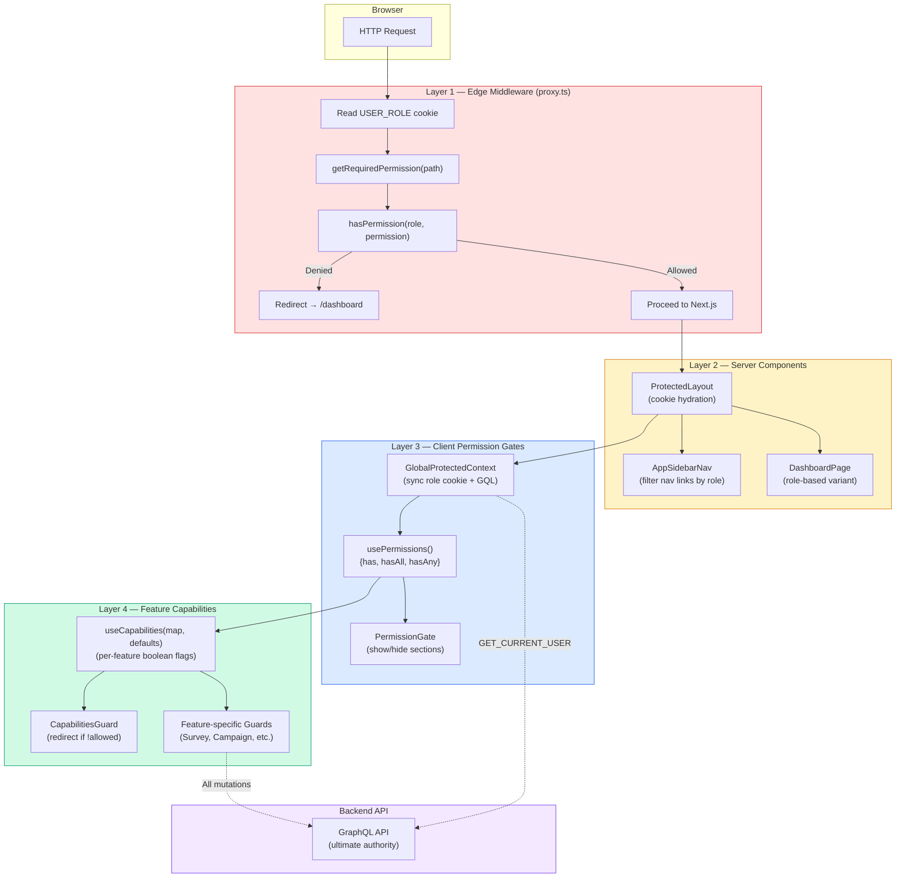
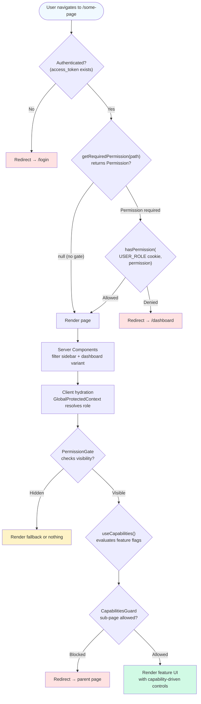
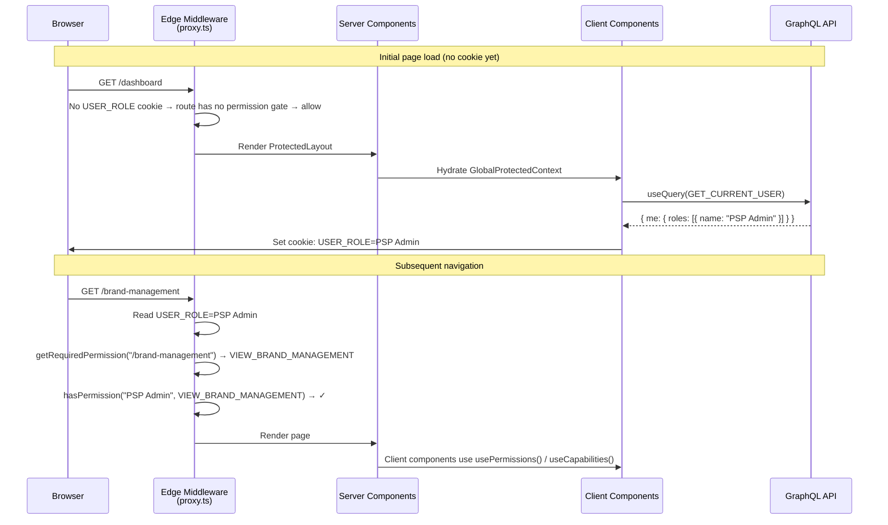
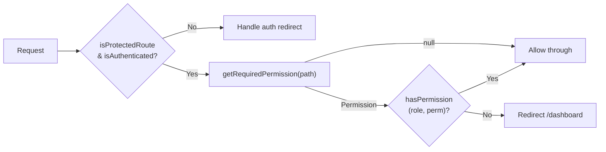
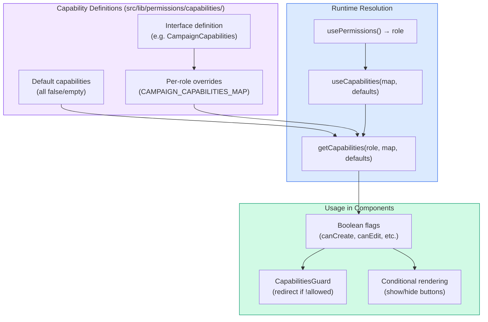
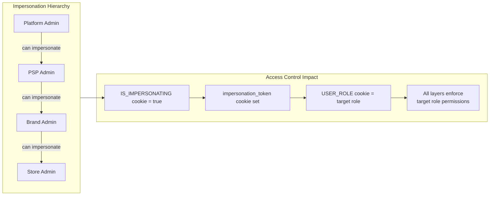

# Access Control Architecture

## Overview

Pop Logic implements a **multi-layered Role-Based Access Control (RBAC)** system with four distinct enforcement layers:

1. **Layer 1 — Edge Middleware (Page-level):** `proxy.ts` blocks unauthorized route access before any component renders
2. **Layer 2 — Server Components (Section-level):** Server-side UI filtering via `cookies()` + permission helpers
3. **Layer 3 — Client Permission Gates (Section-level):** `usePermissions()` hook and `<PermissionGate>` component for UI section visibility
4. **Layer 4 — Feature Capabilities (Component-level):** `useCapabilities()` hook and guard components for granular per-feature, per-action control

The system is driven by a `USER_ROLE` cookie written to the browser after the user's identity resolves from the GraphQL `GET_CURRENT_USER` query. All layers read from this same cookie (or the `GlobalProtectedContext` which derives from it), keeping enforcement stateless and edge-compatible.

---

## Status

Implemented

---

## Architecture Diagram



---

## Access Control Decision Flow



---

## Cookie Lifecycle



---

## Key Concepts

| Concept                 | Description                                                                                                                     |
| ----------------------- | ------------------------------------------------------------------------------------------------------------------------------- |
| `UserRole`              | Enum of 8 role strings matching the back-end values (`"Platform Admin"`, `"PSP Admin"`, etc.)                                   |
| `Permission`            | Enum of 13 page-level permission tokens (`view_user_management`, `view_audit_logs`, etc.)                                       |
| `ROLE_PERMISSIONS`      | Static map `UserRole → Permission[]` — single source of truth for which roles can access which routes                           |
| `ROLE_SIDEBAR_CONFIG`   | Static map `UserRole → SidebarItemConfig[]` — per-role ordered sidebar navigation                                               |
| `CapabilitiesMap<T>`    | Generic type `Partial<Record<UserRole, T>>` — maps roles to feature-specific boolean capability objects                         |
| `USER_ROLE` cookie      | Set on the client by `GlobalProtectedProvider` after `GET_CURRENT_USER` resolves; read by both middleware and Server Components |
| `hasPermission`         | Pure helper: `(role, permission) → boolean` — safe for Edge/Node/Browser                                                        |
| `getRequiredPermission` | Pure helper: `(pathname) → Permission \| null` — `null` means route is open to all authenticated users                          |
| `getCapabilities`       | Pure helper: `(role, map, defaults) → T` — resolves a feature capabilities object for the current role                          |

---

## The Four Layers Explained

### Layer 1 — Edge Middleware (Page-level Gate)

Runs on **every request** to a protected route **before** any React component executes. This is the hard security boundary on the frontend.

**Location:** `src/proxy.ts`

**How it works:**

1. Read `USER_ROLE` cookie from the request (synchronous, Edge-compatible)
2. Call `getRequiredPermission(path)` — looks up the route in `PROTECTED_ROUTES`
3. If a permission is required, call `hasPermission(role, permission)`
4. Denied → redirect to `/dashboard`; Allowed → proceed to Next.js rendering

Routes without a `PROTECTED_ROUTES` entry (e.g. `/dashboard`) are always allowed through for authenticated users.



### Layer 2 — Server Components (Section-level, Server Side)

Server Components that need to gate content call `cookies()` directly and use the same pure helpers. This provides server-rendered UI filtering without client JavaScript.

**Key Server Components:**

| Component         | What it does                                                                                                                                                   |
| ----------------- | -------------------------------------------------------------------------------------------------------------------------------------------------------------- |
| `AppSidebarNav`   | Reads `USER_ROLE` via `next/headers`, filters `PROTECTED_ROUTES` or uses `ROLE_SIDEBAR_CONFIG` per-role                                                        |
| `DashboardPage`   | Reads `USER_ROLE` to select role-specific dashboard variant via `switch` statement                                                                             |
| `ProtectedLayout` | Reads all entity cookies (`PSP_ID`, `BRAND_ID`, `STORE_ID`, `USER_ROLE`, `IS_IMPERSONATING`) and hydrates `GlobalProtectedProvider` with server-side seed data |

### Layer 3 — Client Permission Gates (Section-level, Client Side)

Two client-side primitives for showing/hiding UI sections inside `'use client'` components.

**`usePermissions()` hook** — derives permissions from `GlobalProtectedContext`:

```tsx
const { role, permissions, has, hasAll, hasAny } = usePermissions();
```

**`<PermissionGate>` component** — declarative section gating:

```tsx
// Single permission
<PermissionGate permission={Permission.VIEW_USER_MANAGEMENT}>
  <UserManagementSection />
</PermissionGate>

// Multiple permissions with match mode
<PermissionGate
  permissions={[Permission.VIEW_AUDIT_LOGS, Permission.VIEW_PSP_MANAGEMENT]}
  match="any"
  fallback={<NoAccessBanner />}
>
  <AdminPanel />
</PermissionGate>
```

### Layer 4 — Feature Capabilities (Component-level)

The most granular layer. While Layers 1–3 answer **"can the user see this page/section?"**, Layer 4 answers **"what can the user do within this feature?"**

**`useCapabilities()` hook:**

```tsx
const caps = useCapabilities(CAMPAIGN_CAPABILITIES_MAP, DEFAULT_CAMPAIGN_CAPABILITIES);
// caps.canCreateCampaign → boolean
// caps.canEditCampaign → boolean
// caps.canShipOrders → boolean
```

**Guard components** enforce capabilities at the route/sub-page level:

| Guard                     | Purpose                                                                    |
| ------------------------- | -------------------------------------------------------------------------- |
| `AuthGuard`               | Verifies access token on every navigation; redirects to login if missing   |
| `CapabilitiesGuard`       | Generic guard — accepts an `allowed` boolean, redirects when `false`       |
| `SurveyCapabilitiesGuard` | Survey-specific — gates sub-pages (templates, edit, preview, assign)       |
| `CampaignGuard`           | Campaign-specific — checks if campaign status allows editing               |
| `CampaignSubPageGuard`    | Campaign sub-page — blocks sub-pages + enforces Campaign Manager ownership |
| `CampaignShipOrderGuard`  | PSP Admin only — gates order shipping                                      |

---

## Feature Capabilities System



### Available Capability Maps

| Feature           | File                                | Key Capabilities                                                                                                                                                                                                                                                               |
| ----------------- | ----------------------------------- | ------------------------------------------------------------------------------------------------------------------------------------------------------------------------------------------------------------------------------------------------------------------------------ |
| **Campaign**      | `campaign.capabilities.ts`          | `canCreateCampaign`, `canEditCampaign`, `canArchiveCampaign`, `canSubmitToPsp`, `canImportPromotions`, `canReusePromotions`, `canDistributeToStores`, `canShipOrders`, `canAccessImportPromotionsPage`, `canAccessStoreDistributionPage`, `showBrandFilter`, `showBrandColumn` |
| **Survey**        | `survey.capabilities.ts`            | `canCreateSurvey`, `canAssignToBrand`, `canAssignToStore`, `canViewResponse`, `canAddResponse`, `canAccessTemplates`, `canAccessEditSurveyPage`, `canAccessAddResponsePage`, `showTabs`, `showBrandFilter`, `showCreateSurveyButton`                                           |
| **Exception Req** | `exception-request.capabilities.ts` | `showStoreColumn`, `canReUploadPhotos`, `canApproveRequest`, `canRejectRequest`, `canCancelRequest`, `canViewPhotos`                                                                                                                                                           |
| **Shipment**      | `shipment.capabilities.ts`          | `canReceive`, `showStoreFilter`, `showStoreColumn`                                                                                                                                                                                                                             |
| **Inventory**     | `inventory.capabilities.ts`         | `canCreateInventory`, `canEditInventory`, `canEditQuantityOnly`, `canDeleteInventory`, `canViewInventory`                                                                                                                                                                      |
| **Webhook**       | `webhook.capabilities.ts`           | `canCreate`, `canEdit`, `canRotateSecret`, `showPspColumn`, `showPspFilter`                                                                                                                                                                                                    |

---

## Role → Permission Matrix (Complete)

| Role                | USER_MGMT | PSP_MGMT | BRAND_MGMT | CAMPAIGN_MGMT | AUDIT_LOGS | STORE_MGMT | ALERTS | SHIPMENTS | INVENTORY | SURVEY | EXCEPTION_REQ | REPORTS | WEBHOOKS |
| ------------------- | :-------: | :------: | :--------: | :-----------: | :--------: | :--------: | :----: | :-------: | :-------: | :----: | :-----------: | :-----: | :------: |
| Platform Admin      |     ✓     |    ✓     |            |               |     ✓      |            |        |           |           |        |               |         |    ✓     |
| PSP Admin           |     ✓     |          |     ✓      |       ✓       |     ✓      |            |   ✓    |     ✓     |     ✓     |   ✓    |               |    ✓    |    ✓     |
| Brand Admin         |     ✓     |          |            |       ✓       |     ✓      |     ✓      |   ✓    |     ✓     |           |   ✓    |       ✓       |    ✓    |          |
| Production Operator |           |          |            |       ✓       |            |            |   ✓    |     ✓     |     ✓     |        |               |    ✓    |          |
| Campaign Manager    |           |          |            |       ✓       |            |            |   ✓    |     ✓     |           |        |       ✓       |    ✓    |          |
| Regional Manager    |           |          |            |       ✓       |            |            |   ✓    |     ✓     |           |   ✓    |       ✓       |    ✓    |          |
| Store Admin         |     ✓     |          |            |       ✓       |     ✓      |            |   ✓    |     ✓     |           |   ✓    |       ✓       |         |          |
| Store Operator      |           |          |            |       ✓       |            |            |   ✓    |     ✓     |           |   ✓    |       ✓       |         |          |

Routes without a permission gate (`/dashboard`) are accessible to **all authenticated users**.

---

## Impersonation & Access Control



When impersonating, the `USER_ROLE` cookie is updated to the **target** user's role. All four access control layers then enforce permissions for that role — the impersonating admin effectively sees exactly what the target user sees. The `IS_IMPERSONATING` cookie and `ImpersonationBanner` component provide visual indication that impersonation is active.

**Impersonation hierarchy:** `canImpersonate(currentRole, targetRole)` uses a static one-hop-down map defined in `impersonation.permissions.ts`.

---

## Entity Context & Topbar Scoping

Some roles are scoped to specific organizational entities (PSP, Brand, Store). The `ROLE_TOPBAR_ENTITIES` map controls which entity selectors appear in the topbar:

| Role                | PSP Selector | Brand Selector | Store Selector |
| ------------------- | :----------: | :------------: | :------------: |
| Platform Admin      |              |                |                |
| PSP Admin           |      ✓       |                |                |
| Production Operator |      ✓       |                |                |
| Brand Admin         |      ✓       |       ✓        |                |
| Campaign Manager    |      ✓       |       ✓        |                |
| Regional Manager    |      ✓       |       ✓        |       ✓        |
| Store Admin         |      ✓       |       ✓        |       ✓        |
| Store Operator      |      ✓       |       ✓        |       ✓        |

Selected entity IDs are stored in cookies (`PSP_ID`, `BRAND_ID`, `STORE_ID`) and used by capability maps to scope data queries (e.g. `listingEntityKey: 'brandId' | 'pspId' | 'storeId'`).

---

## Implementation Details

### Cookie Flow

`GlobalProtectedProvider` (`'use client'`) runs inside `ProtectedRootLayout`. On every render it calls `useQuery(GET_CURRENT_USER)` and reads `data?.me?.roles[0]?.name`. If the resolved role name differs from what is currently in `document.cookie`, it writes:

```
USER_ROLE=<roleName>; path=/; max-age=31536000; SameSite=Lax
```

The provider also validates and syncs entity cookies (`PSP_ID`, `BRAND_ID`, `STORE_ID`) against the ME API data, ensuring stale entity references are cleared.

### Server-Side Seed Data

The `ProtectedLayout` Server Component reads all entity cookies and passes them as `initialPspId`, `initialBrandId`, `initialStoreId`, `initialRole`, and `initialIsImpersonating` props to `GlobalProtectedProvider`. This avoids a flash of incorrect UI before the client-side GQL query resolves.

### Sidebar Navigation

`AppSidebarNav` uses a two-tier filtering strategy:

1. **`ROLE_SIDEBAR_CONFIG`** (preferred) — per-role ordered list of sidebar items, allowing custom ordering per role
2. **Fallback** — filters `PROTECTED_ROUTES` using `getRequiredPermission` + `hasPermission`

Both paths resolve translated display names via `getTranslations` (next-intl server API) and pass pre-rendered icon JSX to the client nav item.

### Dashboard Routing

`DashboardPage` reads the `USER_ROLE` cookie and uses a `switch` statement to render role-specific dashboard components (`PlatformAdminDashboard`, `PspAdminDashboard`, etc.).

---

## Current Implementation

| File                                                                 | Role                                                                        |
| -------------------------------------------------------------------- | --------------------------------------------------------------------------- |
| `src/constant/enums/permissions.enum.ts`                             | `Permission` enum (13 page-level tokens)                                    |
| `src/constant/enums/user.enums.ts`                                   | `UserRole` enum, `UserRoleEnum`, `TopbarEntity`, `ROLE_TOPBAR_ENTITIES`     |
| `src/constant/cookie.constants.ts`                                   | Cookie name constants (`USER_ROLE`, `PSP_ID`, `BRAND_ID`, `STORE_ID`, etc.) |
| `src/constant/route.ts`                                              | `PROTECTED_ROUTES`, `ROLE_SIDEBAR_CONFIG`, `ProtectedRoute` enum            |
| `src/lib/permissions/route.permissions.ts`                           | `ROLE_PERMISSIONS`, `hasPermission`, `getRequiredPermission`                |
| `src/lib/permissions/impersonation.permissions.ts`                   | `canImpersonate`, `IMPERSONATION_TARGETS`                                   |
| `src/lib/permissions/capabilities/capabilities.ts`                   | `CapabilitiesMap<T>`, `getCapabilities` generic utility                     |
| `src/lib/permissions/capabilities/campaign.capabilities.ts`          | Campaign feature capabilities per role                                      |
| `src/lib/permissions/capabilities/survey.capabilities.ts`            | Survey feature capabilities per role                                        |
| `src/lib/permissions/capabilities/exception-request.capabilities.ts` | Exception request capabilities per role                                     |
| `src/lib/permissions/capabilities/shipment.capabilities.ts`          | Shipment capabilities per role                                              |
| `src/lib/permissions/capabilities/inventory.capabilities.ts`         | Inventory capabilities per role                                             |
| `src/lib/permissions/capabilities/webhook.capabilities.ts`           | Webhook capabilities per role                                               |
| `src/proxy.ts`                                                       | Layer 1 — page-level enforcement in Edge Middleware                         |
| `src/contexts/GlobalProtectedContext.tsx`                            | Writes cookies after GQL resolves; provides auth context to client tree     |
| `src/hooks/usePermissions.ts`                                        | Client hook deriving `has / hasAll / hasAny` from context                   |
| `src/hooks/useCapabilities.ts`                                       | Client hook resolving feature capability flags from role                    |
| `src/components/permission-gate/PermissionGate.tsx`                  | Declarative client section gate                                             |
| `src/components/guards/AuthGuard.tsx`                                | Client guard — verifies access token on navigation                          |
| `src/components/guards/CapabilitiesGuard.tsx`                        | Client guard — generic redirect when `allowed` is `false`                   |
| `src/components/guards/CampaignGuard.tsx`                            | Client guard — campaign edit status check                                   |
| `src/components/guards/SurveyCapabilitiesGuard.tsx`                  | Client guard — survey sub-page gating                                       |
| `src/components/app-sidebar/app-sidebar-nav.tsx`                     | Server Component — filters sidebar links by role via `ROLE_SIDEBAR_CONFIG`  |
| `src/app/(protected)/layout.tsx`                                     | Server Component — cookie hydration + provider setup                        |
| `src/app/(protected)/dashboard/page.tsx`                             | Server Component — switches dashboard variant by role                       |

---

## Security Considerations

- **Cookie is not a security token.** The `USER_ROLE` cookie is convenience state for UI decisions. The actual authorisation authority is the backend GraphQL API — it enforces access on every operation regardless of what the cookie says.
- **Middleware is the hard frontend gate.** A user who manually edits their cookie to claim a different role cannot navigate to a forbidden URL — the proxy will redirect them. They also cannot fetch data they are not authorised for at the API level.
- **Client components are convenience only.** `PermissionGate`, `usePermissions`, `useCapabilities`, and guard components improve UX (hiding buttons/sections the user cannot use). They are **not** a security boundary.
- **Backend is the ultimate authority.** Every GraphQL query and mutation is independently authorized by the FastAPI backend. Frontend access control is defense-in-depth, not the sole protection.
- **`AppSidebar` must not be barrel-exported.** It transitively imports `next/headers`. Exporting it from the mixed `@/components` barrel would cause Next.js to pull it into the client module graph and break the `next/headers` import. Import it directly by file path.
- **Impersonation tokens** are server-managed. The frontend stores the `impersonation_token` cookie but never generates or validates it — the backend controls the impersonation session lifecycle.

---

## Adding New Access Control

### Adding a new page-level permission

1. Add the new value to `Permission` enum in `src/constant/enums/permissions.enum.ts`
2. Add the permission to relevant roles in `ROLE_PERMISSIONS` in `src/lib/permissions/route.permissions.ts`
3. Add the route with its `permission` field to `PROTECTED_ROUTES` in `src/constant/route.ts`
4. Add the route to each role's `ROLE_SIDEBAR_CONFIG` entry as appropriate
5. The middleware (`proxy.ts`) and sidebar (`AppSidebarNav`) will automatically pick up the new permission

### Adding a new feature capabilities map

1. Create a new file in `src/lib/permissions/capabilities/` (e.g. `my-feature.capabilities.ts`)
2. Define an interface for the feature's capabilities
3. Define default capabilities (typically all `false`)
4. Define per-role capability objects and the `CapabilitiesMap`
5. Export the map and defaults from `src/lib/permissions/index.ts`
6. Use `useCapabilities(MY_FEATURE_MAP, MY_FEATURE_DEFAULTS)` in client components
7. Optionally create a guard component in `src/components/guards/` if sub-page gating is needed

### Adding a new guard component

1. Create the guard in `src/components/guards/{FeatureName}Guard.tsx`
2. Use `useCapabilities()` internally to resolve the capability
3. Redirect to the parent page when the capability is `false`
4. Export from `src/components/index.ts`
5. Wrap the guarded page/component with the new guard

---

## Future Implementation (TODO)

- [ ] Action-level permissions (e.g. `CREATE_USER`, `EDIT_PSP`) for button/form gating
- [ ] Permission checks at the BFF / Server Action layer before GraphQL mutations
- [ ] Centralized capability audit logging

---

## Related Documentation

- [i18n Architecture](../i18n/internationalization.architecture.md) — locale cookie pattern that `USER_ROLE` cookie mirrors
- [Authentication Architecture](../auth/auth.overview.md) — how `access_token` is set, which drives `isAuthenticated` in the proxy
- [Impersonation Architecture](../impersonation/) — full impersonation flow documentation
- [Lib README](../../../src/lib/README.md)
- [Hooks README](../../../src/hooks/README.md)
- [Components README](../../../src/components/README.md)
