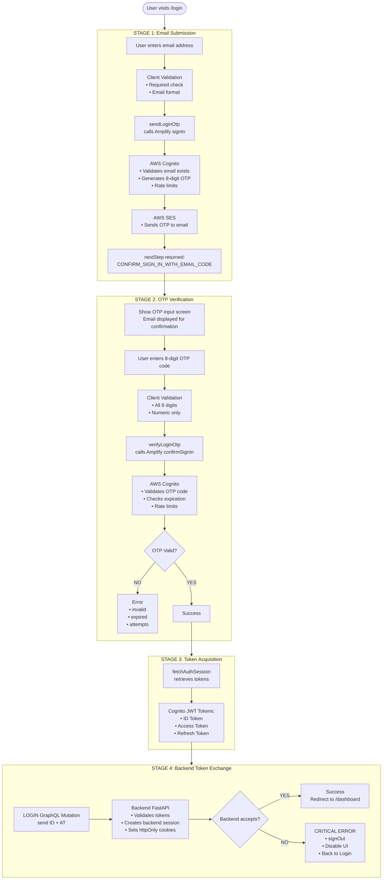
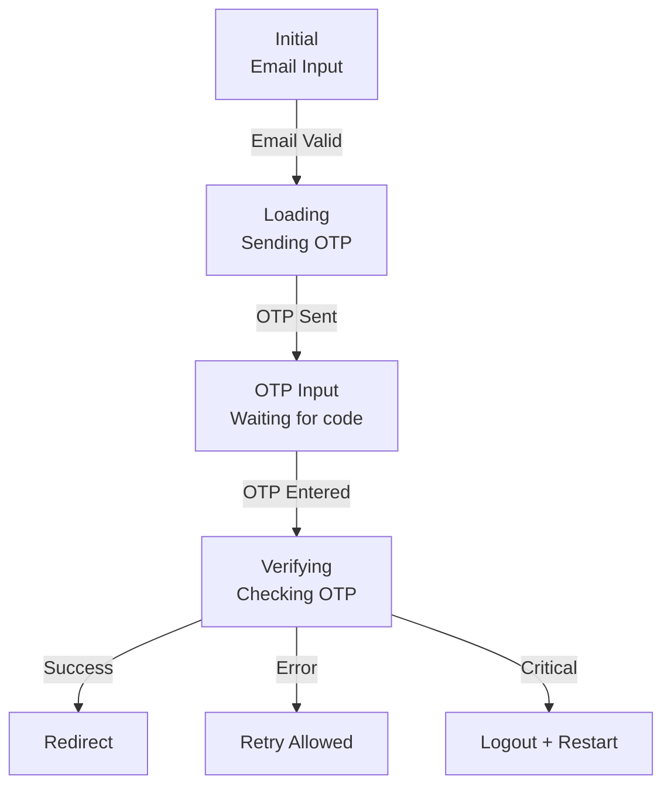

# Login Architecture

## Overview

Pop Logic implements **passwordless authentication** using AWS Cognito with **email-based OTP (One-Time Password)** verification. Users authenticate by receiving an 8-digit code via email instead of using traditional passwords. This document describes the architectural decisions and flow of the initial login process.

## Status

**✅ Implemented** — Passwordless OTP login flow with comprehensive error handling is fully operational.

---

## Architecture Diagram



---

## Key Architectural Decisions

### 1. **Passwordless Authentication (OTP vs Passwords)**

**Decision:** Use email-based OTP instead of passwords.

**Rationale:**

| Aspect             | Passwords                           | OTP (Our Choice)                           |
| ------------------ | ----------------------------------- | ------------------------------------------ |
| **Security**       | Weak/reused passwords common        | ✅ Time-limited, single-use codes          |
| **UX**             | Password management burden on users | ✅ No password to remember                 |
| **Phishing Risk**  | Password can be stolen via phishing | ✅ OTP useless after expiration            |
| **Implementation** | Password hashing, reset flows       | ✅ Cognito handles OTP generation/delivery |
| **Recovery**       | Password reset flow needed          | ✅ Request new OTP anytime                 |

**Benefits:**

- ✅ Improved security (no weak/reused passwords)
- ✅ Better UX (no password to remember/type)
- ✅ Lower support burden (no password reset requests)
- ✅ Aligns with modern auth best practices

**Trade-offs:**

- ❌ Requires reliable email delivery
- ❌ Users must have access to email during login
- ❌ Slightly longer login flow (two steps)

**Alternative Considered:** Magic links (rejected due to email client compatibility issues)

---

### 2. **8-Digit Numeric OTP**

**Decision:** Use 8-digit numeric codes (not 6-digit or alphanumeric).

**Rationale:**

| Code Type    | Security Level | User Experience                    | Our Choice |
| ------------ | -------------- | ---------------------------------- | ---------- |
| 4-digit      | Low            | Easy to type, too easy to guess    | ❌         |
| 6-digit      | Medium         | Common (Google, etc.)              | ❌         |
| 8-digit      | High           | ✅ Harder to brute force           | ✅         |
| Alphanumeric | Highest        | ❌ Harder to type (case-sensitive) | ❌         |

**Security Calculation:**

- 6-digit: 1,000,000 possible codes
- 8-digit: 100,000,000 possible codes (100x more secure)
- Combined with Cognito rate limiting = brute force infeasible

**Benefits:**

- ✅ High security with reasonable UX
- ✅ Numeric-only = easy to type on mobile
- ✅ Clear distinction from 6-digit codes (users recognize it's different)

---

### 3. **Client-Side Authentication Flow (Not Server-Side)**

**Decision:** Handle Amplify/Cognito authentication in Client Components, not Server Components.

**Rationale:**

- Amplify Auth module is designed for browser environment
- Requires access to browser storage (cookies, localStorage)
- Session management tied to browser lifecycle
- RSC cannot manage client-side state

**Flow Split:**

| Step                    | Component Type | Why?                           |
| ----------------------- | -------------- | ------------------------------ |
| Email input             | Client         | Form state management          |
| OTP input               | Client         | Form state management          |
| Amplify `signIn`        | Client         | Browser-only Amplify Auth      |
| Amplify `confirmSignIn` | Client         | Browser-only Amplify Auth      |
| `fetchAuthSession`      | Client         | Browser-only Amplify Auth      |
| Backend token exchange  | Server Action  | ✅ Secure server-side API call |

**Backend Token Exchange via Server Action:**

- After getting tokens from Cognito (client-side), send them to backend
- Use Server Action (`'use server'`) for secure backend communication
- Backend receives tokens, validates them, sets httpOnly cookies

**Benefits:**

- ✅ Amplify optimized for browser usage
- ✅ Server Action ensures secure backend communication
- ✅ Clear separation of concerns

**Alternative Considered:** Handle all auth server-side (rejected due to Amplify design)

---

### 4. **Two-Stage Login (Email → OTP)**

**Decision:** Split login into two screens (email submission, then OTP verification).

**Rationale:**

| Approach                    | Benefits                              | Trade-offs                      |
| --------------------------- | ------------------------------------- | ------------------------------- |
| Single screen (both fields) | Faster if user knows OTP beforehand   | ❌ Confusing (OTP not sent yet) |
| Two screens (our choice)    | ✅ Clear flow (send OTP, then verify) | Slightly longer perceived time  |

**UX Flow:**

1. **Screen 1:** Enter email → "Send Code"
2. **Screen 2:** Enter OTP → "Verify & Login"

**Benefits:**

- ✅ Clear user intent at each stage
- ✅ Email displayed on OTP screen for confirmation
- ✅ User can go back to change email if needed
- ✅ Matches mental model (receive code, then enter it)

---

### 5. **Error Handling Strategy (Multi-Level)**

**Decision:** Implement comprehensive error handling at every stage of the login flow.

**Error Levels:**

| Level                 | Scope                         | Handled By                   |
| --------------------- | ----------------------------- | ---------------------------- |
| **Client Validation** | Email format, required fields | React Hook Form              |
| **Cognito Errors**    | User not found, rate limits   | Amplify error mapping        |
| **Network Errors**    | Connection failures           | Try-catch blocks             |
| **Backend Errors**    | Token validation failures     | Apollo Client error handling |

**See:** [auth.overview.md](./auth.overview.md) for complete error taxonomy.

**Design Philosophy:**

- ✅ **Fail early:** Validate on client before API calls
- ✅ **Fail gracefully:** Show clear error messages, allow retry
- ✅ **Fail safely:** Critical errors → Full auth flow restart

---

### 6. **Critical Failure Protocol (Backend Exchange Failure)**

**Decision:** When backend token exchange fails, treat as critical error requiring full logout.

**Problem:**

- User authenticated with Cognito (OTP verified)
- Backend exchange fails (network, backend down, validation error)
- User now in **limbo state**: Authenticated in Cognito, not in backend

**Solution:**

1. Immediately call `signOut()` to clear Cognito session
2. Disable all form inputs (prevent further actions)
3. Show critical error message
4. Provide "Back to Login" button (force restart)

**Why Full Logout Required:**

- Cannot proceed with Cognito session alone (backend needs session too)
- Cannot retry token exchange with same session (tokens are one-time use for exchange)
- Must start completely fresh

**Implementation:**

```typescript
try {
  const { data } = await loginMutation({
    variables: { idToken, accessToken },
  });

  // Success: Redirect
} catch (error) {
  // CRITICAL: Backend exchange failed
  await signOutUser(); // Clear Cognito session
  setIsCriticalError(true); // Disable UI
  // Show "Back to Login" button
}
```

**Benefits:**

- ✅ Prevents zombie sessions
- ✅ Clear to user that restart is required
- ✅ No false sense of security (acting like user is logged in)

---

### 7. **Resend Code with Cooldown**

**Decision:** Allow OTP resend with enforced 60-second client-side cooldown.

**Rationale:**

| Without Cooldown                  | With Cooldown (Our Choice)                   |
| --------------------------------- | -------------------------------------------- |
| Users spam "Resend Code" button   | ✅ 60s wait prevents accidental spam         |
| Cognito rate limit hit more often | ✅ Reduces load on Cognito/SES               |
| Confusing (which code is valid?)  | ✅ Clear: Previous code invalid after resend |

**Implementation:**

- Client-side cooldown: 60 seconds countdown
- Server-side rate limit: Cognito enforced (protects against API abuse)
- Success message: "New code sent to your email"
- Previous OTP invalid: User must use new code

**Benefits:**

- ✅ Reduces accidental duplicate sends
- ✅ Clear UX (countdown shows when retry available)
- ✅ Backend protected by Cognito rate limits

---

### 8. **Route Protection with Proxy**

**Decision:** Implement authentication check in Next.js `proxy.ts` middleware, not per-route.

**Rationale:**

| Approach                | Benefits                              | Trade-offs                          |
| ----------------------- | ------------------------------------- | ----------------------------------- |
| Per-route checks        | Fine-grained control                  | ❌ Easy to forget on new routes     |
| Middleware (our choice) | ✅ Centralized, runs on every request | Must explicitly allow public routes |

**Implementation:**

```typescript
// src/proxy.ts
export async function middleware(request: NextRequest) {
  const accessToken = request.cookies.get('access_token');

  // Protected routes
  if (request.nextUrl.pathname.startsWith('/dashboard')) {
    if (!accessToken) {
      return NextResponse.redirect(new URL('/login', request.url));
    }
  }

  return NextResponse.next();
}
```

**Protected Routes:**

- `/dashboard` (and all sub-routes)
- Any route added under `(protected)` group

**Public Routes:**

- `/login`
- `/` (landing/home)

**Benefits:**

- ✅ Cannot accidentally expose protected routes
- ✅ Single source of truth for auth checks
- ✅ Runs before page render (fast redirect)

**Alternative Considered:** Per-route checks with hooks (rejected due to inconsistency risk)

---

## Login Flow States

### State Transitions



### State Management

**Email Submission State:**

```typescript
{
  email: string; // User input
  isLoading: boolean; // API call in progress
  error: ErrorCode | null; // Error from Cognito/Amplify
}
```

**OTP Verification State:**

```typescript
{
  otpCode: string[8]; // Array of digits
  isVerifying: boolean; // API call in progress
  error: ErrorCode | null; // Error from Cognito/Amplify
  isCriticalError: boolean; // Backend exchange failed
  resendCooldown: number; // Seconds remaining (0-60)
}
```

---

## Security Considerations

### Rate Limiting

**Cognito-Level Rate Limits:**

- OTP send attempts: Limited per IP/user (Cognito enforced)
- OTP verification attempts: Limited per session (Cognito enforced)
- Resend attempts: Limited per time window (Cognito enforced)

**Client-Side Cooldowns:**

- Resend: 60 seconds (prevents accidental spam)
- Multiple verification failures: Escalating delays (UX enhancement)

**Benefits:**

- ✅ Protects against brute force attacks
- ✅ Prevents email bombing (too many OTPs sent)
- ✅ Reduces costs (fewer SES emails)

---

### OTP Security Properties

| Property          | Implementation                        | Protection Against                |
| ----------------- | ------------------------------------- | --------------------------------- |
| **Time-limited**  | Cognito default expiration            | ✅ Delayed phishing attempts      |
| **Single-use**    | Cognito invalidates after use         | ✅ Replay attacks                 |
| **Numeric-only**  | 8 digits (100M combinations)          | ✅ Brute force (with rate limits) |
| **Rate-limited**  | Cognito enforced attempt limits       | ✅ Automated attack scripts       |
| **Session-bound** | OTP tied to session (cannot transfer) | ✅ Cross-session attacks          |

---

### Token Storage

**Cognito Tokens (ID, Access, Refresh):**

- **Client-side (Amplify):** Stored in Amplify-managed cookies/localStorage
- **Backend-side (Our Backend):** Access Token only, in httpOnly cookie

**Why Two Locations?**

| Token         | Client Storage (Amplify)      | Backend Storage (httpOnly)      |
| ------------- | ----------------------------- | ------------------------------- |
| ID Token      | ✅ Needed for Amplify refresh | ❌ Not needed (backend uses AT) |
| Access Token  | ✅ Needed for Amplify refresh | ✅ Needed for API authorization |
| Refresh Token | ✅ Needed for Amplify refresh | ❌ Not needed (backend uses AT) |

**Security:**

- Client storage: Managed by Amplify (secure by design)
- Backend storage: httpOnly cookies (XSS protection)

---

## User Experience Considerations

### Login Time Expectations

| Stage                   | Typical Duration   | User Perception           |
| ----------------------- | ------------------ | ------------------------- |
| Email submission        | 1-2 seconds        | "Sending code..."         |
| Email delivery          | 5-30 seconds       | User waits for email      |
| OTP verification        | 1-2 seconds        | "Verifying..."            |
| Backend exchange        | 500ms-1s           | Seamless (part of verify) |
| **Total (optimal)**     | **~10-35 seconds** | Acceptable for security   |
| **Total (with resend)** | **+60 seconds**    | User waits for new code   |

**UX Optimizations:**

- ✅ Show email on OTP screen (confirm destination)
- ✅ Loading indicators at each stage
- ✅ Clear error messages with recovery actions
- ✅ Resend countdown (manage expectations)

---

### Accessibility

**Keyboard Navigation:**

- ✅ Tab through email → submit → OTP inputs → verify
- ✅ Enter key submits forms at each stage
- ✅ OTP inputs auto-focus on next digit

**Screen Readers:**

- ✅ Error messages announced via ARIA live regions
- ✅ Form labels properly associated
- ✅ Loading states announced

**Visual:**

- ✅ High-contrast error messages
- ✅ Loading spinners visible
- ✅ OTP input focus indicators

---

## Future Enhancements

### 1. **SMS OTP Fallback**

Allow users to choose email or SMS for OTP delivery.

**Pros:** More accessible (not everyone checks email frequently)  
**Cons:** SMS costs, phone number collection

---

### 2. **Remember Device (Trusted Devices)**

Skip OTP for trusted devices (based on device fingerprint).

**Pros:** Better UX for repeat logins  
**Cons:** Security trade-off, device fingerprinting complexity

---

### 3. **Social Login (Google, Microsoft)**

Allow OAuth-based login as alternative to OTP.

**Pros:** Even faster login for users with SSO  
**Cons:** Additional dependencies, multiple auth flows

---

### 4. **Biometric Login (WebAuthn)**

Use fingerprint/face recognition for returning users.

**Pros:** Best UX, high security  
**Cons:** Browser support, fallback complexity

---

## Related Documentation

- **[Token Refresh Architecture](./token-refresh.architecture.md)** — Post-login request handling and AT expiration
- **[Authentication Overview](./auth.overview.md)** — High-level auth system design
- **[lib/amplify/README.md](../../../src/lib/amplify/)** — Amplify configuration and auth helpers

---

**Last Updated:** February 9, 2026  
**Version:** 1.0 (Initial Login Architecture)


---

Last Update:- 04/06/2026
Agent name:- doc-updater
Author:- Vishav Ranta
