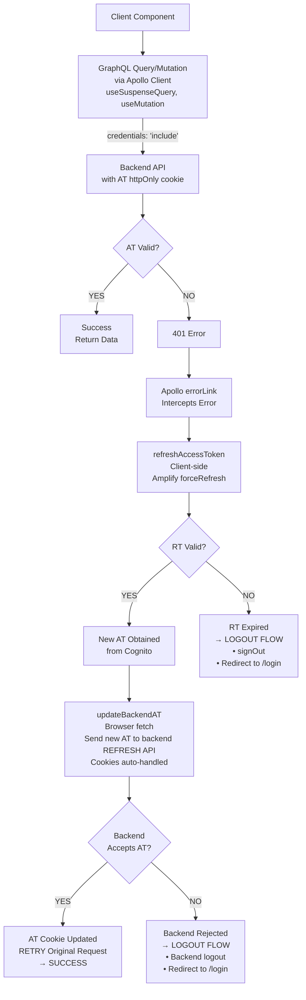
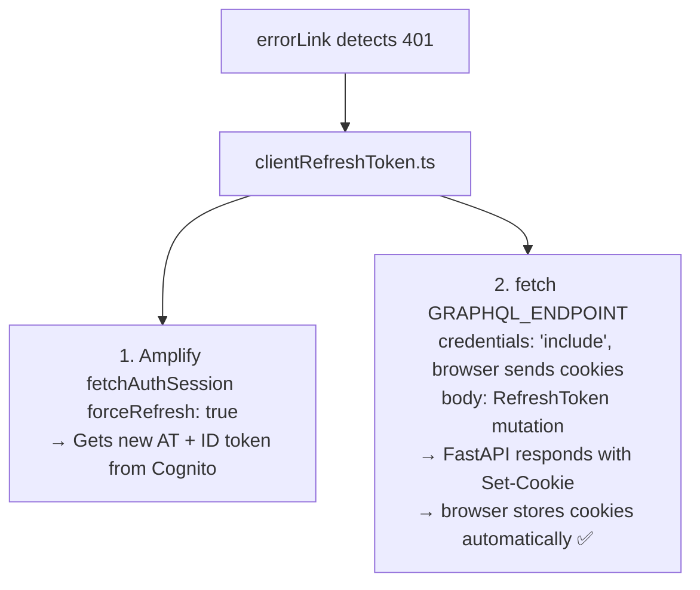

# Token Refresh Architecture

## Overview

This document describes the **post-login request lifecycle** and **access token (AT) refresh flow** in the Pop Logic application. After successful authentication, all subsequent API requests use the AT stored in httpOnly cookies. When the AT expires (401 errors), the system automatically refreshes it using the refresh token (RT) without requiring user re-authentication.

## Status

**✅ Implemented** — Automatic token refresh with 401 error handling is fully operational via **client-side only** fetching.

---

## Architecture Decision: Client-Side Only Fetching

**Decision:** All GraphQL data fetching happens in Client Components using Apollo Client hooks (`useSuspenseQuery`, `useMutation`). Server Components do not fetch authenticated data.

**Rationale:**

| Factor                | Server-Side (RSC)                                          | Client-Side Only                       |
| --------------------- | ---------------------------------------------------------- | -------------------------------------- |
| Auth token management | Duplicated (Cognito on client + cookies on server)         | Single place (Cognito on client)       |
| Cookie forwarding     | Complex, error-prone (can't set cookies during RSC render) | Not needed                             |
| Token refresh         | Can't set cookies during render → breaks                   | Natural — handled by Apollo error link |
| SEO                   | Better                                                     | Not needed (protected pages)           |
| Complexity            | High (two refresh implementations)                         | Low (one implementation)               |

**Why not RSC for protected routes?**

1. **Cookie limitation:** Next.js does not allow setting cookies during Server Component rendering — only in Server Actions or Route Handlers. This breaks the token refresh flow when calling `updateBackendAccessToken` from RSC.
2. **Duplicated auth logic:** Server-side requires a separate Cognito API refresh implementation (`serverRefreshToken`) independent of Amplify.
3. **Protected pages don't need SEO:** All authenticated routes are behind login — search engines never index them.

---

## Architecture Diagram



---

## Key Architectural Decisions

### 1. **Client-Side Only Token Refresh**

**Decision:** Single token refresh implementation in the browser using Amplify's `fetchAuthSession`.

**Rationale:**

| Aspect              | Previous (Dual) Approach                    | Current (Client-Only) Approach   |
| ------------------- | ------------------------------------------- | -------------------------------- |
| **Implementations** | 2 (clientRefreshToken + serverRefreshToken) | 1 (clientRefreshToken only)      |
| **Maintenance**     | Must keep both in sync                      | Single source of truth           |
| **Cookie issues**   | Can't set cookies during RSC render         | Not applicable — runs in browser |
| **Cognito access**  | Direct API call needed in RSC               | Amplify handles everything       |
| **Complexity**      | High                                        | Low                              |

**Implementation:** `clientRefreshToken.ts`

```typescript
// Uses Amplify's built-in token management
const session = await fetchAuthSession({ forceRefresh: true });
const newAccessToken = session.tokens?.accessToken?.toString();
const newIdToken = session.tokens?.idToken?.toString();
// Call FastAPI directly from browser — cookies handled automatically
await updateBackendAccessToken(newAccessToken, newIdToken);
```

**Why Everything Runs in the Browser:**

1. Browser automatically sends httpOnly cookies via `credentials: 'include'`
2. Browser automatically receives and stores Set-Cookie headers from FastAPI
3. No Server Action needed — no manual cookie parsing/forwarding
4. No `cookies()` API calls — eliminates the "Cookies can only be modified in a Server Action" error entirely
5. Single Cognito implementation via Amplify (browser-only)

**Benefits:**

- ✅ Single implementation to maintain
- ✅ Zero cookie forwarding code
- ✅ Browser handles all cookie lifecycle automatically
- ✅ Leverages Amplify's robust token management
- ✅ Simplest possible mental model

---

### 2. **Direct Browser-to-Backend Token Update**

**Decision:** Call the FastAPI `RefreshToken` mutation directly from the browser via `fetch` with `credentials: 'include'`.

**Rationale:**

- When the browser calls FastAPI directly, the browser automatically:
  - Sends existing httpOnly cookies
  - Receives and stores new Set-Cookie headers from FastAPI
- No Server Action needed — eliminates all cookie parsing/forwarding code
- No `refreshAccessToken.ts` Server Action file needed

**Flow:**



**Benefits:**

- ✅ Zero cookie forwarding code
- ✅ No Server Action overhead
- ✅ Browser handles cookie lifecycle natively
- ✅ Entire auth flow lives in one file (`clientRefreshToken.ts`)

---

### 3. **Automatic Retry After Successful Refresh**

**Decision:** Automatically retry the original failed request after successful token refresh.

**Rationale:**

- User experience: No visible error or interruption
- Transparent to application code: Components don't need error handling logic
- Efficient: No need to manually refetch data

**Implementation:**

| Mechanism                                    | Location       |
| -------------------------------------------- | -------------- |
| Apollo `errorLink` with `forward(operation)` | `errorLink.ts` |

**Benefits:**

- ✅ Seamless user experience
- ✅ No application code changes needed
- ✅ Handles auth transparently at infrastructure level

---

### 4. **Singleton Refresh Pattern (Deduplication)**

**Decision:** Only one token refresh happens at a time, even if multiple requests fail simultaneously.

**Problem Solved:**

- Multiple GraphQL queries/mutations might fail with 401 at the same time
- Without deduplication: Multiple refresh requests to Cognito
- Cognito might rate-limit or reject concurrent attempts

**Implementation (Client-side):**

```typescript
// In errorLink.ts
let refreshPromise: Promise<{ success: boolean }> | null = null;

async function getRefreshPromise() {
  if (refreshPromise) {
    return refreshPromise; // Return existing in-flight request
  }

  refreshPromise = refreshAccessToken();

  try {
    return await refreshPromise;
  } finally {
    refreshPromise = null; // Clear after completion
  }
}
```

**Benefits:**

- ✅ Prevents race conditions
- ✅ Reduces load on Cognito
- ✅ All concurrent requests wait for single refresh
- ✅ Efficient resource usage

---

### 5. **Graceful Logout on Refresh Failure**

**Decision:** When token refresh fails, perform graceful logout with cleanup.

**Scenarios:**

| Failure Point                | Behavior                                |
| ---------------------------- | --------------------------------------- |
| RT expired                   | `signOut()` → Redirect to login         |
| Cognito API error            | `signOut()` → Redirect to login         |
| Backend rejects new AT       | Backend logout → `signOut()` → Redirect |
| Network error during refresh | `signOut()` → Redirect to login         |

**Why Direct `/login` Redirect (No Separate Logout Page)?**

- LoginForm component automatically calls `signOut()` on mount via `useEffect`
- Server Components/Actions cannot call browser-only `signOut()` directly
- Simpler flow: Single redirect instead of logout page → login page chain
- Ensures Amplify cookies are always cleared when user lands on login page
- Handles both intentional logouts and automatic session expiration consistently

**Graceful Logout Steps:**

1. Attempt backend logout (clear backend session)
2. Redirect to login page with optional reason parameter
3. LoginForm component automatically calls `signOut()` on mount (clears Cognito/Amplify session)

**Benefits:**

- ✅ Prevents zombie sessions (authenticated in one system but not the other)
- ✅ Clean state for next login attempt
- ✅ User understands why they were logged out (via reason parameter)

**Partial Failure Handling:**

- If backend logout fails, still clear Cognito session (better than nothing)
- If `signOut()` fails, still redirect to login (user can retry)

---

### 6. **Request-Level Credential Inclusion**

**Decision:** All authenticated requests include `credentials: 'include'` to send httpOnly cookies.

**Implementation:**

```typescript
// Client-side Apollo link
const httpLink = createHttpLink({
  uri: GRAPHQL_API_URL,
  credentials: 'include', // Always send cookies
});

// Server-side query
await client.query({
  query: GET_DATA,
  context: {
    fetchOptions: {
      credentials: 'include', // Always send cookies
    },
  },
});
```

**Why This Matters:**

- httpOnly cookies (access_token) are NOT sent automatically by Apollo
- Must explicitly opt-in to sending credentials
- Required for backend to authenticate requests

**Security:**

- ✅ httpOnly cookies immune to XSS attacks
- ✅ Backend validates cookies on every request
- ✅ CORS configured to allow credentials from frontend origin only

---

### 7. **Error Detection via Type Guards**

**Decision:** Use Apollo v4 type guards for reliable error detection instead of string matching.

**Implementation (errorLink.ts):**

```typescript
function isAuthError(error: unknown): boolean {
  if (CombinedGraphQLErrors.is(error)) {
    return error.errors.some(
      (err) =>
        err.extensions?.code === 'UNAUTHENTICATED' ||
        err.extensions?.code === 'FORBIDDEN' ||
        err.message.includes('401'),
    );
  }

  if (ServerError.is(error)) {
    return error.statusCode === 401;
  }

  return false;
}
```

**Benefits:**

- ✅ Type-safe (TypeScript enforces correct usage)
- ✅ Handles both GraphQL errors and network errors
- ✅ More reliable than string matching error messages
- ✅ Forward-compatible with Apollo Client updates

**Alternative Considered:** Check `error.message.includes('401')` (rejected due to fragility)

---

## Request Flow Scenarios

### Scenario 1: **Successful Request (AT Valid)**

```
1. Component makes GraphQL request
2. Apollo/fetch sends request with AT cookie
3. Backend validates AT → Success
4. Data returned to component
5. Component renders data
```

**Duration:** ~100-500ms (network + backend processing)

---

### Scenario 2: **First 401 After AT Expiry (Single Request)**

```
1. Component makes GraphQL request
2. Backend validates AT → EXPIRED → 401
3. errorLink/queryWithRetry detects 401
4. Refresh flow triggered:
   a. Amplify refreshes tokens (client) OR Cognito API call (server)
   b. New AT sent to backend via updateBackendAccessToken
   c. Backend updates AT cookie
5. Original request retried with new AT cookie
6. Backend validates new AT → Success
7. Data returned to component
8. Component renders data
```

**Duration:** ~1-2 seconds (refresh + retry)

**User Experience:** Slight delay, but no error visible

---

### Scenario 3: **Multiple Concurrent 401s**

```
1. Multiple components make GraphQL requests simultaneously
2. All requests fail with 401 (AT expired)
3. errorLink triggers for each failed request
4. getRefreshPromise() deduplicates:
   a. First request creates refreshPromise
   b. Other requests wait for same refreshPromise
5. Single refresh flow executes
6. All requests retry with new AT cookie
7. All requests succeed
8. All components render data
```

**Duration:** ~1-2 seconds (single refresh + concurrent retries)

**Optimization:** Deduplication prevents 5 refresh requests for 5 concurrent queries

---

### Scenario 4: **RT Expired (Logout Required)**

```
1. Component makes GraphQL request
2. Backend validates AT → EXPIRED → 401
3. Refresh flow triggered
4. Amplify/Cognito attempt: RT expired → Error
5. Logout flow:
   a. Backend logout (clear backend session)
   b. Redirect to /login?reason=session_expired
   c. LoginForm calls signOut() on mount (clear Cognito/Amplify session)
6. User sees login page with "Session expired" message
```

**Duration:** ~500ms-1s (refresh attempt + logout)

**User Experience:** Redirect to login with clear reason

---

### Scenario 5: **Backend Rejects New AT (Rare)**

```
1. Component makes GraphQL request
2. Backend validates AT → EXPIRED → 401
3. Refresh flow triggered
4. Amplify/Cognito: New AT obtained successfully
5. updateBackendAccessToken: Backend rejects AT → Error
6. Logout flow (same as Scenario 4)
```

**Why This Happens:**

- Backend and Cognito clocks out of sync (rare)
- Backend has stricter validation than Cognito (misconfiguration)
- Network issue during AT validation

**Handling:** Same as RT expired (logout required)

---

## Performance Considerations

### Token Expiration Timing

| Token Type    | Default Lifespan | Configurable? | Impact on UX                        |
| ------------- | ---------------- | ------------- | ----------------------------------- |
| Access Token  | 1 hour           | Yes (Cognito) | Frequent refreshes if too short     |
| Refresh Token | 30 days          | Yes (Cognito) | User must re-login after expiration |
| ID Token      | 1 hour           | Yes (Cognito) | Same as Access Token                |

**Current Configuration:**

- AT: 1 hour (default)
- RT: 30 days (default)

**Trade-offs:**

| Setting         | Shorter AT (e.g., 15 min)                   | Longer AT (e.g., 4 hours)        |
| --------------- | ------------------------------------------- | -------------------------------- |
| **Security**    | ✅ Less time for stolen token to be abused  | ❌ Longer window for token abuse |
| **UX**          | ❌ More frequent refresh interruptions      | ✅ Fewer refresh interruptions   |
| **Performance** | ❌ More refresh requests to Cognito/Backend | ✅ Fewer refresh requests        |

**Recommendation:** Keep default 1 hour (balanced security/UX)

---

### Caching & Refresh Windows

**Problem:** User has long-lived session open, AT expires while idle.

**Solution:** Proactive refresh before expiration (not yet implemented).

**Future Enhancement:**

```typescript
// Refresh AT 5 minutes before expiry
const AT_BUFFER = 5 * 60 * 1000; // 5 minutes

setInterval(async () => {
  const session = await fetchAuthSession();
  const expiresAt = session.tokens?.accessToken?.payload.exp! * 1000;

  if (Date.now() + AT_BUFFER > expiresAt) {
    await refreshAccessToken(); // Proactive refresh
  }
}, 60 * 1000); // Check every minute
```

**Benefits:**

- ✅ Refresh happens before expiration (no 401 errors)
- ✅ Better UX (no request delays)

**Trade-offs:**

- ❌ Background refresh uses resources
- ❌ Complexity in timing calculations

---

## Security Considerations

### httpOnly Cookies

**Decision:** Store AT in httpOnly cookies, not localStorage or sessionStorage.

**Rationale:**

| Storage Location | XSS Vulnerable? | CSRF Vulnerable? | Our Choice | Why?                                                     |
| ---------------- | --------------- | ---------------- | ---------- | -------------------------------------------------------- |
| localStorage     | ✅ Yes          | ❌ No            | ❌         | Accessible by JavaScript → XSS risk                      |
| sessionStorage   | ✅ Yes          | ❌ No            | ❌         | Accessible by JavaScript → XSS risk                      |
| httpOnly Cookie  | ❌ No           | ✅ Yes           | ✅         | Not accessible by JavaScript, CSRF mitigated by SameSite |

**CSRF Mitigation:**

- Backend sets `SameSite=Strict` on cookies
- Frontend and backend on same domain (or configured CORS)
- Browser enforces same-site policy

---

### Token Validation

**Where Tokens Are Validated:**

1. **Backend (every request):**
   - Signature verification with Cognito public keys
   - Expiration check
   - Audience/issuer validation

2. **Cognito (during refresh):**
   - RT validity check
   - User status check (active, not disabled)

**Backend Never Trusts Client:**

- Even though client sends AT, backend independently validates it
- Client cannot forge or tamper with tokens (JWT signatures)

---

## Error Handling & Observability

### Logging & Monitoring (Recommended)

**Key Metrics to Track:**

| Metric                        | Purpose                                 | Alert Threshold         |
| ----------------------------- | --------------------------------------- | ----------------------- |
| Token refresh rate            | Detect abnormal refresh patterns        | > 10 refreshes/min/user |
| Refresh failure rate          | Detect Cognito outages or config issues | > 5% failure rate       |
| 401 error rate                | Detect widespread AT expiration issues  | > 10% of requests       |
| Logout due to refresh failure | Track RT expiration or Cognito issues   | > 5% of sessions/day    |

**Implementation:**

```typescript
// Example: Log refresh attempts
await refreshAccessToken()
  .then(() => {
    console.log('[Auth] Token refresh successful');
    // Send to analytics/monitoring
  })
  .catch((error) => {
    console.error('[Auth] Token refresh failed:', error);
    // Send to error tracking (Sentry, etc.)
  });
```

---

## Testing Scenarios

### Manual Testing

| Scenario                     | Steps                                          | Expected Result                     |
| ---------------------------- | ---------------------------------------------- | ----------------------------------- |
| Normal request flow          | Make authenticated request with valid AT       | Request succeeds                    |
| AT expired (single request)  | Wait 1 hour, make request                      | Automatic refresh + retry → Success |
| AT expired (concurrent)      | Wait 1 hour, trigger 5 requests simultaneously | Single refresh, all retries succeed |
| RT expired                   | Wait 30 days, make request                     | Logout + redirect to login          |
| Backend refresh failure      | Mock backend REFRESH_TOKEN API failure         | Logout + redirect to login          |
| Network error during refresh | Disconnect network during refresh attempt      | Logout + redirect to login          |

### Automated Testing (Recommendations)

```typescript
// Example: Test errorLink retry behavior
test('errorLink retries request after successful refresh', async () => {
  // Mock 401 response
  // Mock successful refresh
  // Assert original request retried
  // Assert data returned
});

test('errorLink logs out on refresh failure', async () => {
  // Mock 401 response
  // Mock failed refresh (RT expired)
  // Assert signOut() called
  // Assert redirect to /login (LoginForm will handle signOut on mount)
});
```

---

## Future Enhancements

### 1. **Proactive Token Refresh**

Refresh AT before expiration to prevent 401 errors entirely.

**Pros:** Better UX (no delays)  
**Cons:** Additional background processing

---

### 2. **Token Refresh Retry with Backoff**

If Cognito refresh fails due to transient network error, retry with exponential backoff.

**Pros:** More resilient to temporary outages  
**Cons:** Delayed logout if RT is actually expired

---

### 3. **Refresh Token Rotation**

Cognito supports RT rotation (new RT issued with each refresh).

**Pros:** Enhanced security (stolen RT has limited lifespan)  
**Cons:** More complex token management

---

### 4. **Session Heartbeat**

Ping backend periodically to keep session alive and detect expiration early.

**Pros:** Can warn user before session expires  
**Cons:** Additional network requests

---

## Related Documentation

- **[Login Architecture](./login.architecture.md)** — Initial authentication and OTP flow
- **[Authentication Overview](./auth.overview.md)** — High-level auth system design
- **[lib/README.md](../../../src/lib/README.md)** — Implementation details and API reference

---

Last Update:- 04/06/2026
Agent name:- doc-updater
Author:- Vishav Ranta
