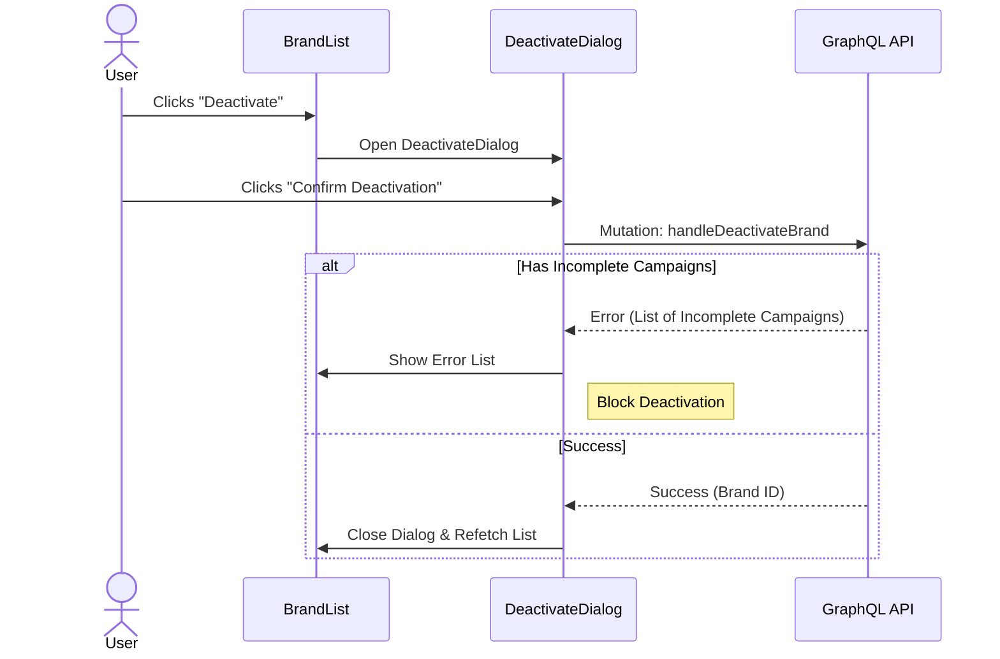

# Brand Activation/Deactivation

The Activate/Deactivate feature allows administrators to manage the active status of brands through confirmation dialogs.

## Workflow Diagram



## Components

### ActivateBrandDialog

Located: `src/app/(protected)/brand-management/(components)/activate-deactivate-dialog/activate-brand-dialog.tsx`

This dialog allows users to activate a brand.

**Props:**

| Prop                  | Type                            | Description                                                                       |
| --------------------- | ------------------------------- | --------------------------------------------------------------------------------- |
| `brand`               | `BrandType`                     | The brand to activate                                                             |
| `onClose`             | `() => void`                    | Close handler                                                                     |
| `handleActivateBrand` | `(id: string) => Promise<void>` | Mutation handler passed from the parent (`BrandActionCell` or `BrandDetailsView`) |
| `isUpdatingStatus`    | `boolean`                       | Disables buttons while mutation is in-flight                                      |

**Behavior:**

- Opens programmatically (no trigger inside the dialog).
- Uses `disablePointerDismissal={isUpdatingStatus}` to prevent accidental closure mid-mutation.
- Calls `handleActivateBrand(brand.id)` then `onClose()` on confirm.

### DeactivateBrandDialog

Located: `src/app/(protected)/brand-management/(components)/activate-deactivate-dialog/deactivate-brand-dialog.tsx`

This dialog allows users to deactivate a brand, with a blocker for incomplete campaigns.

**Props:**

| Prop                    | Type                                                        | Description                                  |
| ----------------------- | ----------------------------------------------------------- | -------------------------------------------- |
| `brand`                 | `BrandType`                                                 | The brand to deactivate                      |
| `onClose`               | `() => void`                                                | Close handler                                |
| `handleDeactivateBrand` | `(id: string) => Promise<IncompleteCampaignType[] \| null>` | Mutation handler from parent                 |
| `isUpdatingStatus`      | `boolean`                                                   | Disables buttons while mutation is in-flight |

**Behavior:**

- Uses `disablePointerDismissal={isUpdatingStatus}` to prevent accidental closure.
- Calls `handleDeactivateBrand(brand.id)`. If the function returns a non-empty array, the campaigns are stored in local state and displayed inside the dialog — deactivation is blocked.
- If `null` is returned (success), calls `onClose()`.

## Data Flow (State Management)

The activate/deactivate handlers originate in two places:

1. **Brand list page** — `useBrandManagementContext` owns the `UPDATE_BRAND_STATUS` mutation. `BrandActionCell` reads `handleActivateBrand`, `handleDeactivateBrand`, and `isUpdatingStatus` directly from `BrandManagementContext` and passes them as props to the dialogs.
2. **Brand details page** — `useBrandDetailsView` owns its own `UPDATE_BRAND_STATUS` mutation instance. `BrandDetailsView` similarly passes the handlers as props to the same dialog components.

The dialogs themselves are stateless with respect to the mutation — they only manage local `incompleteCampaigns` state for the error display.

## Error Handling

### Incomplete Campaigns Check

When deactivating a brand, if the brand has associated incomplete campaigns (e.g., drafts, pending approvals), the deactivation is blocked. The user sees a list of affected campaigns so they can address them before attempting to deactivate again.

**Example Component Logic:**

```tsx
const handleDeactivate = async () => {
  const campaigns = await handleDeactivateBrand(brand.id);
  if (campaigns) {
    setIncompleteCampaigns(campaigns); // Shows list
    return;
  }
  // Success -> Only close if no returned campaigns
  onClose();
};
```

## Accessibility

- **Dialog**: Standard accessible dialog pattern with focus trap and `aria-modal`.
- **Icons**: Decorative icons are hidden (`aria-hidden="true"`).
- **Loading State**: Buttons use `isLoading` prop and `disabled` to prevent double-submissions.
- **Pointer Dismissal**: `disablePointerDismissal` is set when `isUpdatingStatus` is true to prevent accidental closure.

---

Last Update:- 11/05/2026
Agent name:- doc-updater
Author:- Vishav Ranta
