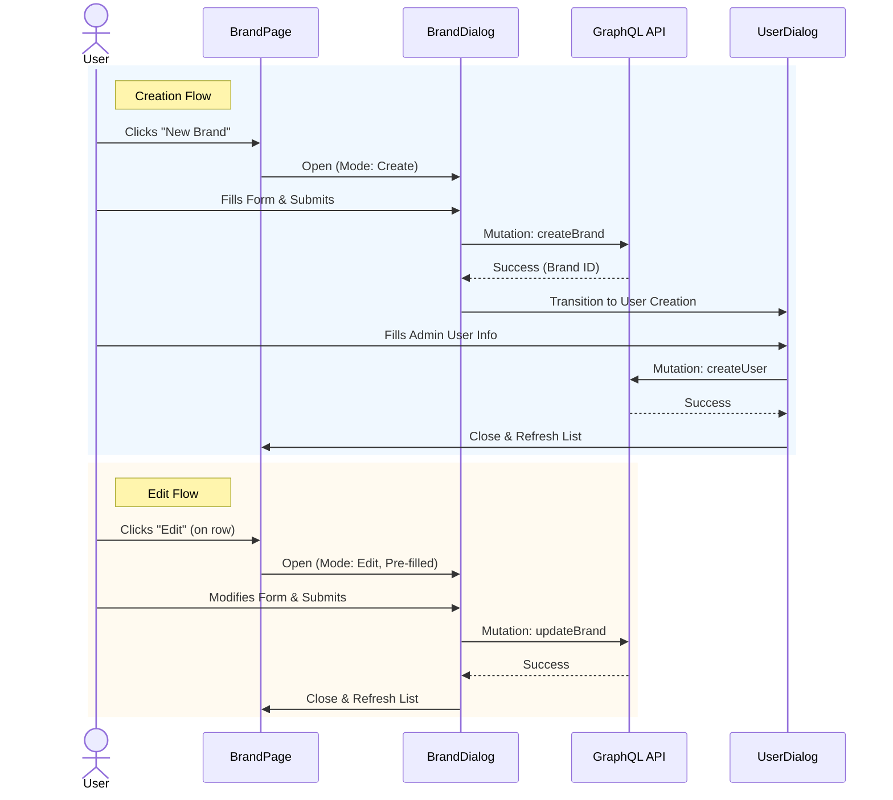

# Brand Creation and Editing

The Brand Creation and Editing feature allows users to add new brands and modify existing brand details via modal dialogs (`src/components/dialog/brand-dialog/brand-dialog.tsx`).

## Workflow Diagram

## Components

### BrandCreationButton

Located: `src/app/(protected)/brand-management/(components)/create-brand-button/create-brand-button.tsx`

This component renders a "New Brand" button (`PagePrimaryAction`). It manages a local `isBrandDialogOpen` boolean. Clicking it opens `BrandDialog` in `mode="create"`. The `onSubmit` prop is wired to `handleCreateBrand` from `BrandManagementContext`, which is an alias for `refetchBrands` — ensuring the table refreshes after a brand is created.

### BrandDialog

Located: `src/components/dialog/brand-dialog/brand-dialog.tsx`

This reusable dialog handles both creating and editing brands based on the `mode` prop.

**Props:**

- `mode`: `"create" | "edit"` (determines behavior and labels).
- `onClose`: Function to close the dialog.
- `initialData`: Partial `Brand` object for pre-populating edit forms.
- `onSubmit`: Callback after successful submission.

**State Management (`useBrandDialog`):**

- **Creation Flow**: `mode="create"`
  - User fills out brand details (Name, Address, contact, etc.).
  - On submit, triggers `createBrand` mutation.
  - Upon success, the dialog transitions to create a Brand Admin user via `UserDialog`.
- **Edit Flow**: `mode="edit"`
  - Pre-populates form with `initialData` or fetches data if needed.
  - On submit, triggers `updateBrand` mutation.
  - Closes dialog immediately on success.

### User Creation Integration

After a brand is created, the system prompts the user to create an initial Brand Admin user.

- **Component**: `UserDialog` (imported from `../user-dialog/user-dialog`)
- **Integration**:
  - Rendered conditionally: `if (showUserDialog && createdBrand)`
  - Passes created `brandId` and default role `Brand Admin` as initial data.
  - Fields like `role` and `brandId` are disabled/hidden to enforce association.

## Form Data Validation

The form uses `react-hook-form` and defines a schema via Zod (`brand-dialog.schema.ts`).

- **Required fields**: Name, Country, State (if applicable per country rules), City, Street Address, Zip Code (format validation).
- **Validation**:
  - Ensures valid zip code format based on selected country logic (implied by `config`).
  - Required fields cannot be empty.

## Data Fetching

Dropdown data (`countriesData`, `statesData`) is fetched inside `BrandDialog` via Apollo to populate country/state selects dynamically. States are conditionally fetched based on the selected country (`skipToken` pattern). `isDropdownLoading` gates the state dropdown during the dependent fetch.

## Accessibility

- **Focus Management**: Focus is trapped within the dialog.
- **Labels**: Form fields use `<label>` associations via `react-hook-form`.
- **Error Handling**: Zod validation errors are displayed inline and announced to screen readers.
- **Loading State**: Submit button shows `isLoading` and is disabled during submission to prevent duplicate requests.

---

Last Update:- 11/05/2026
Agent name:- doc-updater
Author:- Vishav Ranta
