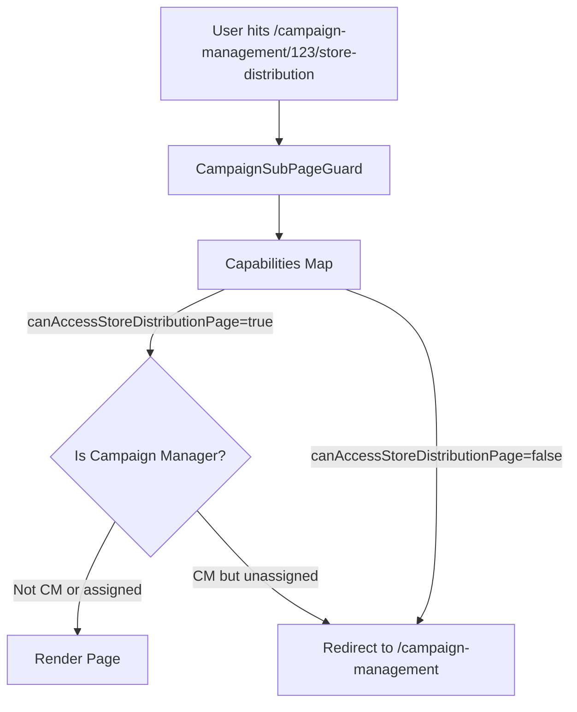

# Campaign Capabilities

## Purpose

The `Capabilities` pattern defines a tightly-controlled, role-based access dictionary to prevent business logic fragmentation. Instead of scattering `if (role === BRAND_ADMIN)` checks across hundreds of components (which scales poorly and leads to bugs), capabilities map roles to a strict set of boolean permissions (`canDistributeToStores`, `showBrandFilter`, etc.).

This allows the UI to simply ask: "Does this user have the capability to create campaigns?" regardless of what their actual role label is.

## Supported Roles

The system defines capabilities for seven roles:

| Role                    | `listingEntityKey` | Primary Focus                                                                                           |
| ----------------------- | ------------------ | ------------------------------------------------------------------------------------------------------- |
| **Brand Admin**         | `brandId`          | Full campaign lifecycle — create, edit, delete, archive, distribute, submit, review installation proofs |
| **Campaign Manager**    | `brandId`          | Same as Brand Admin but scoped to assigned campaigns; can self-assign                                   |
| **PSP Admin**           | `pspId`            | Order fulfilment — ship orders, update status                                                           |
| **Production Operator** | `pspId`            | Same as PSP Admin (ship orders, update status)                                                          |
| **Store Admin**         | `storeId`          | View-only + upload installation proof photos                                                            |
| **Store Operator**      | `storeId`          | View-only + upload installation proof photos                                                            |
| **Regional Manager**    | `storeId`          | View-only access                                                                                        |

## Architecture & Implementation

### 1. `capabilities.ts` (Core Utility)

A generic utility function `getCapabilities` that safely maps a `UserRole` to a specific capability map. This is intentionally pure and independent of React, allowing it to be securely executed inside Edge middleware, RSCs, or standard Client Components.

### 2. `campaign.capabilities.ts` (Domain Definitions)

Located: `src/lib/permissions/capabilities/campaign.capabilities.ts`

Defines `CampaignCapabilities` — an interface with the following capability groups:

#### Campaign-Level Actions

| Flag                 | Brand Admin | Campaign Manager | PSP Admin | Production Op | Store Admin | Store Op | Regional Mgr |
| -------------------- | :---------: | :--------------: | :-------: | :-----------: | :---------: | :------: | :----------: |
| `canCreateCampaign`  |     ✅      |        ✅        |    ❌     |      ❌       |     ❌      |    ❌    |      ❌      |
| `canEditCampaign`    |     ✅      |       ✅\*       |    ❌     |      ❌       |     ❌      |    ❌    |      ❌      |
| `canDeleteCampaign`  |     ✅      |       ✅\*       |    ❌     |      ❌       |     ❌      |    ❌    |      ❌      |
| `canArchiveCampaign` |     ✅      |       ✅\*       |    ❌     |      ❌       |     ❌      |    ❌    |      ❌      |
| `canSubmitToPsp`     |     ✅      |       ✅\*       |    ❌     |      ❌       |     ❌      |    ❌    |      ❌      |
| `canMarkOnHold`      |     ✅      |       ✅\*       |    ❌     |      ❌       |     ❌      |    ❌    |      ❌      |
| `canMarkComplete`    |     ✅      |       ✅\*       |    ❌     |      ❌       |     ❌      |    ❌    |      ❌      |
| `canEditStatus`      |     ❌      |        ❌        |    ✅     |      ✅       |     ❌      |    ❌    |      ❌      |

\* Campaign Manager write actions restricted to assigned campaigns only (`canEditOwnCampaignsOnly`).

#### Promotion-Level Actions

| Flag                     | Brand Admin | Campaign Manager | PSP Admin | Others |
| ------------------------ | :---------: | :--------------: | :-------: | :----: |
| `canImportPromotions`    |     ✅      |       ✅\*       |    ❌     |   ❌   |
| `canReusePromotions`     |     ✅      |       ✅\*       |    ❌     |   ❌   |
| `canAddPromotions`       |     ✅      |       ✅\*       |    ❌     |   ❌   |
| `canViewPromotions`      |     ✅      |        ✅        |    ✅     |   ✅   |
| `canEditPromotions`      |     ✅      |       ✅\*       |    ❌     |   ❌   |
| `canDeletePromotions`    |     ✅      |       ✅\*       |    ❌     |   ❌   |
| `canDuplicatePromotions` |     ✅      |       ✅\*       |    ❌     |   ❌   |
| `canDistributeToStores`  |     ✅      |       ✅\*       |    ❌     |   ❌   |

#### Orders & Installation Proof

| Flag                         | Brand Admin | Campaign Mgr | PSP Admin | Prod Op | Store Admin | Store Op | Regional Mgr |
| ---------------------------- | :---------: | :----------: | :-------: | :-----: | :---------: | :------: | :----------: |
| `canShipOrders`              |     ❌      |      ❌      |    ✅     |   ✅    |     ❌      |    ❌    |      ❌      |
| `canSubmitInstallationProof` |     ❌      |      ❌      |    ❌     |   ❌    |     ✅      |    ✅    |      ❌      |
| `canReviewInstallationProof` |     ✅      |      ✅      |    ❌     |   ❌    |     ❌      |    ❌    |      ❌      |
| `canUploadInstallationProof` |     ❌      |      ❌      |    ❌     |   ❌    |     ✅      |    ✅    |      ❌      |

#### Campaign Manager-Specific

| Flag                       | Description                                                                            |
| -------------------------- | -------------------------------------------------------------------------------------- |
| `canAssignSelfToCampaign`  | Campaign Manager can claim unassigned campaigns via `ASSIGN_CAMPAIGN_MANAGER` mutation |
| `canEditOwnCampaignsOnly`  | Write actions restricted to campaigns where `campaignManagerId === currentUserId`      |
| `hideCampaignManagerField` | Auto-fills the Campaign Manager field in create/edit dialog with the current user      |

#### Listing UI Configuration

| Flag                    | Brand Admin | Campaign Mgr | PSP Admin | Prod Op | Store roles | Regional Mgr |
| ----------------------- | :---------: | :----------: | :-------: | :-----: | :---------: | :----------: |
| `showBrandFilter`       |     ❌      |      ❌      |    ✅     |   ✅    |     ❌      |      ❌      |
| `showBrandColumn`       |     ❌      |      ❌      |    ✅     |   ✅    |     ❌      |      ❌      |
| `showQuantityColumn`    |     ❌      |      ❌      |    ✅     |   ✅    |     ❌      |      ❌      |
| `showStoreColumn`       |     ✅      |      ✅      |    ❌     |   ❌    |     ❌      |      ❌      |
| `showPromotionsColumn`  |     ✅      |      ✅      |    ❌     |   ❌    |     ✅      |      ✅      |
| `showArchiveFilter`     |     ✅      |      ✅      |    ❌     |   ❌    |     ❌      |      ❌      |
| `showDraftStatusFilter` |     ✅      |      ✅      |    ❌     |   ❌    |     ❌      |      ❌      |
| `showStoreFilter`       |     ✅      |      ✅      |    ❌     |   ❌    |     ❌      |      ❌      |
| `showActionsColumn`     |     ✅      |      ✅      |    ✅     |   ✅    |     ❌      |      ❌      |

### Campaign Manager Unassigned Capabilities

When a Campaign Manager views a campaign that is **not** assigned to them (`campaignManagerId !== currentUserId`), the `useCampaignDetailsContext` hook downgrades their capabilities to `CAMPAIGN_MANAGER_UNASSIGNED_CAPABILITIES`:

- All write actions (`canEdit*`, `canDelete*`, `canImport*`, `canDistribute*`, etc.) are set to `false`.
- `canViewPromotions` remains `true` (read-only access).
- `canAssignSelfToCampaign` remains `true` so they can claim the campaign.
- `orderTabStatuses` still allows viewing the orders tab.

### Usage in Components

When a component needs to hide or show an element, it accesses the capabilities via a shared context hook:

```tsx
const { capabilities } = useCampaignManagementContext();

// Instead of role checking:
// if (user.role === UserRole.BRAND_ADMIN) { ... }

// We check the capability behavior directly:
if (capabilities.canImportPromotions) {
  return <ImportPromotionsButton />;
}
```

### Usage in Guards

Capabilities also drive Route Guards (`CampaignSubPageGuard.tsx`, `CampaignShipOrderGuard.tsx`). If a user attempts to manually navigate to an unauthorised sub-page like `/campaign-management/123/import-promotions`, the Guard component intercepts the render and redirects them to the fallback path if `capabilities.canAccessImportPromotionsPage` is `false`.

For Campaign Managers, `CampaignSubPageGuard` additionally fetches `GET_CAMPAIGN` to verify ownership — blocking access even if the role-level capability flag is `true` but the campaign is not assigned to them.



## Maintenance

To introduce a new system role, you only need to define its capability dictionary inside `campaign.capabilities.ts` and add it to the `CAMPAIGN_CAPABILITIES_MAP`. You **never** need to update individual components to teach them about the new role.

---

Last Update:- 11/05/2026
Agent name:- doc-updater
Author:- Vishav Ranta
