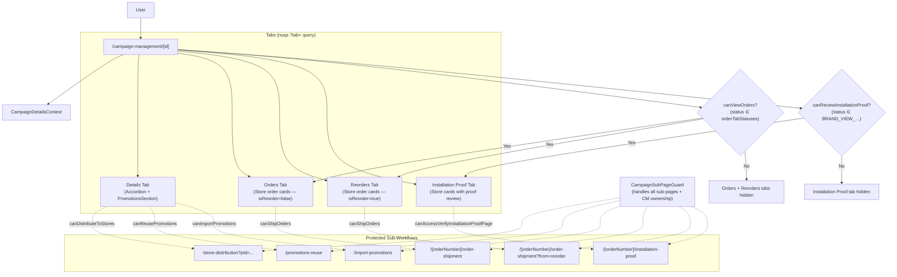

# Campaign Details Flow

## Overview

The Campaign Details view (`/campaign-management/[id]`) acts as a central hub for all actions pertaining to a specific campaign. It leverages a tabbed interface to separate core details (promotions included) from order logistics, reorder logistics, and installation proof review. The `[id]` URL segment is an **encoded** campaign ID — `decodeId()` is called server-side; an invalid or missing ID triggers Next.js `notFound()`.

## Routing Structure

The page encapsulates its complexity through sub-folders mapped as logical components:

- `(components)/campaign-detail-header`: Renders the back link, campaign name, status badge, type, and action buttons. Button visibility is derived by intersecting **capabilities** with **status eligibility** (e.g., `showEditButton = capabilities.canEditCampaign && isEditable`).
- `(components)/details-tab`: Contains `CampaignDetailsAccordion` (info cards + overview cards) and `PromotionsSection` (paginated promotions table with search).
- `(components)/(order-tabs)/orders-tab`: Renders `OrderTabContent` with `isReorder=false` — per-store order cards (accordion) with lazy-loaded promotion detail dialog on row click.
- `(components)/(order-tabs)/reorders-tab`: Renders `OrderTabContent` with `isReorder=true` — same UI, filtered to reorder stores.
- `(components)/installation-proof-tab`: Renders store cards filtered by `INSTALLATION_PROOF_TAB_ORDER_STATUSES`, each with installation proof review actions.

## Architecture

```text
┌──────────────────────────────────────────────────────────────────────────┐
│  CampaignDetailsPage (RSC — app/(protected)/campaign-management/[id])    │
│  decodeId(id) → campaignId  (notFound if invalid)                       │
│                                                                          │
│  ┌────────────────────────────────────────────────────────────────────┐  │
│  │  CampaignDetailsProvider (Client Context)                          │  │
│  │                                                                    │  │
│  │   ┌─────────────────────┐   ┌──────────────────────────────────┐  │  │
│  │   │ CampaignDetailHeader│   │ CampaignDetailTabs               │  │  │
│  │   │ (action buttons +   │   │ ┌────────┐ ┌──────┐ ┌────────┐  │  │  │
│  │   │  status badge +     │   │ │Details │ │Orders│ │Reorders│  │  │  │
│  │   │  type label)        │   │ │ Tab    │ │ Tab  │ │  Tab   │  │  │  │
│  │   └─────────────────────┘   │ └────────┘ └──────┘ └────────┘  │  │  │
│  │                             │ ┌─────────────────────┐          │  │  │
│  │                             │ │Installation Proof   │          │  │  │
│  │                             │ │      Tab            │          │  │  │
│  │                             │ └─────────────────────┘          │  │  │
│  │                             └──────────────────────────────────┘  │  │
│  │                                                                    │  │
│  │   useCampaignDetailsContext():                                    │  │
│  │   - campaignData (via GET_CAMPAIGN useSuspenseQuery)              │  │
│  │   - capabilities (CAMPAIGN_CAPABILITIES_MAP + CM ownership)       │  │
│  │   - promotionsLength / setPromotionsLength                        │  │
│  │   - formatDate (locale-aware Intl.DateTimeFormat)                 │  │
│  │   - encodedCampaignId (for sub-page navigation links)             │  │
│  │                                                                    │  │
│  └───────────────────────────┬────────────────────────────────────────┘  │
└──────────────────────────────┼───────────────────────────────────────────┘
                               ▼
                  ┌────────────────────────────┐
                  │    Apollo Client (Browser) │
                  │    GET_CAMPAIGN             │
                  └────────────────────────────┘
```

## Campaign Detail Header Actions

The header renders action buttons whose visibility is computed by combining capabilities with campaign-status sets:

| Button         | Capability                | Status Set                                         | Notes                                                         |
| -------------- | ------------------------- | -------------------------------------------------- | ------------------------------------------------------------- |
| Assign to Self | `canAssignSelfToCampaign` | `EDITABLE_CAMPAIGN_STATUSES` + no existing manager | Campaign Manager only                                         |
| Update Status  | `canEditStatus`           | `SHOW_EDIT_STATUS_BUTTON_STATUSES`                 | PSP Admin / Production Operator                               |
| Edit           | `canEditCampaign`         | `EDITABLE_CAMPAIGN_STATUSES`                       | Opens `CampaignDialog` in edit mode                           |
| Delete         | `canDeleteCampaign`       | `DELETABLE_CAMPAIGN_STATUSES`                      | Opens `DeleteCampaignDialog`, redirects to listing on success |
| Submit to PSP  | `canSubmitToPsp`          | `SUBMIT_TO_PSP_CAMPAIGN_STATUSES`                  | Disabled when `promotionsLength === 0`                        |
| Mark On Hold   | `canMarkOnHold`           | `MARK_ON_HOLD_CAMPAIGN_STATUSES`                   | Uses `CHANGE_CAMPAIGN_STATUS` mutation                        |
| Mark Complete  | `canMarkComplete`         | `MARK_COMPLETE_CAMPAIGN_STATUSES`                  | Uses `CHANGE_CAMPAIGN_STATUS` mutation                        |

### Header Mutations

| Mutation                  | Purpose                                              |
| ------------------------- | ---------------------------------------------------- |
| `DELETE_CAMPAIGN`         | Deletes the campaign and redirects to listing        |
| `SUBMIT_CAMPAIGN`         | Submits campaign to PSP, then `router.refresh()`     |
| `CHANGE_CAMPAIGN_STATUS`  | Transitions to ON_HOLD or COMPLETED                  |
| `ASSIGN_CAMPAIGN_MANAGER` | Claims the campaign for the current Campaign Manager |

## Tab System

`CampaignDetailTabs` uses `nuqs` (`useQueryState('tab')`) to persist the active tab in the URL query string (`?tab=order`, `?tab=reorder`, `?tab=installation-proof`). The `details` tab is the default and cleared from the URL via `clearOnDefault: true`.

### Tab Visibility

| Tab                    | Condition                                                                                    |
| ---------------------- | -------------------------------------------------------------------------------------------- |
| **Details**            | Always visible                                                                               |
| **Orders**             | `campaignData.status ∈ capabilities.orderTabStatuses`                                        |
| **Reorders**           | Same condition as Orders                                                                     |
| **Installation Proof** | `canReviewInstallationProof && status ∈ BRAND_VIEW_INSTALLATION_PROOF_TAB_CAMPAIGN_STATUSES` |

If the active `?tab=` value points to a hidden tab, the component falls back to `'details'`.

### Details Tab Content

```text
┌──────────────────────────────────────────────────────────┐
│  CampaignDetailsAccordion                                 │
│  ┌────────────────────────────────────────────────────┐  │
│  │  DetailInfoCards                                    │  │
│  │  (Brand name*, Campaign Manager, Start, End,       │  │
│  │   Expected Ship By)   * PSP Admin only             │  │
│  └────────────────────────────────────────────────────┘  │
│  ┌────────────────────────────────────────────────────┐  │
│  │  DetailOverviewCard (Objective + Description)       │  │
│  └────────────────────────────────────────────────────┘  │
└──────────────────────────────────────────────────────────┘
┌──────────────────────────────────────────────────────────┐
│  PromotionsSection                                        │
│  ┌──────────────────────────────────────────┐            │
│  │  PromotionsActions (count + search +     │            │
│  │  Import/Reuse/Add buttons)               │            │
│  └──────────────────────────────────────────┘            │
│  ┌──────────────────────────────────────────┐            │
│  │  PromotionsTable (server-paginated,      │            │
│  │  searchable, with View/Edit/Delete/      │            │
│  │  Distribute per-row actions)             │            │
│  └──────────────────────────────────────────┘            │
└──────────────────────────────────────────────────────────┘
```

### Orders / Reorders Tab Content

Both tabs render the same `OrderTabContent` component, differentiated by an `isReorder` prop. The component:

1. Fetches `GET_CAMPAIGN_STORE_ORDERS` via `useSuspenseQuery` (filtered by `selectedStoreId` for Store roles).
2. Filters stores by `isReorder` flag.
3. Provides **client-side search** (store name or order number) and client-side pagination via `useClientPagination`.
4. Renders each store as a `StoreOrderCard` accordion containing per-promotion rows.
5. `StoreOrderCard` conditionally shows:
   - **Ship Order** button → navigates to `[orderNumber]/order-shipment?from=reorder|order` (PSP Admin / Production Operator only).
   - **Submit Installation Proof** button → validates images per order item, uploads via `useInstallationUpload`, and calls `SUBMIT_INSTALLATION_PROOF` mutation (Store Admin / Store Operator only).
6. **View Promotion Dialog**: lazy-loads promotion detail via `GET_PROMOTION_DETAIL` when a row is clicked.

An `OrdersTabProvider` context manages ephemeral state for installation proof uploads: per-item images, notes, and validation flags.

### Installation Proof Tab Content

Renders store cards filtered by `INSTALLATION_PROOF_TAB_ORDER_STATUSES`. Each `InstallationProofStoreCard` shows promotion rows with their installation status, proof images, and reject/approve actions (Brand Admin only). See [installation-proof.md](installation-proof.md) for full details.

## Flow & Guard Protection

Sub-pages branching off the Detail view are gated by `CampaignSubPageGuard`.

> **Note:** All sub-pages (promotion workflows, ship orders, and installation proof verification) are protected by `CampaignSubPageGuard`, which accepts a `campaignSubPageName` enum value and resolves the correct capability flag internally. For Campaign Managers, the guard additionally verifies campaign ownership.



## Context & State Management

The `CampaignDetailsContext` provides the active layout state, handling caching rules via Apollo.

- **Dialog management is local state** inside the respective components (e.g., `CampaignDetailHeader` manages its own `isEditOpen`, `isDeleteOpen`, `isStatusOpen` booleans). The context does **not** hold dialog state.
- `promotionsLength` (tracked via `setPromotionsLength` called from `usePromotionsSection`) is surfaced in the header to conditionally show/hide the Submit to PSP button when the campaign has no promotions.
- **Campaign Manager ownership**: `useCampaignDetailsContext` checks if the current user is a `CAMPAIGN_MANAGER` and whether the campaign's `campaignManagerId` matches the current user. If not, capabilities are downgraded to `CAMPAIGN_MANAGER_UNASSIGNED_CAPABILITIES` (view-only + assign-to-self).

---

Last Update:- 11/05/2026
Agent name:- doc-updater
Author:- Vishav Ranta
