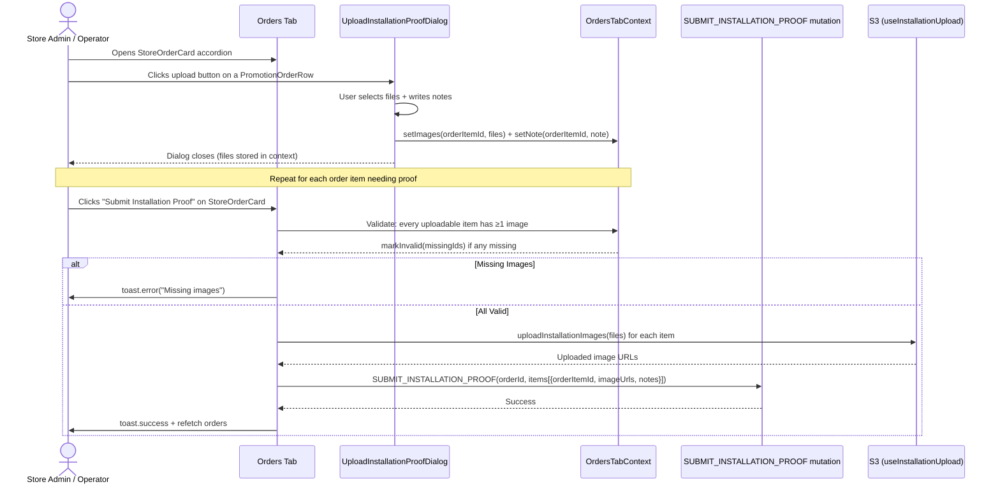

# Installation Proof

## Overview

The Installation Proof feature enables a two-party workflow for verifying that promotional materials have been physically installed at store locations:

1. **Store users** (Store Admin / Store Operator) upload installation proof photos and notes for received order items via the **Orders tab**.
2. **Brand users** (Brand Admin / Campaign Manager) review, approve, or reject those proofs via the **Installation Proof tab** and the **Verify Installation Proof sub-page**.

## Architecture

```text
┌────────────────────────────────────────────────────────────────────────────────┐
│  Campaign Details Page (/campaign-management/[id])                             │
│                                                                                │
│  ┌─────────────────────────────────────────────────────────────────────────┐   │
│  │  Orders / Reorders Tab (Store Admin / Store Operator)                   │   │
│  │                                                                         │   │
│  │  ┌───────────────────────────┐  ┌───────────────────────────────────┐   │   │
│  │  │ StoreOrderCard            │  │ OrdersTabContext                   │   │   │
│  │  │  (Submit Installation     │  │ (images, notes, validation per    │   │   │
│  │  │   Proof button)           │  │  orderItemId)                     │   │   │
│  │  │                           │  └───────────────────────────────────┘   │   │
│  │  │  ┌─────────────────────┐  │                                         │   │
│  │  │  │ PromotionOrderRow   │  │                                         │   │
│  │  │  │  (Upload dialog     │  │                                         │   │
│  │  │  │   trigger per item) │  │                                         │   │
│  │  │  └─────────────────────┘  │                                         │   │
│  │  └───────────────────────────┘                                         │   │
│  └─────────────────────────────────────────────────────────────────────────┘   │
│                                                                                │
│  ┌─────────────────────────────────────────────────────────────────────────┐   │
│  │  Installation Proof Tab (Brand Admin / Campaign Manager)                │   │
│  │                                                                         │   │
│  │  ┌─────────────────────────────────────────────────────────────────┐    │   │
│  │  │ InstallationProofStoreCard  (per store accordion)               │    │   │
│  │  │  ┌─────────────────────────────────────────────────────────┐    │    │   │
│  │  │  │ InstallationProofPromotionRow (per order item)           │    │    │   │
│  │  │  │  - Installation status badge                             │    │    │   │
│  │  │  │  - View proof images link                                │    │    │   │
│  │  │  │  - View rejection reason (if rejected)                   │    │    │   │
│  │  │  └─────────────────────────────────────────────────────────┘    │    │   │
│  │  │                                                                 │    │   │
│  │  │  [Verify] button → /[orderNumber]/installation-proof            │    │   │
│  │  └─────────────────────────────────────────────────────────────────┘    │   │
│  └─────────────────────────────────────────────────────────────────────────┘   │
└────────────────────────────────────────────────────────────────────────────────┘
                               │
                               ▼
┌────────────────────────────────────────────────────────────────────────────────┐
│  Verify Installation Proof Page                                                │
│  /campaign-management/[id]/[orderNumber]/installation-proof                   │
│                                                                                │
│  ┌─────────────────────────────────────────────────────────────────────────┐   │
│  │  VerifyInstallationProofProvider (Client Context)                       │   │
│  │  - campaignId, orderNumber, encodedCampaignId                          │   │
│  │  - storeOrder (via GET_CAMPAIGN_STORE_ORDER)                           │   │
│  │  - campaignName (via GET_CAMPAIGN)                                     │   │
│  │                                                                         │   │
│  │  ┌──────────────────────┐  ┌──────────────────────────────────────┐    │   │
│  │  │VerifyInstallation    │  │VerifyInstallationProofTable          │    │   │
│  │  │ProofHeader           │  │ (per-item approve/reject actions)    │    │   │
│  │  └──────────────────────┘  └──────────────────────────────────────┘    │   │
│  └─────────────────────────────────────────────────────────────────────────┘   │
└────────────────────────────────────────────────────────────────────────────────┘
```

## Workflow: Store User — Upload Proof



### OrdersTabContext

The `OrdersTabProvider` manages ephemeral state that persists across dialog opens/closes within the same tab session:

| Method                          | Description                                              |
| ------------------------------- | -------------------------------------------------------- |
| `getImages(orderItemId)`        | Returns saved `File[]` for an order item                 |
| `setImages(orderItemId, files)` | Saves files; auto-clears invalid state if files provided |
| `getNote(orderItemId)`          | Returns saved notes string for an order item             |
| `setNote(orderItemId, note)`    | Saves notes for an order item                            |
| `markInvalid(orderItemIds[])`   | Marks items as invalid (red border highlight)            |
| `isInvalid(orderItemId)`        | Check if an item is marked invalid                       |
| `clearInvalid(orderItemId)`     | Clears the invalid flag                                  |

### Upload Dialog

`UploadInstallationProofDialog` manages per-item file selection and notes:

- Accepts `initialFiles` and `initialNote` from the context (preserving state across re-opens).
- File validation via Zod schema (`upload-installation-proof-dialog.schema.ts`).
- On save, calls `onSave(files)` and `onNoteSave(note)` which update the `OrdersTabContext`.

### Submit Flow (StoreOrderCard)

The "Submit Installation Proof" button on each `StoreOrderCard`:

1. Identifies uploadable items (where `installationStatus ∈ SHOW_UPLOAD_INSTALLATION_BUTTON`).
2. Validates every uploadable item has at least one image via `getImages()`.
3. Calls `markInvalid()` for items missing images and shows a toast error.
4. If valid, uploads all images via `useInstallationUpload` (S3).
5. Submits the `SUBMIT_INSTALLATION_PROOF` mutation with uploaded URLs.
6. On success, refetches `GET_CAMPAIGN_STORE_ORDERS` and `GET_CAMPAIGN`.

## Workflow: Brand User — Review Proof

### Installation Proof Tab

Visible to Brand Admin and Campaign Manager when:

- `canReviewInstallationProof === true`
- `campaignData.status ∈ BRAND_VIEW_INSTALLATION_PROOF_TAB_CAMPAIGN_STATUSES`

The tab fetches `GET_CAMPAIGN_STORE_ORDERS` and filters stores by `INSTALLATION_PROOF_TAB_ORDER_STATUSES`. Each store is rendered as an `InstallationProofStoreCard` accordion:

- **Store header**: Store name, order number, total promotions, total quantity, order status.
- **Verify button**: Links to `/[orderNumber]/installation-proof` (shown when `SHOW_VERIFY_BUTTON.has(orderStatus) && canReviewInstallationProof`).
- **Promotion rows** (`InstallationProofPromotionRow`): Show promotion name, specs, quantities (total/shipped/remaining), installation status badge, and:
  - **View Proof** link → opens `ViewImagesDialog` with uploaded installation photos.
  - **View Rejection Reason** → opens `RejectionReasonDialog` (when status is REJECTED).

### Verify Installation Proof Sub-Page

Route: `/campaign-management/[id]/[orderNumber]/installation-proof`

Protected by `CampaignSubPageGuard` with `CAMPAIGN_SUB_PAGE_NAME.VERIFY_INSTALLATION_PROOF`.

#### Context: VerifyInstallationProofProvider

Fetches data via two `useSuspenseQuery` calls:

| Query                      | Purpose                                           |
| -------------------------- | ------------------------------------------------- |
| `GET_CAMPAIGN`             | Campaign name for header                          |
| `GET_CAMPAIGN_STORE_ORDER` | Store order details (items + installation status) |

Exposes: `campaignId`, `orderNumber`, `encodedCampaignId`, `storeOrder`, `campaignName`, `storeId`.

#### Components

- `VerifyInstallationProofHeader`: Back link + campaign/store name breadcrumb.
- `VerifyInstallationProofTable`: Per-item table with approve/reject actions for each order item.

### Reject Dialog

`RejectInstallationProofDialog` collects a rejection reason:

- Form validated via Zod schema (`reject-installation-proof-dialog.schema.ts`):
  - `notes`: required, max length from `VALIDATION_LENGTH.INSTALLATION_PROOF.REJECTION_REASON.MAX`.
- Uses `react-hook-form` with `zodResolver`.
- Shows a list of promotion names being rejected.
- On submit, calls the parent's `onSubmit(notes)` callback.

## Role Capabilities Summary

| Action                           | Store Admin | Store Op | Brand Admin | Campaign Mgr | Others |
| -------------------------------- | :---------: | :------: | :---------: | :----------: | :----: |
| Upload installation proof photos |     ✅      |    ✅    |     ❌      |      ❌      |   ❌   |
| Submit installation proof        |     ✅      |    ✅    |     ❌      |      ❌      |   ❌   |
| View installation proof images   |     ✅      |    ✅    |     ✅      |      ✅      |   ✅   |
| View rejection reasons           |     ✅      |    ✅    |     ✅      |      ✅      |   ✅   |
| Review (approve/reject) proofs   |     ❌      |    ❌    |     ✅      |      ✅      |   ❌   |
| Access verify sub-page           |     ❌      |    ❌    |     ✅      |      ✅      |   ❌   |

## Accessibility

- Promotion rows use `role="listitem"` with `aria-label` set to the promotion name.
- File upload dialogs have `aria-label` on the form element.
- The reject dialog has `aria-labelledby` and `aria-describedby` linking to the title and description.
- Loading states are announced via `aria-live="polite"` regions.
- `disablePointerDismissal` is set during upload submissions to prevent accidental closure.

---

Last Update:- 11/05/2026
Agent name:- doc-updater
Author:- Vishav Ranta
