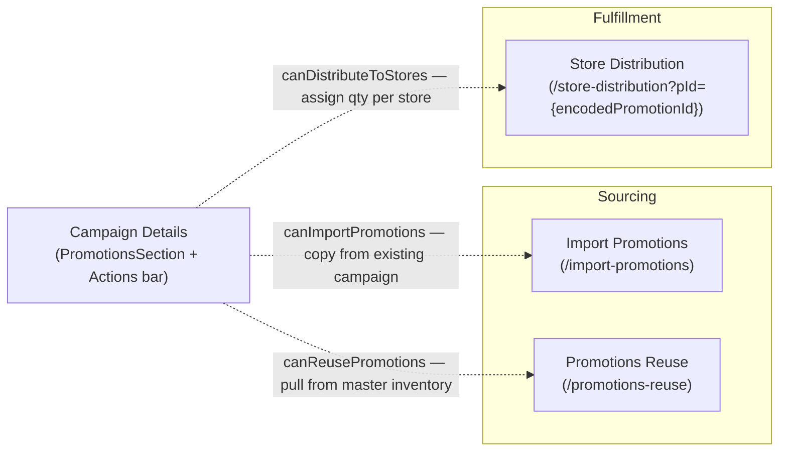
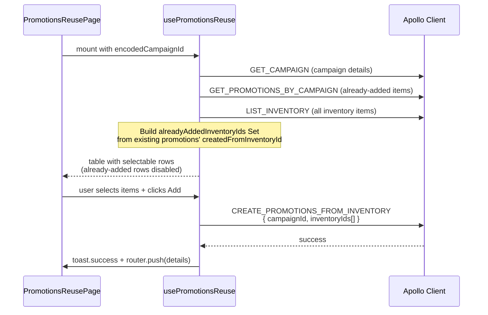

# Promotions & Distribution

## Overview

Managing promotions is the core functional requirement of a Campaign. This document outlines the complex workflows involved in acquiring and distributing promotional items within a specific campaign (`/campaign-management/[id]`).

## Sub-Workflows

All three sub-pages are accessible only to Brand Admin and Campaign Manager (gated by `CampaignSubPageGuard` checking the corresponding `canAccess*Page` capability). For Campaign Managers, the guard additionally verifies campaign ownership.

---

### 1. Import Promotions (`/[id]/import-promotions`)

Streamlines the duplication of promotions from another past or parallel **campaign** into the current one.

| Detail             | Value                                                                                                                    |
| ------------------ | ------------------------------------------------------------------------------------------------------------------------ |
| Context            | `ImportPromotionsContext` (via `ImportPromotionsProvider`)                                                               |
| Status guard       | `ImportPromotionsProvider` wraps children in `CampaignGuard` — only campaigns in an editable status can be imported into |
| Import mode        | Configurable via radio buttons (`ImportPromotionMode`): `COPY` mode (default)                                            |
| Source selection   | `SourceCampaignDropdown` — lists other campaigns (filtered by `brandId`)                                                 |
| Destination banner | `DestinationCampaignName` shows the target campaign name inline in a blue info card                                      |
| Table              | `ImportPromotionsTable` — shows promotions from the selected source campaign with row selection                          |

#### Import Promotions Context

`useImportPromotionsContext` manages:

| State                 | Description                                                      |
| --------------------- | ---------------------------------------------------------------- |
| `destinationCampaign` | Fetched via `GET_CAMPAIGN` (destination campaign data)           |
| `brandId`             | Derived from destination campaign for filtering source campaigns |
| `importAction`        | `ImportPromotionMode` (COPY)                                     |
| `sourceCampaignId`    | Selected source campaign                                         |
| `rowSelection`        | TanStack `RowSelectionState` for picking specific promotions     |
| `isImporting`         | Loading state for the mutation                                   |

#### Import Mutation

Uses `IMPORT_PROMOTIONS` mutation with variables: `targetCampaignId`, `sourceCampaignId`, `promotionIds[]`, `mode`. On success:

- Evicts `promotionsByCampaign` and `campaign` cache fields.
- Calls `cache.gc()` for cleanup.
- Redirects back to campaign details page.
- Triggers `router.refresh()`.

---

### 2. Promotions Reuse (`/[id]/promotions-reuse`)

Allows a user to cherry-pick global **inventory items** and convert them into campaign-specific promotions.

| Detail            | Value                                                                                                   |
| ----------------- | ------------------------------------------------------------------------------------------------------- |
| Main hook         | `usePromotionsReuse` (lives in `promotions-reuse/` page folder)                                         |
| Data source       | `LIST_INVENTORY` (all PSP+brand inventory, full page via `ALL_RECORDS_PAGE_SIZE`)                       |
| Duplication guard | `GET_PROMOTIONS_BY_CAMPAIGN` fetched upfront; items already in the campaign are marked as already-added |
| Table mode        | TanStack table **client-side** (full dataset loaded, no server-side pagination)                         |
| Selection         | Row selection enabled — disabled for items already added (via `enableRowSelection` callback)            |
| View details      | `ViewPromotionDialog` with `showStores=false` and `showNeedDesign=true`                                 |
| Mutation          | `CREATE_PROMOTIONS_FROM_INVENTORY`                                                                      |
| Post-mutation     | Router pushes back to campaign details page                                                             |

#### Promotions Reuse Data Flow

---

### 3. Store Distribution (`/[id]/store-distribution?pId={encodedPromotionId}`)

Assigns target quantities of a **specific promotion** across eligible stores for the campaign.

| Detail            | Value                                                                                                                  |
| ----------------- | ---------------------------------------------------------------------------------------------------------------------- |
| Entry requirement | Must supply `?pId=` query param (encoded promotion ID); missing or invalid values redirect to dashboard                |
| ID validation     | Both `id` and `pId` are decoded server-side with `decodeId()` — invalid decodes redirect to `ProtectedRoute.DASHBOARD` |
| Table mode        | TanStack React Table for multi-row quantity entry                                                                      |
| Validation        | Per-row validation against maximum available quantity                                                                  |
| Main component    | `StoreDistributionForm` (receives `encodedCampaignId`, `campaignId`, `promotionId`)                                    |

---

## Promotions Section (Details Tab)

The `PromotionsSection` component on the Details tab is the entry point for all promotion workflows. It consists of:

1. **`PromotionsActions`**: Renders the total count, search input, and capability-gated action buttons (Import, Reuse, Add, etc.).
2. **`PromotionsTable`**: Server-paginated TanStack table with per-row actions (View, Edit, Delete, Distribute).

### Promotions Table Data Fetching

`usePromotionsSection` manages:

- `GET_PROMOTIONS_BY_CAMPAIGN` query with server-side pagination and sorting.
- Debounced search with `SEARCH_DEBOUNCE_MS` delay.
- Reports `totalCount` back to `CampaignDetailsContext` via `setPromotionsLength` (used to enable/disable the Submit to PSP button).
- For Store roles, filters by `selectedStoreId`.

### Delete Promotion Dialog

`DeletePromotionDialog` owns its own `DELETE_PROMOTION` mutation instance with `refetchQueries: ['GetPromotionsByCampaign']` to refresh the table after deletion.

## Apollo Cache Strategy

When performing large-scale actions (e.g., `IMPORT_PROMOTIONS`, `CREATE_PROMOTIONS_FROM_INVENTORY`, `DISTRIBUTE_PROMOTIONS_TO_STORES`), the UI must react instantly. We employ manual Apollo Cache eviction and garbage collection (`cache.gc()`) inside the mutation hooks to purge stale campaign and promotion data. This prevents hard page reloads and adheres to our SPA architecture.

---

Last Update:- 11/05/2026
Agent name:- doc-updater
Author:- Vishav Ranta
