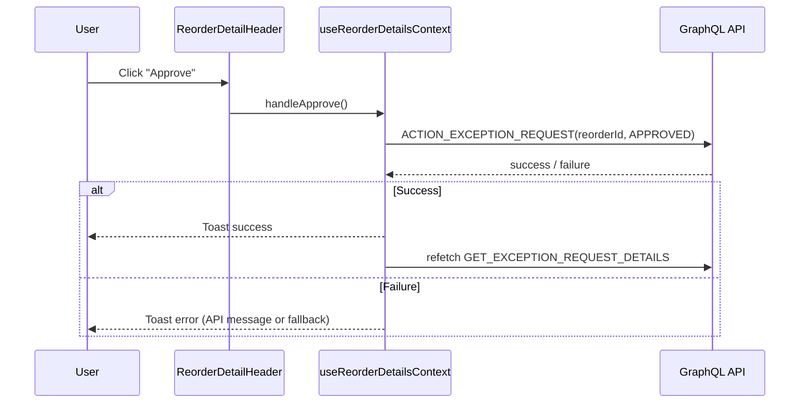
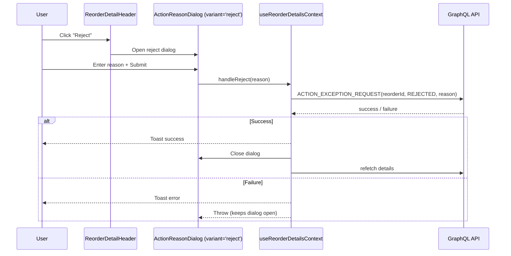
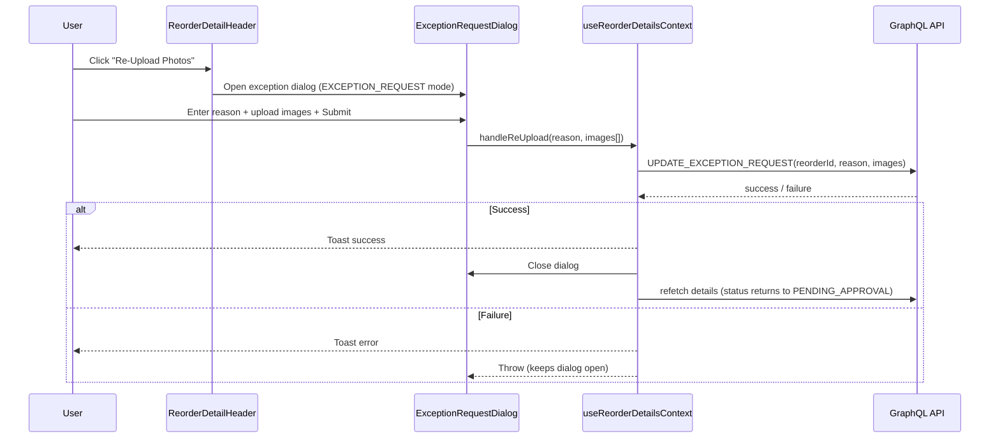

# Exception Request — Detail & Actions

This document covers the reorder detail page (`/exception-request/[encodedReorderId]`) including the info section, promotions table, and all action flows (approve, reject, cancel, re-upload).

## Page Structure

The detail page decodes the URL parameter via `decodeId(encodedReorderId)`. If the decoded ID is falsy, `notFound()` is called immediately (server-side 404).

Three sections are rendered within `ReorderDetailsProvider`:

1. **ReorderDetailHeader** — Back link, title with shipment number, and action buttons
2. **ReorderInfoSection** — Campaign, store, status, reason, and rejection/cancellation reason cards
3. **ReorderPromotionTable** — Client-side sorted/filtered/paginated promotion items with discrepancy totals

Each section has its own `<SectionErrorBoundary>` + `<Suspense>` wrapper with a dedicated skeleton.

## Context: ReorderDetailsProvider

`useReorderDetailsContext` is the core hook. It:

1. Fetches `GET_EXCEPTION_REQUEST_DETAILS` via `useSuspenseQuery` (network-only)
2. Resolves capabilities with an **unassigned Campaign Manager override**: if the current user is a `CAMPAIGN_MANAGER` and `exceptionRequest.campaignManagerId !== currentUserId`, the restricted `EXCEPTION_REQUEST_CAMPAIGN_MANAGER_UNASSIGNED_CAPABILITIES` set is used instead
3. Manages dialog open/close state for reject, cancel, re-upload, and view-photos dialogs
4. Exposes mutation handlers: `handleApprove`, `handleReject`, `handleCancel`, `handleReUpload`

### Exposed State

| Property           | Type                           | Description                                                                             |
| ------------------ | ------------------------------ | --------------------------------------------------------------------------------------- |
| `exceptionRequest` | `ExceptionRequestDetailType`   | Full detail object from the query                                                       |
| `caps`             | `ExceptionRequestCapabilities` | Resolved capabilities (role + assignment-aware)                                         |
| `isWorking`        | `boolean`                      | `true` while any mutation is in flight                                                  |
| Dialog states      | `boolean` + setters            | `isRejectDialogOpen`, `isCancelDialogOpen`, `isExceptionDialogOpen`, `isViewPhotosOpen` |

## Header & Action Buttons

`ReorderDetailHeader` renders the back navigation link, page title (with shipment number), and conditionally renders action buttons based on **both** client capabilities (`caps`) and server-returned permission flags (`canApprove`, `canReject`, `canCancel`, `canUpdate`).

### Action Visibility Rules

All actions also require `status === PENDING_APPROVAL` except Re-Upload which requires `status === REJECTED`:

| Action           | Capability Check         | Server Flag  | Status Required    |
| ---------------- | ------------------------ | ------------ | ------------------ |
| Approve          | `caps.canApproveRequest` | `canApprove` | `PENDING_APPROVAL` |
| Reject           | `caps.canRejectRequest`  | `canReject`  | `PENDING_APPROVAL` |
| Cancel           | `caps.canCancelRequest`  | `canCancel`  | `PENDING_APPROVAL` |
| Re-Upload Photos | `caps.canReUploadPhotos` | `canUpdate`  | `REJECTED`         |

All buttons are disabled while `isWorking === true`.

## Action Flows

### Approve

### Reject

### Cancel

Same flow as Reject but with `variant='cancel'` and `action: CANCELLED`.

### Re-Upload Photos

## ActionReasonDialog

A shared dialog component used by both **Reject** and **Cancel** flows. It is parameterized by `variant: 'reject' | 'cancel'` which selects the appropriate i18n namespace for title, description, and labels.

### Form Validation

Uses Zod schema (`createActionReasonSchema`) with React Hook Form + `zodResolver`:

| Field    | Validation                                                                           |
| -------- | ------------------------------------------------------------------------------------ |
| `reason` | Required, trimmed, min 1 char, max `VALIDATION_LENGTH.SHIPMENT_EXCEPTION.REASON.MAX` |

The dialog blocks dismissal (`disablePointerDismissal`) while `isSubmitting` is true. On successful submission, the form is reset automatically.

## Info Section

`ReorderInfoSection` renders a read-only grid of metadata:

| Row                 | Fields                                                                                                          |
| ------------------- | --------------------------------------------------------------------------------------------------------------- |
| Row 1               | Campaign name, Store (name + address)                                                                           |
| Row 2               | Status (`ExceptionRequestStatusCell`), Reason for Exception                                                     |
| Row 3 (conditional) | Rejection reason (when `REJECTED`) or Cancellation reason (when `CANCELLED`) — rendered in a highlighted `Card` |

## Promotions Table

`ReorderPromotionTable` uses **client-side** sorting, filtering, and pagination (unlike the listing page which is server-side). All promotion items are loaded in a single `GET_EXCEPTION_REQUEST_DETAILS` query.

### Table Columns

| Column             | Accessor            | Sortable | Notes                                             |
| ------------------ | ------------------- | -------- | ------------------------------------------------- |
| Promotion Name     | `promotionName`     | Yes      | Also used as the client-side search/filter target |
| Shipped QTY        | `originalQuantity`  | No       | Original shipped quantity                         |
| Valid Received QTY | _(computed)_        | No       | `originalQuantity - requestedQuantity` (min 0)    |
| Exception Type     | `exceptionType`     | No       | Mapped to labels: Missing, Incorrect, Damaged     |
| Discrepancy QTY    | `requestedQuantity` | No       | Quantity requested for reorder                    |

### Table Footer

A summary row displays **Total Items** with the sum of all `requestedQuantity` values (`totalDiscrepancyQty`).

### Client-Side Processing

`useReorderPromotionTable` configures TanStack React Table with:

- `getSortedRowModel()` — client-side sorting (default: `promotionName` ascending)
- `getFilteredRowModel()` — client-side text filter on `promotionName`
- `getPaginationRowModel()` — client-side pagination (`DEFAULT_PAGE_SIZE`)

### View Photos

When `caps.canViewPhotos === true` and images exist, a "View Photos" button opens `ViewImagesDialog` — a lightbox-style gallery showing all uploaded evidence images.

### Re-Upload Dialog

The `ExceptionRequestDialog` (imported from the shipments module) is reused here in `EXCEPTION_REQUEST` mode. It accepts a `shipmentId` and calls `handleReUpload` with a reason and `ReorderImageInput[]` array on submission.

## Security Considerations

- **Double-gated actions**: All mutations check both client-side capabilities (`useCapabilities`) and server-returned permission flags (`canApprove` / `canReject` / `canCancel` / `canUpdate`). Even if client-side checks are bypassed, the backend enforces authorization.
- **Encoded IDs**: Internal reorder IDs are obfuscated in URLs via `encodeId` / `decodeId` to prevent enumeration.
- **Campaign Manager assignment check**: Unassigned Campaign Managers receive reduced capabilities — they can view photos but cannot approve, reject, or cancel requests.

---

Last Update:- 11/05/2026
Agent name:- doc-updater
Author:- Vishav Ranta
