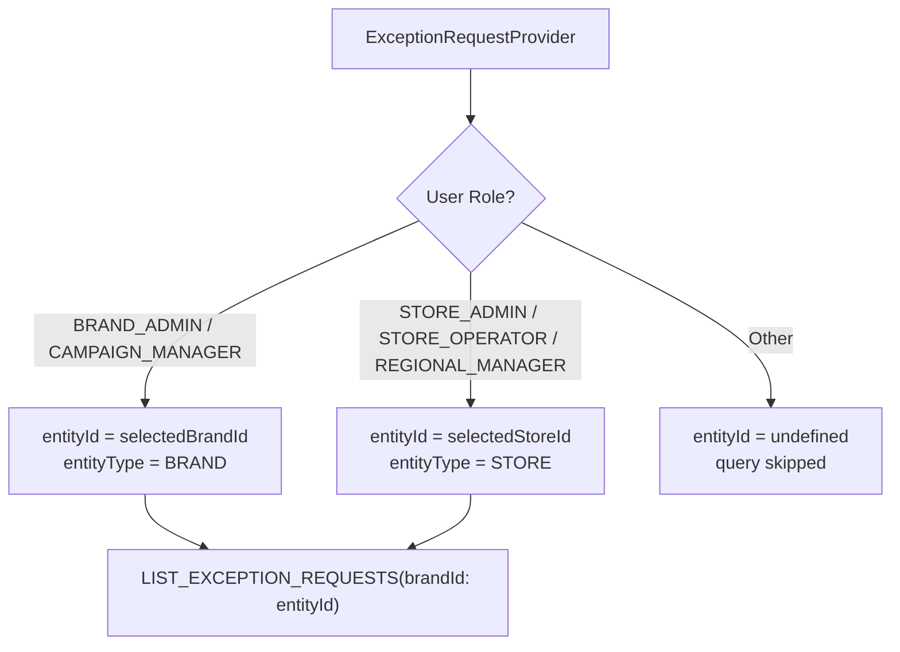
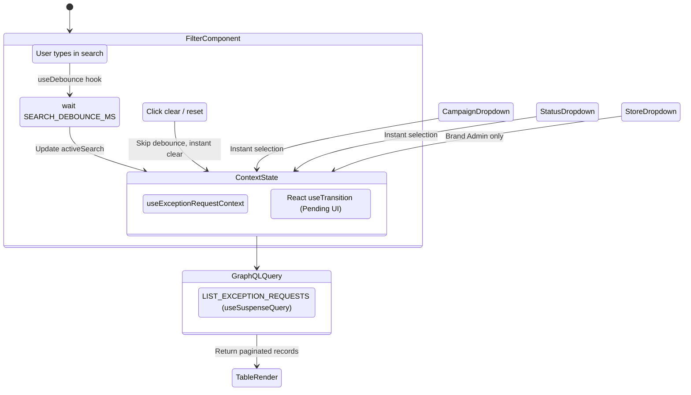

# Exception Request — Listing & Filtering

This document describes how the exception request listing page implements server-assisted data grids with role-scoped filtering.

## Page Structure

The listing page (`/exception-request`) renders three main sections in order:

1. **Stat Cards** — Aggregate status counts (Pending Approval, Approved, Rejected, Cancelled)
2. **Filters** — Search, campaign, store (Brand Admin only), and status dropdowns
3. **Table** — Paginated, sortable exception request list with navigation links

All sections consume data from a single `LIST_EXCEPTION_REQUESTS` query orchestrated by `ExceptionRequestContext`.

## Context & Entity Scoping

The `ExceptionRequestProvider` determines the API scope based on the current user's role:



The `entityType` value is used as a dynamic GraphQL variable key — `brandId` or `storeId` — ensuring correct backend scoping.

## Stat Cards

`ExceptionRequestStatCards` displays four `<StatCard>` components sourced from `statusCounts` in the query response:

| Card             | Icon              | Field                          |
| ---------------- | ----------------- | ------------------------------ |
| Pending Approval | `ClockIcon`       | `statusCounts.pendingApproval` |
| Approved         | `CheckCircleIcon` | `statusCounts.approved`        |
| Rejected         | `AlertCircleIcon` | `statusCounts.rejected`        |
| Cancelled        | `PauseCircleIcon` | `statusCounts.cancelled`       |

> The `total` count exists in the API response but is currently **commented out** in the UI.

## Filtering Architecture



### Filter Inputs

| Filter       | Type            | Sentinel Value      | Role Restriction | Notes                                                                                                     |
| ------------ | --------------- | ------------------- | ---------------- | --------------------------------------------------------------------------------------------------------- |
| `search`     | Debounced text  | `''`                | All roles        | Full-text search. Uses `skipDebounceRef` for instant clear.                                               |
| `campaignId` | Select dropdown | `__ALL_CAMPAIGNS__` | All roles        | Populated from `filterOptions.campaigns` (sorted alphabetically).                                         |
| `storeId`    | Select dropdown | `__ALL_STORES__`    | Brand Admin only | Populated from `filterOptions.stores` (sorted alphabetically). Conditionally rendered via `isBrandAdmin`. |
| `status`     | Select dropdown | `__ALL_STATUSES__`  | All roles        | Static options: `PENDING_APPROVAL`, `APPROVED`, `REJECTED`, `CANCELLED`.                                  |

All filter changes reset `pageIndex` to `0` and are wrapped in `startTransition` for pending UI support.

### Reset

`PageResetButton` calls `resetFilters()` which restores the default filter state for all fields simultaneously.

## Table Columns

The `ExceptionRequestTable` uses TanStack React Table with `manualSorting` and `manualPagination` delegating to the server.

| Column        | Accessor         | Sortable | Notes                                                                   |
| ------------- | ---------------- | -------- | ----------------------------------------------------------------------- |
| Issue Number  | `issueNumber`    | Yes      | Renders as a `<Link>` to `/exception-request/[encodedReorderId]`        |
| Campaign Name | `campaignName`   | No       | Renders as a `<Link>` to `/campaign-management/[encodedId]?tab=reorder` |
| Shipment No   | `shipmentNumber` | Yes      | Includes `totalQuantity` units sub-text                                 |
| Order Number  | `orderNumber`    | Yes      | Plain text                                                              |
| Store Name    | `storeName`      | No       | **Conditionally shown** — only when `caps.showStoreColumn === true`     |
| Status        | `status`         | No       | Uses `<ExceptionRequestStatusCell>` component                           |

### Column Sort Map

Only three columns are wired to server-side sorting:

```
issueNumber  → ExceptionRequestSortField.ISSUE_NUMBER
shipmentId   → ExceptionRequestSortField.SHIPMENT_NUMBER
orderNumber  → ExceptionRequestSortField.ORDER_NUMBER
```

Default sort: `issueNumber` descending.

Unrecognized column IDs fall back to `ExceptionRequestSortField.CAMPAIGN_NAME`.

### Conditional Store Column

The `showStoreColumn` capability controls whether the "Store Name" column is included. It is `true` for Brand Admin and Campaign Manager roles, `false` for store-level roles.

## Responsiveness & Loading States

1. **Root Load**: Full-page skeleton (`loading.tsx`) with skeleton approximations for header, stat cards, filters, and table.
2. **Stat Cards Skeleton**: `ExceptionRequestStatCardsSkeleton` renders 5 skeleton cards as the Suspense fallback.
3. **Table Skeleton**: `ExceptionRequestTableSkeleton` is the `<Suspense>` fallback inside `SectionErrorBoundary`.
4. **Inline Loading**: `ExceptionRequestTableInlineLoading` renders during transitions. The `isPending` flag drives `aria-busy` on the `<Table>` and the sr-only live region announces loading state (WCAG 4.1.3).
5. **Accessibility**: All filter inputs have `aria-label` attributes; table headers use `aria-sort`; sticky table headers with `scope='col'`.

---

Last Update:- 11/05/2026
Agent name:- doc-updater
Author:- Vishav Ranta
