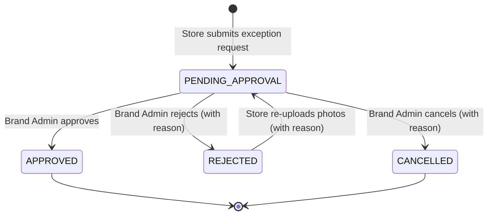

# Exception Request Management — Overview

## Overview

The Exception Request feature enables stores to report shipment discrepancies (missing, damaged, or incorrect items) and request reorders. Brand Admins and Campaign Managers review these requests and can approve, reject, or cancel them. Store users can re-upload evidence photos when a request has been rejected.

The feature spans two routes:

| Route                                   | Purpose                                                      |
| --------------------------------------- | ------------------------------------------------------------ |
| `/exception-request`                    | Listing page — stat cards, filters, paginated table          |
| `/exception-request/[encodedReorderId]` | Detail page — info section, promotions table, action buttons |

## Status

Implemented

## Architecture Diagram

```text
┌───────────────────────────────────────────────────────────────────────────────────┐
│  ExceptionRequestPage (RSC — app/(protected)/exception-request/page.tsx)          │
│                                                                                   │
│  ┌─────────────────────────────────────────────────────────────────────────────┐  │
│  │  ExceptionRequestProvider (Client Context)                                  │  │
│  │    Derives entityId + entityType from user role + GlobalProtectedContext     │  │
│  │                                                                             │  │
│  │   ┌──────────────────────┐                                                  │  │
│  │   │  ExceptionRequest    │                                                  │  │
│  │   │  StatCards (Client)  │ ← statusCounts from LIST_EXCEPTION_REQUESTS      │  │
│  │   └──────────────────────┘                                                  │  │
│  │   ┌──────────────────────┐                                                  │  │
│  │   │  ExceptionRequest    │                                                  │  │
│  │   │  Filters (Client)    │ ← filterOptions from LIST_EXCEPTION_REQUESTS     │  │
│  │   └──────────────────────┘                                                  │  │
│  │   ┌──────────────────────────────────────────────────────────────────────┐   │  │
│  │   │  SectionErrorBoundary                                                │   │  │
│  │   │    <Suspense fallback=<ExceptionRequestTableSkeleton>>               │   │  │
│  │   │      ExceptionRequestTable (Client)                                  │   │  │
│  │   │        → Link to /exception-request/[encodedReorderId]               │   │  │
│  │   └──────────────────────────────────────────────────────────────────────┘   │  │
│  └─────────────────────────────────────────────────────────────────────────────┘  │
└───────────────────────────────────────────────────────────────────────────────────┘
                                         │ click issue number
                                         ▼
┌───────────────────────────────────────────────────────────────────────────────────┐
│  ReorderDetailPage (RSC — [encodedReorderId]/page.tsx)                            │
│    decodeId(encodedReorderId) → reorderId  (notFound() if invalid)                │
│                                                                                   │
│  ┌─────────────────────────────────────────────────────────────────────────────┐  │
│  │  ReorderDetailsProvider (Client Context)                                    │  │
│  │    GET_EXCEPTION_REQUEST_DETAILS + ACTION / UPDATE mutations                │  │
│  │                                                                             │  │
│  │   ┌──────────────────────────────┐                                          │  │
│  │   │  ReorderDetailHeader         │ ← back link, title, action buttons       │  │
│  │   │  (Approve / Reject / Cancel  │   (capability-gated + status-gated)      │  │
│  │   │   / Re-Upload Photos)        │                                          │  │
│  │   └──────────────────────────────┘                                          │  │
│  │   ┌──────────────────────────────┐                                          │  │
│  │   │  ReorderInfoSection          │ ← campaign, store, status, reason,       │  │
│  │   │                              │   rejection/cancellation reason           │  │
│  │   └──────────────────────────────┘                                          │  │
│  │   ┌──────────────────────────────────────────────────────────────────────┐   │  │
│  │   │  ReorderPromotionTable       │ ← client-side sorted/filtered/paginated  │  │
│  │   │    + ExceptionRequestDialog  │   promotion items with discrepancy totals│  │
│  │   │    + ViewImagesDialog        │                                          │  │
│  │   └──────────────────────────────────────────────────────────────────────┘   │  │
│  └─────────────────────────────────────────────────────────────────────────────┘  │
└───────────────────────────────────────────────────────────────────────────────────┘
                                         │
                                         ▼
                         ┌──────────────────────────────┐
                         │   Apollo Client (browser)     │
                         │  LIST_EXCEPTION_REQUESTS      │
                         │  GET_EXCEPTION_REQUEST_DETAILS│
                         │  ACTION_EXCEPTION_REQUEST     │
                         │  UPDATE_EXCEPTION_REQUEST     │
                         └──────────────────────────────┘
```

## Key Concepts

| Concept                         | Description                                                                                                                                                                                                                                                                   |
| ------------------------------- | ----------------------------------------------------------------------------------------------------------------------------------------------------------------------------------------------------------------------------------------------------------------------------- |
| **ExceptionRequestContext**     | Listing-page context. Derives `entityId` + `entityType` from the current user role (`BRAND`/`STORE`). Wraps `useExceptionRequestContext` which manages table state, filters, and `LIST_EXCEPTION_REQUESTS` query.                                                             |
| **ReorderDetailsContext**       | Detail-page context. Wraps `useReorderDetailsContext` which fetches `GET_EXCEPTION_REQUEST_DETAILS`, manages dialog states, and exposes approve/reject/cancel/re-upload handlers.                                                                                             |
| **Capability-Gated Actions**    | All actions use `useCapabilities(EXCEPTION_REQUEST_CAPABILITIES_MAP, DEFAULT_EXCEPTION_REQUEST_CAPABILITIES)`. A special override `EXCEPTION_REQUEST_CAMPAIGN_MANAGER_UNASSIGNED_CAPABILITIES` applies when a Campaign Manager is viewing a request they are not assigned to. |
| **Encoded Reorder IDs**         | The dynamic route segment `[encodedReorderId]` uses `encodeId` / `decodeId` from `@/lib` to obfuscate internal IDs in URLs. Invalid encoded IDs trigger `notFound()`.                                                                                                         |
| **Status Lifecycle**            | Requests follow: `PENDING_APPROVAL` → `APPROVED` / `REJECTED` / `CANCELLED`. Rejected requests can be re-uploaded (returns to `PENDING_APPROVAL`).                                                                                                                            |
| **Server-returned Permissions** | Each exception request object includes `canApprove`, `canReject`, `canCancel`, `canUpdate` boolean flags from the API, checked **in addition to** client-side capability checks.                                                                                              |

## Role Access Matrix

| Role                          | Entity Scope | Can Approve | Can Reject | Can Cancel | Can Re-Upload | Can View Photos | Store Column |
| ----------------------------- | ------------ | ----------- | ---------- | ---------- | ------------- | --------------- | ------------ |
| Brand Admin                   | `brandId`    | Yes         | Yes        | Yes        | No            | Yes             | Yes          |
| Campaign Manager (assigned)   | `brandId`    | Yes         | Yes        | Yes        | No            | Yes             | Yes          |
| Campaign Manager (unassigned) | `brandId`    | No          | No         | No         | No            | Yes             | Yes          |
| Store Admin                   | `storeId`    | No          | No         | No         | Yes           | No              | No           |
| Store Operator                | `storeId`    | No          | No         | No         | Yes           | No              | No           |
| Regional Manager              | `storeId`    | No          | No         | No         | No            | No              | No           |

## GraphQL Operations

### Queries

| Query                           | Purpose                                                                                                                                   |
| ------------------------------- | ----------------------------------------------------------------------------------------------------------------------------------------- |
| `LIST_EXCEPTION_REQUESTS`       | Paginated listing with filters, status counts, and filter options (campaigns & stores). Accepts `brandId` or `storeId` depending on role. |
| `GET_EXCEPTION_REQUEST_DETAILS` | Full detail view for a single reorder including items, images, store info, and action permissions.                                        |

### Mutations

| Mutation                   | Purpose                                                                        |
| -------------------------- | ------------------------------------------------------------------------------ |
| `ACTION_EXCEPTION_REQUEST` | Approve, reject (with reason), or cancel (with reason) a request.              |
| `UPDATE_EXCEPTION_REQUEST` | Re-upload photos with a reason after rejection. Accepts `ReorderImageInput[]`. |

## Status Lifecycle



## Loading States

| Skeleton                             | Used By                                                        |
| ------------------------------------ | -------------------------------------------------------------- |
| `ExceptionRequestStatCardsSkeleton`  | Listing page stat cards Suspense fallback                      |
| `ExceptionRequestTableSkeleton`      | Listing page table Suspense fallback                           |
| `ExceptionRequestTableInlineLoading` | Table inline loading during filter/sort/pagination transitions |
| `ReorderDetailHeaderLoading`         | Detail page header Suspense fallback                           |
| `ReorderInfoSectionLoading`          | Detail page info section Suspense fallback                     |
| `ReorderPromotionTableLoading`       | Detail page promotions table Suspense fallback                 |
| `loading.tsx` (listing)              | Full-page Next.js loading boundary                             |
| `loading.tsx` (detail)               | Full-page Next.js loading boundary for `[encodedReorderId]`    |

## Error Handling

All async sections on both pages are wrapped in `<SectionErrorBoundary>` + `<Suspense>` for graceful degradation. Mutation errors are surfaced via `sonner` toast notifications with translated messages.

## Related Documentation

- [Exception Request Listing & Filtering](exception-request-listing.md)
- [Exception Request Detail & Actions](exception-request-detail.md)

---

Last Update:- 11/05/2026
Agent name:- doc-updater
Author:- Vishav Ranta
