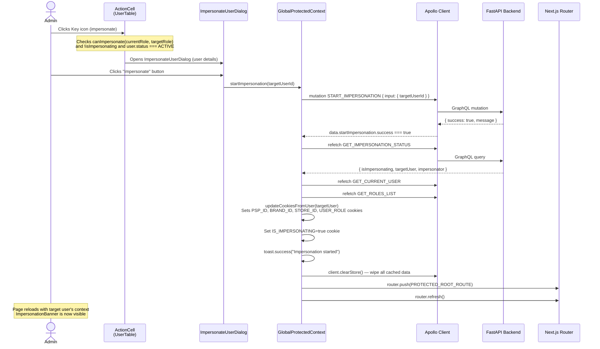
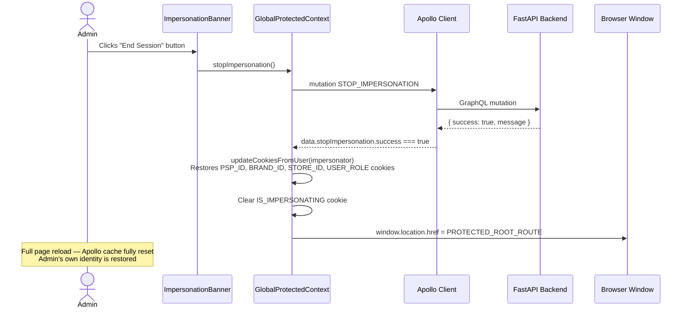
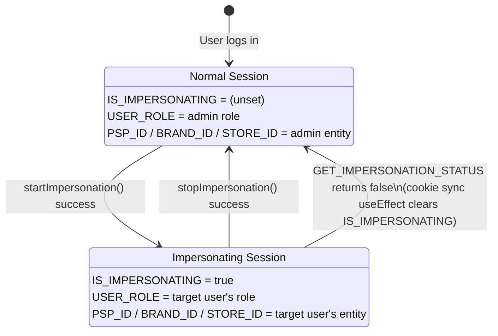

# Impersonation Flow

Detailed lifecycle for starting and stopping an impersonation session.

---

## Start Impersonation Flow

---

## Stop Impersonation Flow

---

## Cookie State Machine

The following cookies are managed throughout the impersonation lifecycle. The server reads these in `ProtectedRootLayout` to seed the initial client state with zero waterfall.

---

## ImpersonationBanner Logic

The banner (`ImpersonationBanner`) is rendered inside `ProtectedRootLayout` above all page content. It:

1. Reads `isImpersonating` from `GlobalProtectedContext`.
2. If `false` → renders `null` (invisible).
3. If `true` → renders a fixed top bar (`z-50`) with:
   - A message showing the **impersonated user's role** and **entity name** (PSP / Brand / Store name derived from `currentUserData`).
   - An **End Session** button that calls `stopImpersonation()`.

The `useImpersonatedEntityName()` hook inside the banner maps the impersonated user's role to the correct entity name:

| Role          | Entity Name Source  |
| ------------- | ------------------- |
| `PSP_ADMIN`   | `me.psps[0].name`   |
| `BRAND_ADMIN` | `me.brands[0].name` |
| `STORE_ADMIN` | `me.stores[0].name` |

---

## API Error Codes

The following backend error codes are handled and translated in all three locales (`en`, `es`, `fr`):

| Error Code                            | Meaning                                                 |
| ------------------------------------- | ------------------------------------------------------- |
| `IMPERSONATION_ALREADY_ACTIVE`        | A session is already in progress                        |
| `IMPERSONATION_CHAIN_NOT_ALLOWED`     | Nested impersonation is forbidden                       |
| `IMPERSONATION_DISABLED`              | Feature is disabled server-side                         |
| `IMPERSONATION_ENTITY_SCOPE_MISMATCH` | Target user's entity scope doesn't match required scope |
| `IMPERSONATION_FAILED_START`          | General start failure                                   |
| `IMPERSONATION_FAILED_STOP`           | General stop failure                                    |
| `IMPERSONATION_INVALID_TARGET`        | Target user ID is invalid                               |
| `IMPERSONATION_NOT_ACTIVE`            | No active session to stop                               |
| `IMPERSONATION_NOT_ALLOWED`           | Caller lacks permission to impersonate this user        |
| `IMPERSONATION_TARGET_INACTIVE`       | Target user is not active                               |
| `IMPERSONATION_TARGET_NOT_FOUND`      | Target user does not exist                              |
| `IMPERSONATION_TOKEN_MISSING`         | Impersonation token absent from request                 |

---

Last Update:- 11/05/2026
Agent name:- doc-updater
Author:- Vishav Ranta
