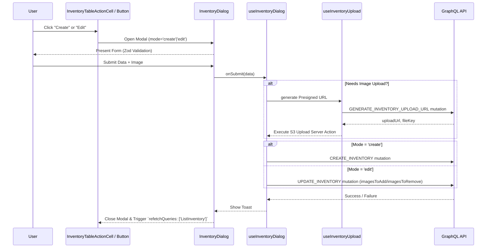
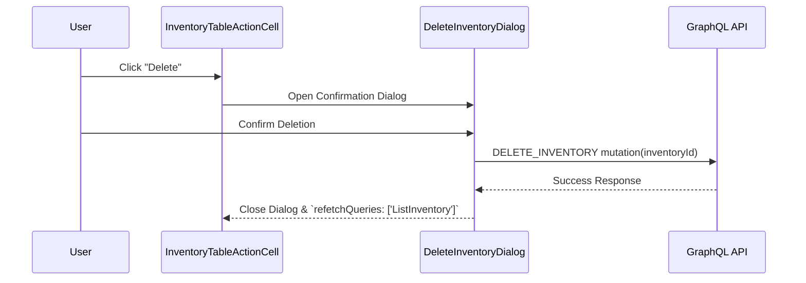

# Inventory CRUD Flow

This document details the lifecycle and operations for creating, reading, updating, and deleting an inventory item within Pop Logic.

## Interactive Modals Approach

Inventory flows heavily rely on dialog/modal components rather than separate pages. This preserves the user's list context, search strings, and filter configurations while they interact with individual items.

All dialogs are conditionally rendered inline inside `InventoryActionCell` (for view/edit/delete) or `CreateInventoryButton` (for create). None rely on separate routes.

### Capability-Gated Rendering

Every action is guarded by the `useCapabilities(INVENTORY_CAPABILITIES_MAP, DEFAULT_INVENTORY_CAPABILITIES)` hook:

| Action | Capability Required  |
| ------ | -------------------- |
| Create | `canCreateInventory` |
| View   | `canViewInventory`   |
| Edit   | `canEditInventory`   |
| Delete | `canDeleteInventory` |

### Active Campaign Lock

When `inventory.inActiveCampaign === true`, the **edit** and **delete** buttons are hidden and replaced by an `InfoCircleIcon` with a tooltip (`actions.activeCampaignReadOnly`). This prevents modifications to items currently committed to active campaigns. The **view** action remains accessible regardless.

## Form Fields

The `InventoryDialog` form (validated by a Zod schema) exposes the following fields:

| Field               | Required                                                    | Notes                                                                          |
| ------------------- | ----------------------------------------------------------- | ------------------------------------------------------------------------------ |
| `name`              | Yes                                                         | Min 2 chars, max bounded by `VALIDATION_LENGTH.INVENTORY.NAME`                 |
| `brandId`           | Yes                                                         | Selected from `GET_BRANDS` dropdown (fetched via `useQuery` inside the dialog) |
| `width`             | Yes                                                         | Positive number, max 2 decimal places                                          |
| `height`            | Yes                                                         | Positive number, max 2 decimal places                                          |
| `material`          | No                                                          | Max length enforced                                                            |
| `specifications`    | No                                                          | Max length enforced                                                            |
| `description`       | No                                                          | Max length enforced                                                            |
| `availableQuantity` | No                                                          | Non-negative integer                                                           |
| `image`             | Create: required / Edit: optional if existing image present | JPEG/PNG, max file size enforced                                               |

> **Note:** `notes` exists in `InventoryType` and `CreateInventoryInput` / `UpdateInventoryInput` mutation types, but is **not** currently exposed as a form field in the UI.

## CREATE & UPDATE Flow

Creating or updating an inventory item uses the same `InventoryDialog` component but injects different mode flags (`mode='create'` vs `mode='edit'`).

### Key Differences Between Create and Update

- **Initialization**: `Create` loads with empty defaults, while `Update` pre-fills via an `initialData` object representing the selected inventory row.
- **Image Handling**: `Update` must track if the current image is removed or replaced, translating into `imagesToAdd` and `imagesToRemove` properties for the GraphQL mutation.
- **Validation Rules**: `Create` demands an image under strict rules. `Update` makes the image field optional if an existing image stays in place.

## READ (View Details) Flow

When a user opts to view item details without editing:

1. The Action cell (`InventoryActionCell`) passes the row object to the `ViewInventoryDialog` component via `open` / `onOpenChange` / `inventory` props.
2. The primary image is resolved from `inventory.images` — the first image with `isPrimary: true`, or the first image in the array if none is flagged as primary.
3. Brand name is resolved from `inventory.brandName` (already present on the list item — no extra network call).
4. The `createdAt` date is formatted via `formatDateLocalized` using the active locale.
5. All fields are rendered in a read-only layout inside a scrollable dialog.
6. A `ViewInventoryDialogSkeleton` (`view-inventory-dialog.loading.tsx`) is available for deferred loading states if needed.

## DELETE Flow

Safe deletion involves user confirmation since inventory items can be referenced by campaigns or sales.

## Security & API Behavior

- Direct browser-to-S3 uploads are bypassed to evade CORS constraints and enhance tracking, funneling binary data through a Server Action (`upload.actions.ts`).
- The `useInventoryDialog` hook fetches brands using `useQuery` (not `useSuspenseQuery`) so the dialog renders immediately and the brand dropdown populates asynchronously, rather than blocking the dialog's open transition.

- Any destructive operation triggers immediate `ListInventory` query refetches ensuring localized state maps tightly to database reality.

---

Last Update:- 11/05/2026
Agent name:- doc-updater
Author:- Vishav Ranta
