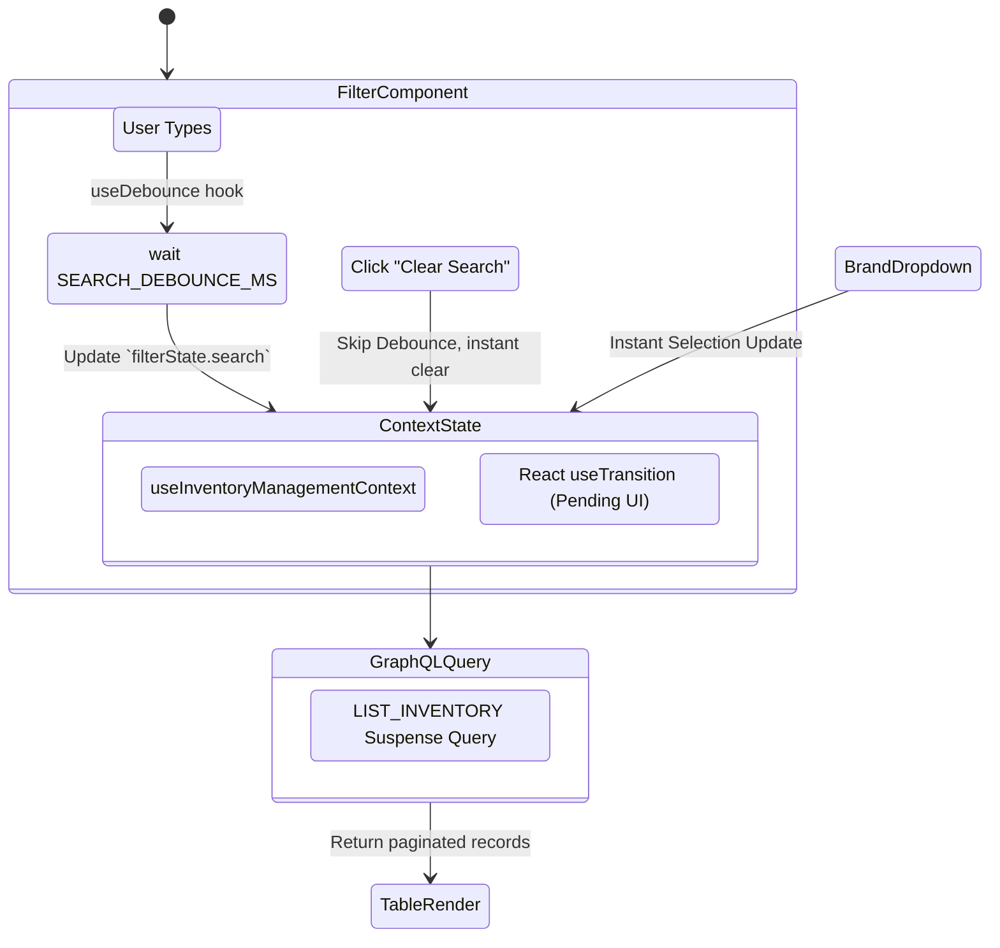

# Inventory Listing and Filtering

This document describes how the `inventory-management` feature implements highly performant, server-assisted data grids.

## Components & Data Fetching Strategy

The main view uses a **TanStack React Table** that delegates pagination, sorting, and filtering back to the Apollo GraphQL server.

### Filtering Architecture

To guarantee the user interface remains responsive while querying massive lists, Pop Logic decouples text input state from the active query state.

### Table State Controls

The `useInventoryManagementContext` hook explicitly maps local state to GraphQL query arguments:

- **Sorting**: Uses `manualSorting: true`. The `COLUMN_SORT_MAP` currently maps only one column: `name → InventorySortField.NAME`. The other enum values (`CREATED_AT`, `QUANTITY`, `IS_ACTIVE`) exist in the backend schema but are not wired to table columns yet. Unrecognized column IDs fall back to `InventorySortField.NAME`.
- **Pagination**: Uses standard `pageIndex` / `pageSize` paradigms (from `INITIAL_PAGE_INDEX` / `DEFAULT_PAGE_SIZE` constants). Any change to filter properties resets `pageIndex` to `0` immediately.
- **Implemented Filter Inputs**:
  1. `search` — A debounced text string for full-text lookup. Applied to the query as `activeSearch` (updated after `SEARCH_DEBOUNCE_MS` delay, or instantly on clear).
  2. `brandIds` — Single-selection dropdown. Brand list is fetched via `GET_BRANDS` and **sorted alphabetically** (`localeCompare`) before rendering. Choosing "All" sends `undefined`; choosing a specific brand sends `[brandId]`.
- **Unimplemented Filter**: `hasQuantity` exists in `InventoryFilterInput` (backend type) but is not exposed in the UI.

### Responsiveness & Loading States

1. **Root Transitions**: The first load triggers the full-page skeleton in `loading.tsx` (Next.js file-based loading boundary).
2. **Table Skeleton**: `InventoryTableSkeleton` is the `<Suspense>` fallback inside `SectionErrorBoundary`. An `InventoryTableInlineLoading` overlay (matching the current row count) is rendered inside the table while `dataTableBody` has `isLoading={loading}` set.
3. **Pending Actions**: All state mutations (`updateSearch`, `updateBrandId`, `resetFilters`, `setSorting`, `setPagination`) are wrapped in `startTransition`. The resulting `isPending` flag is exposed as `loading` from context and drives `aria-busy` on the `<Table>` and the inline skeleton.

---

Last Update:- 11/05/2026
Agent name:- doc-updater
Author:- Vishav Ranta
