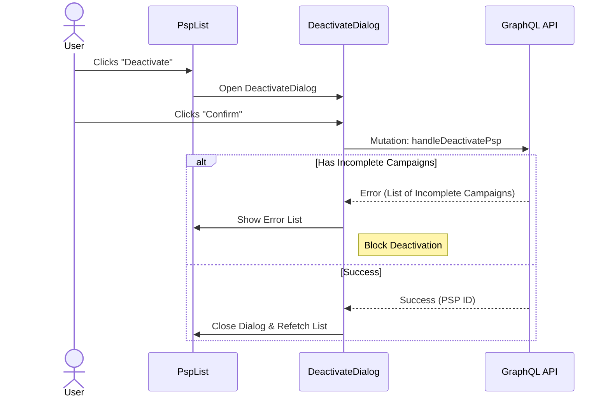

# PSP Activation/Deactivation

The Activate/Deactivate feature allows administrators to manage the active status of PSPs through confirmation dialogs.

## Workflow Diagram



## Components

### ActivatePspDialog

Located: `src/app/(protected)/psp-management/(components)/activate-deactivate-dialog/activate-psp-dialog.tsx`

This dialog allows users to activate a PSP.

**Behavior:**

- **Trigger**: Click "Activate" on a disabled PSP in `PspTable`.
- **Action**: Confirms activation and calls `handleActivatePsp(psp.id)`.
- **Handling**: Upon success, dialog closes, and the table updates (`PspManagementContext` handles refresh logic and toast).

**Props:**

- `psp`: The PSP object to activate.
- `onClose`: Function to close the dialog.

### DeactivatePspDialog

Located: `src/app/(protected)/psp-management/(components)/activate-deactivate-dialog/deactivate-psp-dialog.tsx`

This dialog allows users to deactivate a PSP, with checks for dependent entities.

**Behavior:**

- **Trigger**: Click "Deactivate" on an active PSP in `PspTable`.
- **Action**: Confirms deactivation and calls `handleDeactivatePsp(psp.id)`.
- **Conditional Logic**:
  - The API checks if the PSP has active or incomplete campaigns.
  - If incomplete campaigns exist, the API returns an array of `IncompleteCampaignType` which `handleDeactivatePsp` captures.
  - If blocking dependencies exist, an error is shown within the dialog, listing the campaigns. The PSP is _not_ deactivated.
  - If no blockers, deactivation proceeds, success toast is shown, dialog closes, and the table updates.

**Props:**

- `psp`: The PSP object to deactivate.
- `onClose`: Function to close the dialog.

## Data Flow (State Management)

Both dialogs use `PspManagementContext` to:

- Access status update mutations via: `handleActivatePsp`, `handleDeactivatePsp`.
- Access loading state: `isUpdatingStatus` (disables interactions while mutation is pending).

## Error Handling

### Incomplete Campaigns Check

When deactivating a PSP, if the PSP has associated incomplete campaigns (e.g., pending orders, open drafts that rely on this PSP), the deactivation is blocked. The user sees a list of affected campaigns so they can address them before attempting to deactivate again.

**Example Component Logic:**

```tsx
const handleDeactivate = async () => {
  const campaigns = await handleDeactivatePsp(psp.id);
  if (campaigns) {
    setIncompleteCampaigns(campaigns); // Shows list of IncompleteCampaignType
    return;
  }
  // Success -> Only close if no returned campaigns
  onClose();
};
```

## Accessibility

- **Dialog**: Uses standard accessible dialog patterns (focus trap, ARIA modal).
- **Icons**: Decorative icons are hidden (`aria-hidden="true"`), relying on dialog titles and descriptions for context.
- **Alerts**: Error messages use `role="alert"`/`aria-atomic="true"` to announce failures (e.g., campaign blockers) immediately.

## Loading State: Buttons show loading indicators and disable interaction during processing.

## Delete Interaction

Although full permanent deletion of a PSP is generally discouraged, there is a **DeletePspDialog** (`src/app/(protected)/psp-management/(components)/delete-psp/delete-psp-dialog.tsx`) that provides an interface for this flow.

- A user selecting "Delete" on the action cell will be presented with this dialog.
- The dialog heavily recommends **Deactivating** instead of deleting (as deletion is permanent).
- The dialog provides action buttons to either Deactivate or permanently delete. (Note: Full permanent deletion might be restricted or unimplemented at the API level depending on current requirements, and the dialog primarily channels users toward deactivation).

---

Last Update:- 11/05/2026
Agent name:- doc-updater
Author:- Vishav Ranta
