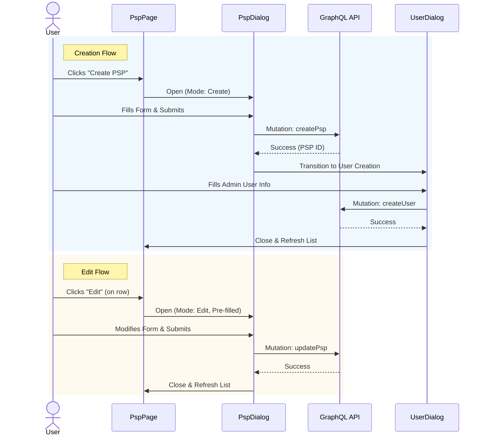

# PSP Creation and Editing

The PSP Creation and Editing feature allows users to add new PSPs and modify existing PSP details via modal dialogs (`src/components/dialog/psp-dialog/psp-dialog.tsx`).

## Workflow Diagram

## Components

### CreatePspButton

Located: `src/app/(protected)/psp-management/(components)/create-psp-button/create-psp-button.tsx`

This component renders a "Create PSP" button. Clicking it opens the `PspDialog` in `mode="create"` within its own managing state (e.g. `isPspDialogOpen`).

### PspDialog

Located: `src/components/dialog/psp-dialog/psp-dialog.tsx`

This reusable dialog handles both creating and editing PSPs based on the `mode` prop.

**Props:**

- `mode`: `"create" | "edit"` (determines behavior and labels).
- `onClose`: Function to close the dialog.
- `initialData`: Partial `PSPType` object for pre-populating edit forms.
- `onSubmit`: Callback after successful submission.

**State Management (`usePspDialog`):**

- **Creation Flow**: `mode="create"`
  - User fills out PSP details (Name, Address, contact, etc.).
  - On submit, triggers `createPsp` mutation.
  - Upon success, the dialog transitions to create a PSP Admin user via `UserDialog`.
- **Edit Flow**: `mode="edit"`
  - Pre-populates form with `initialData` or fetches data if needed.
  - On submit, triggers `updatePsp` mutation.
  - Closes dialog immediately on success.

### User Creation Integration

After a PSP is created, the system prompts the user to create an initial PSP Admin user.

- **Component**: `UserDialog` (imported from `../user-dialog/user-dialog`)
- **Integration**:
  - Rendered conditionally: `if (showUserDialog && createdPsp)`
  - Passes created `pspId` and default role `PSP Admin` as initial data.
  - Fields like `role` and `pspId` are disabled/hidden to enforce association.

## Form Data Validation

The form uses `react-hook-form` and defines a schema via Zod (`psp-dialog.schema.ts`).

- **Required fields**: Name, Country, State, City, Street Address, Zip Code (format validation).
- **Validation**:
  - Ensures valid zip code format based on selected country logic.
  - Required fields cannot be empty.

## Data Fetching

- Dropdown data (`countriesData`, `statesData`, `getStates`) is fetched dynamically.
- `isDropdownLoading` manages loading states while fetching dependent data.

## Accessibility

- **Focus Management**: Focus is trapped within the dialog.
- **Labels**: Form fields use `<label>` associations.
- **Error Handling**: Validation errors are displayed and announced.
- **Loading State**: Submit button shows loading spinner (`isLoading`) and is disabled during submission to prevent duplicate requests.

---

Last Update:- 11/05/2026
Agent name:- doc-updater
Author:- Vishav Ranta
