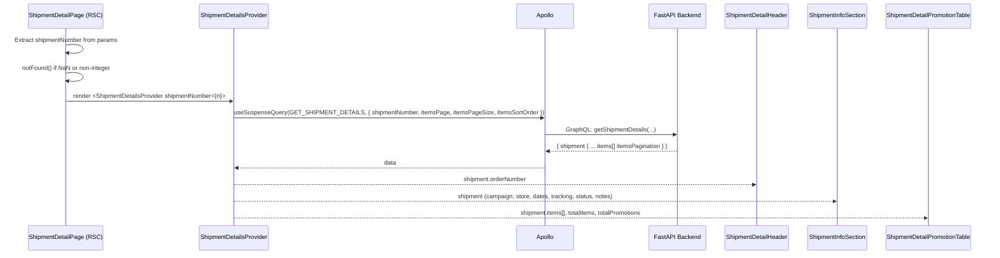
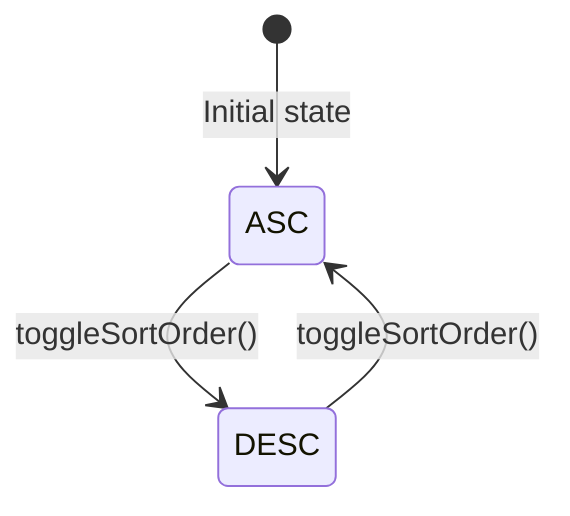

# Shipment Details

## Overview

The shipment detail page (`/shipments/[id]`) renders the full information for a single shipment. The `[id]` segment is the integer `shipmentNumber` (not a UUID). The page validates that the param is an integer and calls `notFound()` if it is not.

## Route

```
/shipments/[id]
```

`[id]` must be a valid integer `shipmentNumber`. Non-integer or missing params trigger Next.js `notFound()`.

## Component Breakdown

| Component                                            | Type           | Purpose                                                         |
| ---------------------------------------------------- | -------------- | --------------------------------------------------------------- |
| `ShipmentDetailsProvider` / `ShipmentDetailsContext` | Client Context | Owns the `GET_SHIPMENT_DETAILS` query, sort order, pagination   |
| `ShipmentDetailHeader`                               | Client         | Back navigation link + page title + order number                |
| `ShipmentInfoSection`                                | Client         | Info card grid: campaign, store, dates, tracking, status, notes |
| `ShipmentDetailPromotionTable`                       | Client         | Paginated promotion items table with sort toggle and total row  |
| `ExceptionRequestDialog`                             | Client         | Form dialog submitting shipment exception requests              |

## Architecture

```
ShipmentDetailPage (RSC)
└── ShipmentDetailsProvider (Client Context)
    ├── ShipmentDetailHeader     — back link + title + orderNumber
    ├── ShipmentInfoSection      — info cards
    ├── ShipmentDetailPromotionTable  — promotion items table
    └── ExceptionRequestDialog   — exception submission modal
```

## Data Flow



## Info Cards Layout

`ShipmentInfoSection` renders two responsive rows of `InfoCard` components:

**Row 1** (4 columns on xl, 2 on sm, 1 on mobile):
| Card | Field |
|---|---|
| Campaign | `shipment.campaignName` |
| Store | `store.name`, `store.stateAbbr`, `store.countryName` (comma-joined) |
| Shipment Date | `shipment.shipmentDate` |
| Estimated Delivery | `shipment.estimatedDelivery` |

**Row 2** (2 columns on sm, 1 on mobile):
| Card | Field |
|---|---|
| Tracking Number | `shipment.trackingNumber` |
| Status | `shipment.status` rendered as a `<Badge>` |

**Conditional Row 3**: A `Card` containing free-text `Notes` — only rendered when `shipment.notes` is non-empty.

## Promotion Table

`ShipmentDetailPromotionTable` displays the promotion items shipped in this shipment.

### Columns

| Column         | Field                  | Sortable                                    |
| -------------- | ---------------------- | ------------------------------------------- |
| Promotion Name | `item.promotionName`   | Yes (ASC/DESC toggle via `toggleSortOrder`) |
| Quantity       | `item.quantityShipped` | No                                          |

- A **Total Items** row is always appended at the bottom using `shipment.totalItems`.
- A **badge** in the section header shows `shipment.totalPromotions` (distinct promotion count).

### Sort Behavior



- `toggleSortOrder` uses `startTransition` and resets `pageIndex` to `0` on each toggle.

## Loading & Error States

Each of the three sections is independently wrapped in `<Suspense>` + `<SectionErrorBoundary>`:

| Section         | Suspense Fallback                     | Error Title i18n Key                      |
| --------------- | ------------------------------------- | ----------------------------------------- |
| Header          | `ShipmentDetailHeaderLoading`         | `shipmentDetails.errors.header.title`     |
| Info            | `ShipmentInfoSectionLoading`          | `shipmentDetails.errors.info.title`       |
| Promotion Table | `ShipmentDetailPromotionTableLoading` | `shipmentDetails.errors.promotions.title` |

## GraphQL Query: `GET_SHIPMENT_DETAILS`

```
query GetShipmentDetails(
  $shipmentNumber: Int!
  $itemsPage: Int
  $itemsPageSize: Int
  $itemsSearch: String
  $itemsSortOrder: String
)
```

Returns:

- `shipment.id`, `shipmentNumber`, `orderNumber`, `campaignName`
- `shipment.store` (name, countryName, stateAbbr)
- `shipmentDate`, `estimatedDelivery`, `trackingNumber`, `status`, `notes`
- `shipment.items[]` — paginated promotion rows (`promotionName`, `quantityShipped`)
- `itemsPagination` — standard `PaginationFields` fragment
- `totalItems`, `totalPromotions`

## Exception Request Support

The `ExceptionRequestDialog` (`[id]/(components)/exception-request-dialog/exception-request-dialog.tsx`) provides an interface to submit an exception request against a shipment (e.g. damaged goods).
- **Mode:** It accepts `ExceptionDialogMode` indicating `SHIPMENT` or `EXCEPTION_REQUEST`.
- **Form:** Users provide a required reason and must upload supporting photos.
- **Upload Flow:** The dialog integrates photo uploads (handling size boundaries and validation via its schema).

---

Last Update:- 11/05/2026
Agent name:- doc-updater
Author:- Vishav Ranta
