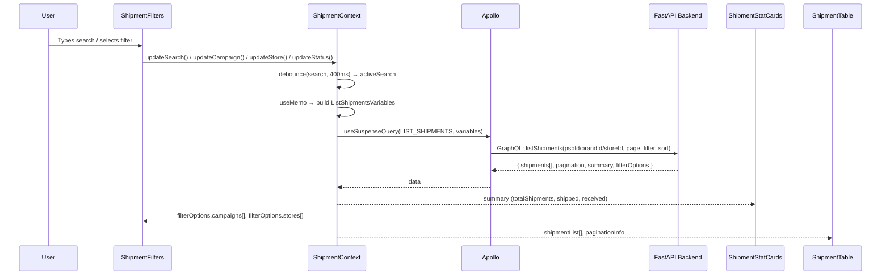

# Shipment Listing & Filtering

## Overview

The shipments listing page (`/shipments`) is a read-only view of all shipments scoped to the authenticated user's entity. It combines summary stat cards, a multi-field filter bar, and a server-side paginated and sortable data table.

## Component Breakdown

| Component                              | Type           | Purpose                                                                  |
| -------------------------------------- | -------------- | ------------------------------------------------------------------------ |
| `ShipmentStatCards`                    | Client         | Displays 3 stat cards: Total Shipments, Shipped, Received                |
| `ShipmentFilters`                      | Client         | Search, Campaign selector, Store selector, Status selector, Reset button |
| `ShipmentTable`                        | Client         | TanStack Table with server-side sorting, pagination, and inline loading  |
| `ShipmentProvider` / `ShipmentContext` | Client Context | Shared state between all listing components                              |

## Filter State

Managed by `useShipmentContext` inside the `ShipmentContext`.

| Filter Field | Sentinel / Default                        | Clears Pagination                   |
| ------------ | ----------------------------------------- | ----------------------------------- |
| `search`     | `''` (debounced 400 ms via `useDebounce`) | Yes (on commit via `useTransition`) |
| `campaignId` | `__ALL_CAMPAIGNS__`                       | Yes                                 |
| `storeId`    | `__ALL_STORES__`                          | Yes                                 |
| `status`     | `__ALL_STATUSES__`                        | Yes                                 |

- Search commits to `activeSearch` only after the debounce fires (or `clearSearch` resets it immediately using `skipDebounceRef`).
- All filter updates use `startTransition` so stale content stays visible during refetch.

## Sorting

Column sort IDs map to GraphQL `ShipmentSortField` enum values:

| Column ID        | `ShipmentSortField` |
| ---------------- | ------------------- |
| `shipmentNumber` | `ORDER_NUMBER`      |
| `orderNumber`    | `ORDER_NUMBER`      |
| `campaignName`   | `CAMPAIGN_NAME`     |
| `shipmentEta`    | `SHIPMENT_ETA`      |
| `store`          | `CAMPAIGN_NAME`     |
| `trackingNumber` | `ORDER_NUMBER`      |

Default sort: `shipmentNumber DESC`.

## Table Columns

| Column          | Sortable | Description                                                             |
| --------------- | -------- | ----------------------------------------------------------------------- |
| Shipment No.    | Yes      | Clickable link to `/shipments/{shipmentNumber}`, shows unit count below |
| Campaign Name   | Yes      | Campaign name text                                                      |
| Order Number    | Yes      | Fulfillment order number                                                |
| Store           | Yes      | Store name + state/country sub-label                                    |
| Shipment ETA    | Yes      | Estimated arrival date                                                  |
| Tracking Number | Yes      | Carrier tracking number                                                 |
| Status          | No       | Badge colored by status variant                                         |

## Listing Data Flow

## Stat Cards

Pull from `summary` returned in the same `LIST_SHIPMENTS` response:

| Card            | Field                    | Icon               | Color               |
| --------------- | ------------------------ | ------------------ | ------------------- |
| Total Shipments | `summary.totalShipments` | `PackageIcon`      | Amber               |
| Shipped         | `summary.shipped`        | `TruckIcon`        | Pending (blue-gray) |
| Received        | `summary.received`       | `ItemsShippedIcon` | Active (green)      |

## Loading & Error States

- **Skeletons**: `ShipmentStatCardsSkeleton` and `ShipmentTableSkeleton` render as `Suspense` fallbacks on initial load.
- **Inline loading**: `ShipmentTableInlineLoading` renders a spinner overlay inside the table while refetching (pagination/sort change) — the table stays mounted, preventing layout shift.
- **Errors**: Each section (`ShipmentStatCards`, `ShipmentTable`) is wrapped in `<SectionErrorBoundary>` with i18n-keyed title/description.
- **No data**: When `entityId` is not yet resolved (e.g. role detection pending), the query is skipped via Apollo `skipToken`.

## Filter Options Population

Campaign and Store dropdowns are dynamic — they are populated from `filterOptions.campaigns` and `filterOptions.stores` returned by the same `LIST_SHIPMENTS` query. This ensures the dropdowns only show options relevant to the scoped entity.

---

Last Update:- 11/05/2026
Agent name:- doc-updater
Author:- Vishav Ranta
