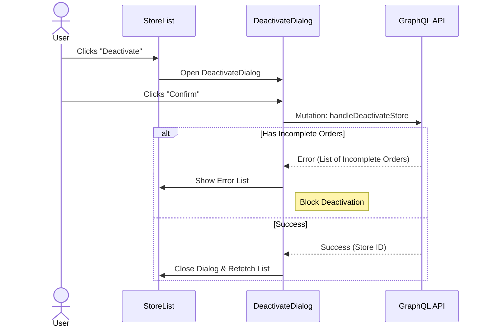

# Store Activation/Deactivation

The Activate/Deactivate feature allows administrators to manage the active status of Stores through confirmation dialogs.

## Workflow Diagram



## Components

### ActivateStoreDialog

Located: `src/app/(protected)/store-management/(components)/activate-deactivate-dialog/activate-store-dialog.tsx`

This dialog allows users to activate a store.

**Behavior:**

- **Trigger**: Click "Activate" on a disabled store in `StoreTable`.
- **Action**: Confirms activation and calls `handleActivateStore(store.id)`.
- **Handling**: Upon success, dialog closes, and the table updates (`StoreManagementContext` handles refresh logic).

**Props:**

- `store`: The Store object to activate.
- `onClose`: Function to close the dialog.

### DeactivateStoreDialog

Located: `src/app/(protected)/store-management/(components)/activate-deactivate-dialog/deactivate-store-dialog.tsx`

This dialog allows users to deactivate a store, with checks for dependent entities (e.g., pending orders).

**Behavior:**

- **Trigger**: Click "Deactivate" on an active store in `StoreTable`.
- **Action**: Confirms deactivation and calls `handleDeactivateStore(store.id)`.
- **Conditional Logic**:
  - The API checks if the store has active or incomplete orders.
  - If incomplete orders exist, the API returns them or signals an error, which `handleDeactivateStore` captures.
  - If blocking dependencies exist, an error is shown within the dialog, listing the orders (`incompleteOrdersError.description` and `ordersListLabel`). The store is _not_ deactivated.
  - If no blockers, deactivation proceeds, dialog closes, and the table updates.

**Props:**

- `store`: The Store object to deactivate.
- `onClose`: Function to close the dialog.

## Data Flow (State Management)

Both dialogs use `StoreManagementContext` to:

- Access status update mutations: `handleActivateStore`, `handleDeactivateStore`.
- Access loading state: `isUpdatingStatus` (disables interactions while mutation is pending).

## Error Handling

### Incomplete Orders Check

When deactivating a store, if the store has associated incomplete orders (e.g., pending, processing orders), the deactivation is blocked. The user sees a list of affected orders so they can address them before attempting to deactivate again.

**Example Component Logic:**

```tsx
const handleDeactivate = async () => {
  const orders = await handleDeactivateStore(store.id);
  if (orders) {
    setIncompleteOrders(orders); // Shows list
    return;
  }
  // Success -> Only close if no returned orders
  onClose();
};
```

## Accessibility

- **Dialog**: Uses standard accessible dialog patterns (focus trap, ARIA modal).
- **Icons**: Decorative icons are hidden (`aria-hidden="true"`), relying on dialog titles and descriptions for context.
- **Alerts**: Error messages use `role="alert"`/`aria-atomic="true"` to announce failures (e.g., order blockers) immediately.

---

Last Update:- 11/05/2026
Agent name:- doc-updater
Author:- Vishav Ranta
