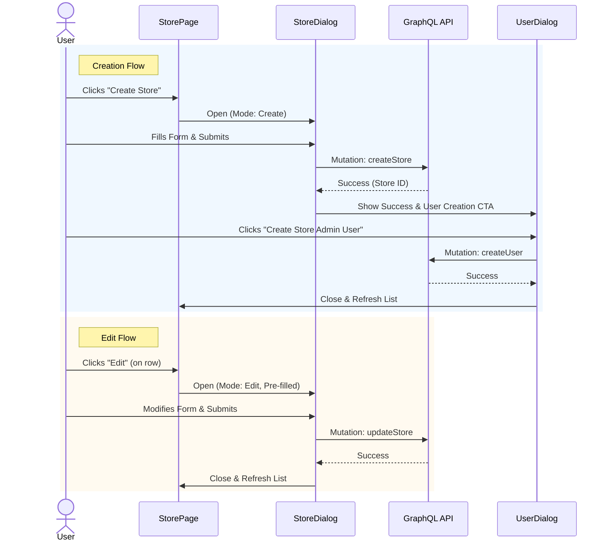

# Store Creation and Editing

The Store Creation and Editing feature allows users to add new stores and modify existing store details via modal dialogs (`src/components/dialog/store-dialog/store-dialog.tsx`).

## Workflow Diagram

## Components

### CreateStoreButton

Located: `src/app/(protected)/store-management/(components)/create-store-button/create-store-button.tsx`

This component renders a "Create Store" button. Clicking it opens the `StoreDialog` in `mode="create"` within its own managing state (`isStoreDialogOpen`).

### StoreDialog

Located: `src/components/dialog/store-dialog/store-dialog.tsx`

This reusable dialog handles both creating and editing stores based on the `mode` prop.

**Props:**

- `mode`: `"create" | "edit"` (determines behavior and labels).
- `onClose`: Function to close the dialog.
- `initialData`: Partial `StoreType` object for pre-populating edit forms.
- `onSubmit`: Callback after successful submission.

**State Management (`useStoreDialog`):**

- **Creation Flow**: `mode="create"`
  - User fills out Store details (Name, Store Number, Address, Contact, etc.).
  - On submit, triggers `createStore` mutation.
  - Upon success, displays a `DialogCreateSuccess` view with a CTA to create a `Store Admin` user.
- **Edit Flow**: `mode="edit"`
  - Pre-populates form with `initialData`.
  - On submit, triggers the `updateStore` GraphQL mutation.
  - Closes dialog immediately on success.

### User Creation Integration

After a store is created, the system prompts the user to create an initial Store Admin user.

- **Component**: `UserDialog` (imported from `../user-dialog/user-dialog`)
- **Integration**:
  - Rendered conditionally: `if (showUserDialog && createdStore)`
  - Passes created `role` (Store Admin ID) as initial data.
  - Fields like `role` are disabled to enforce association.

## Form Data Validation

The form uses `react-hook-form` and defines a schema via Zod (`store-dialog.schema.ts`).

- **Required fields**: Store Name, Phone Number, Country, State, City, Street Address, Zip Code.
- **Validation**:
  - Format validation for Zip Code and Phone Number.
  - Country/State dependencies handled via `FormComboboxField` logic in `useStoreDialog` (fetching states based on country).

## Data Fetching

- Dropdown data (`countriesData`, `statesData`, `getStates`) is fetched dynamically via GraphQL queries (`GET_COUNTRIES`, `GET_STATES_BY_COUNTRY`).
- `isDropdownLoading` manages loading states while fetching dependent data.

## Accessibility

- **Focus Management**: Focus is trapped within the dialog (Base UI Dialog).
- **Autocomplete**: Address fields use `autoComplete` attributes (e.g., `tel-national`, `street-address`) to support browser autofill.
- **Form Labels**: All inputs have associated labels and error messages announced via `aria-describedby`.

---

Last Update:- 11/05/2026
Agent name:- doc-updater
Author:- Vishav Ranta
