# Survey Management Architecture

## Overview

Survey Management is a multi-role feature that enables PSP Admins to create and manage surveys, assign them to brands and stores, and collect structured responses from store-level users. It supports a full lifecycle from template authoring → survey creation → brand/store assignment → response collection → survey closure.

The feature is built as a Next.js 16 App Router module with server-side pagination, React Hook Form + Zod validation, Apollo Client 4.x for GraphQL data fetching, and a role-gated multi-layer access control system.

---

## Status

Implemented

---

## Feature Architecture Overview

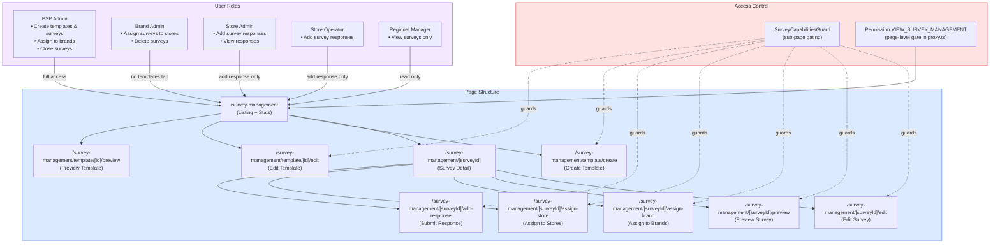

---

## Survey Lifecycle

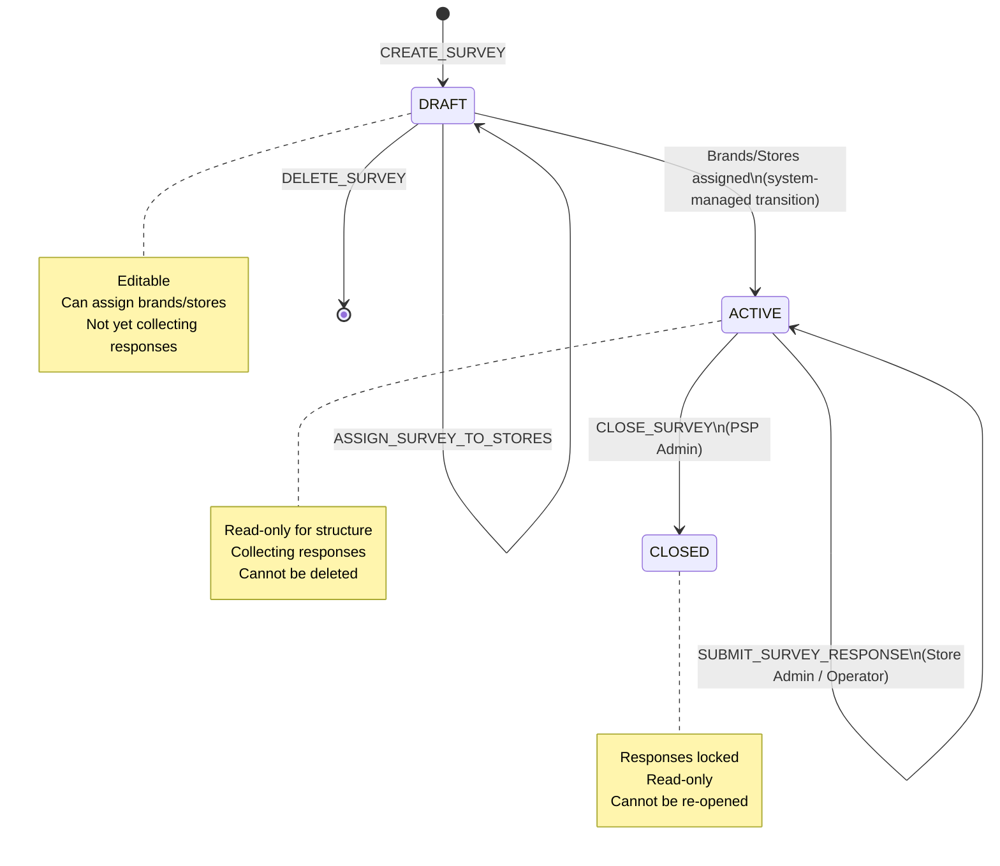

---

## Data Model

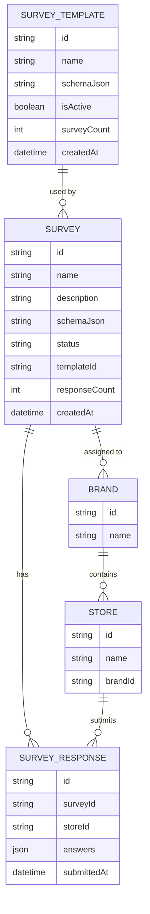

---

## Role-Based Capabilities Matrix

| Capability                      | PSP Admin | Brand Admin | Store Admin | Store Operator | Regional Manager |
| ------------------------------- | :-------: | :---------: | :---------: | :------------: | :--------------: |
| Create survey                   |     ✓     |             |             |                |                  |
| Edit survey                     |     ✓     |             |             |                |                  |
| Delete survey                   |     ✓     |      ✓      |             |                |                  |
| Preview survey                  |     ✓     |      ✓      |             |                |                  |
| Close survey                    |     ✓     |             |             |                |                  |
| Assign to brand                 |     ✓     |             |             |                |                  |
| Assign to store                 |           |      ✓      |             |                |                  |
| Add response                    |           |             |      ✓      |       ✓        |                  |
| View responses                  |     ✓     |      ✓      |      ✓      |                |                  |
| Access Templates tab            |     ✓     |             |             |                |                  |
| Create template                 |     ✓     |             |             |                |                  |
| Show brand filter               |     ✓     |             |             |                |                  |
| Show brand assigned column      |     ✓     |             |             |                |                  |
| Show store assigned column      |     ✓     |      ✓      |             |                |                  |
| Show response count column      |     ✓     |      ✓      |             |                |                  |
| Show tabs (Surveys + Templates) |     ✓     |             |             |                |                  |

> **Guard enforcement:** Each sub-page is wrapped in `SurveyCapabilitiesGuard` which reads the matching capability flag and redirects to `/survey-management` when denied.

---

## Page Structure

### `/survey-management` — Listing Page

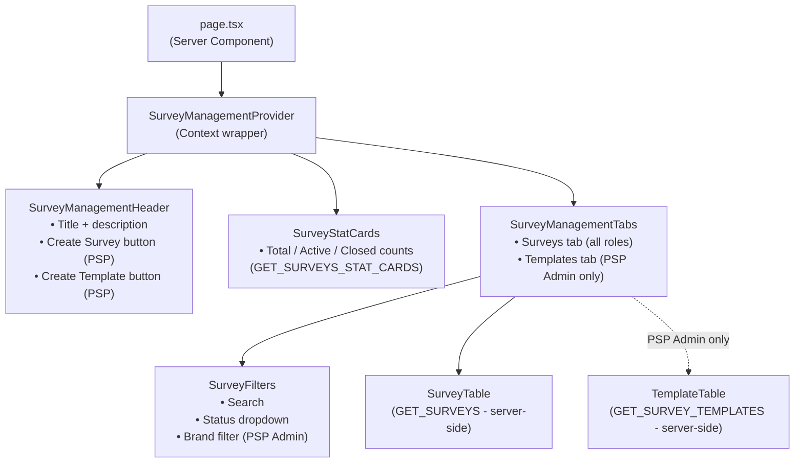

### `/survey-management/[surveyId]` — Detail Page

Shows the survey structure with brand → store hierarchy and response status.

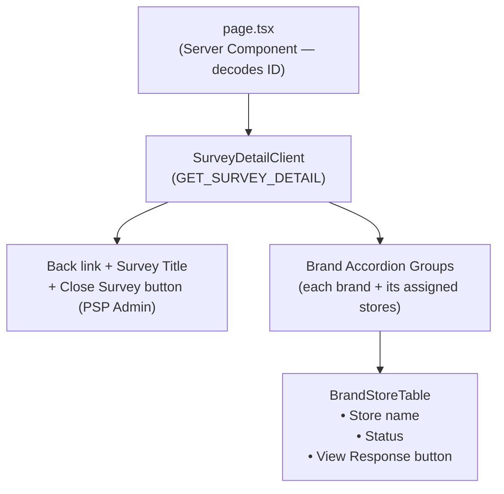

### `/survey-management/[surveyId]/edit` — Edit Survey

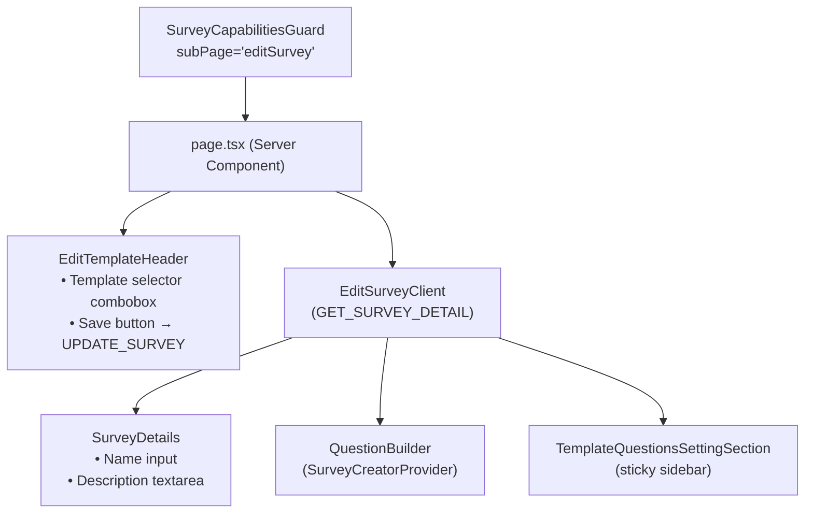

### `/survey-management/[surveyId]/assign-brand` — Brand Assignment

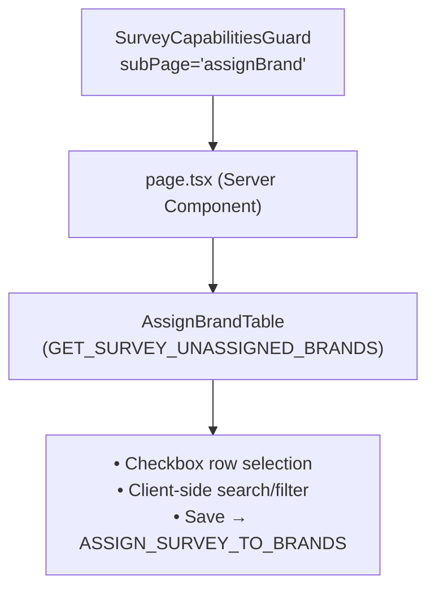

### `/survey-management/[surveyId]/assign-store` — Store Assignment

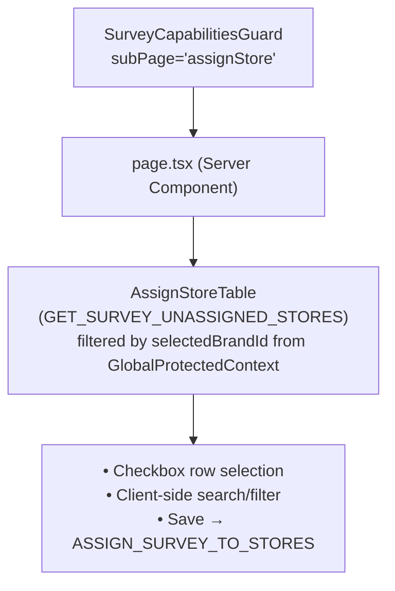

### `/survey-management/[surveyId]/add-response` — Submit Response

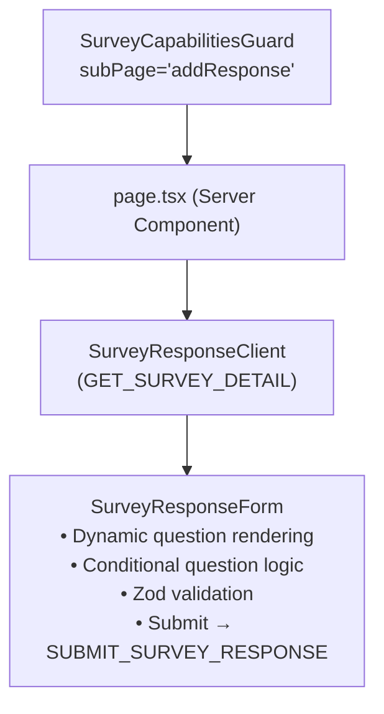

### `/survey-management/[surveyId]/preview` — Preview Survey

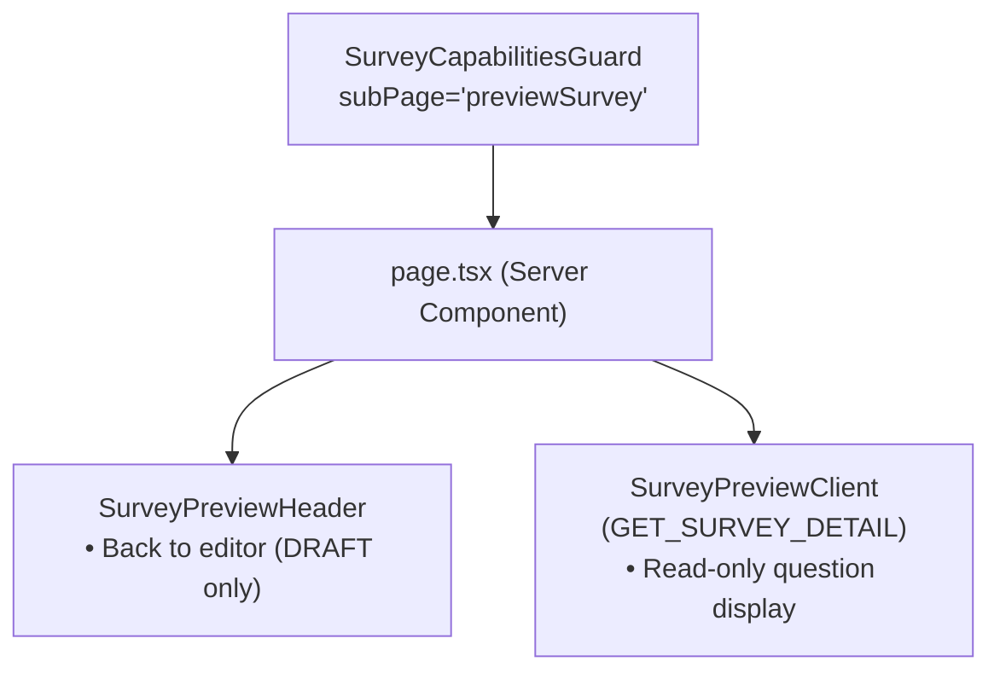

### Template Pages

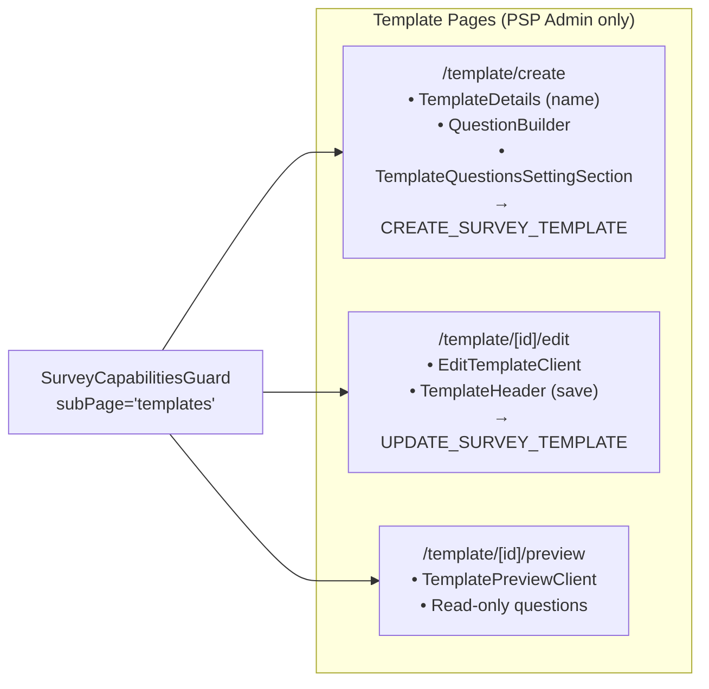

---

## State Management

### `SurveyManagementContext`

A React context wrapping the entire listing page. Managed by `useSurveyManagementContext`.

| State                  | Type                       | Purpose                                      |
| ---------------------- | -------------------------- | -------------------------------------------- |
| `activeTab`            | `'surveys' \| 'templates'` | Controls which table is visible              |
| `surveyPagination`     | `PaginationState`          | Current page + page size for survey table    |
| `templatePagination`   | `PaginationState`          | Current page + page size for template table  |
| `surveySort`           | `SortingState`             | Active sort column + direction for surveys   |
| `templateSort`         | `SortingState`             | Active sort column + direction for templates |
| `surveyFilters`        | `SurveyFilters`            | Search text, status filter, brand filter     |
| `templateSearch`       | `string`                   | Template search input (debounced)            |
| `deleteDialog`         | dialog state               | Survey delete modal open state + target      |
| `deleteTemplateDialog` | dialog state               | Template delete modal open state + target    |
| `createDialog`         | dialog state               | Create survey dialog open state              |
| `surveys`              | `SurveyListItemType[]`     | Current page of survey rows                  |
| `templates`            | `SurveyTemplateType[]`     | Current page of template rows                |
| `statCards`            | summary counts             | Total/Active/Closed counts for stat cards    |

All data is fetched via Apollo Client using `useSuspenseQuery` (tables) and `useQuery` (stat cards). Sorting and pagination changes trigger re-fetches via Apollo's reactive variables.

---

## GraphQL Operations

### Queries

| Operation                      | Purpose                                         | Variables                                                                |
| ------------------------------ | ----------------------------------------------- | ------------------------------------------------------------------------ |
| `GET_SURVEYS`                  | Paginated survey list with filters              | `page`, `pageSize`, `sortBy`, `sortOrder`, `search`, `status`, `brandId` |
| `GET_SURVEYS_STAT_CARDS`       | Total / Active / Closed counts for header cards | none                                                                     |
| `GET_SURVEY_DETAIL`            | Single survey with brand groups + stores        | `id` (decoded)                                                           |
| `GET_SURVEY_TEMPLATES`         | Paginated template list                         | `page`, `pageSize`, `sortBy`, `sortOrder`, `search`                      |
| `GET_SURVEY_TEMPLATE_DETAIL`   | Single template for edit/preview                | `id`                                                                     |
| `GET_SURVEY_UNASSIGNED_BRANDS` | Brands not yet assigned to a survey             | `surveyId`                                                               |
| `GET_SURVEY_UNASSIGNED_STORES` | Stores not yet assigned, filtered by brandId    | `surveyId`, `brandId`                                                    |
| `GET_SURVEY_RESPONSE`          | Single response detail for view-response dialog | `surveyId`, `storeId`                                                    |

### Mutations

| Operation                       | Purpose                                           | Called From                         |
| ------------------------------- | ------------------------------------------------- | ----------------------------------- |
| `CREATE_SURVEY`                 | Create a new survey (optionally from template)    | CreateSurveyDialog                  |
| `UPDATE_SURVEY`                 | Save changes to survey name/description/questions | EditSurveyClient header save button |
| `DELETE_SURVEY`                 | Delete survey (DRAFT only)                        | DeleteSurveyDialog                  |
| `CLOSE_SURVEY`                  | Mark survey as CLOSED                             | SurveyDetailClient close button     |
| `ASSIGN_SURVEY_TO_BRANDS`       | Bulk-assign survey to selected brands             | AssignBrandTable save button        |
| `ASSIGN_SURVEY_TO_STORES`       | Bulk-assign survey to selected stores             | AssignStoreTable save button        |
| `SUBMIT_SURVEY_RESPONSE`        | Store admin submits a survey response             | SurveyResponseForm submit           |
| `CREATE_SURVEY_TEMPLATE`        | Create a new template                             | Template create page                |
| `UPDATE_SURVEY_TEMPLATE`        | Save changes to a template                        | Template edit page header save      |
| `DELETE_SURVEY_TEMPLATE`        | Delete template                                   | DeleteTemplateDialog                |
| `TOGGLE_SURVEY_TEMPLATE_STATUS` | Activate or deactivate a template                 | Template action cell                |

---

## Access Control Flow

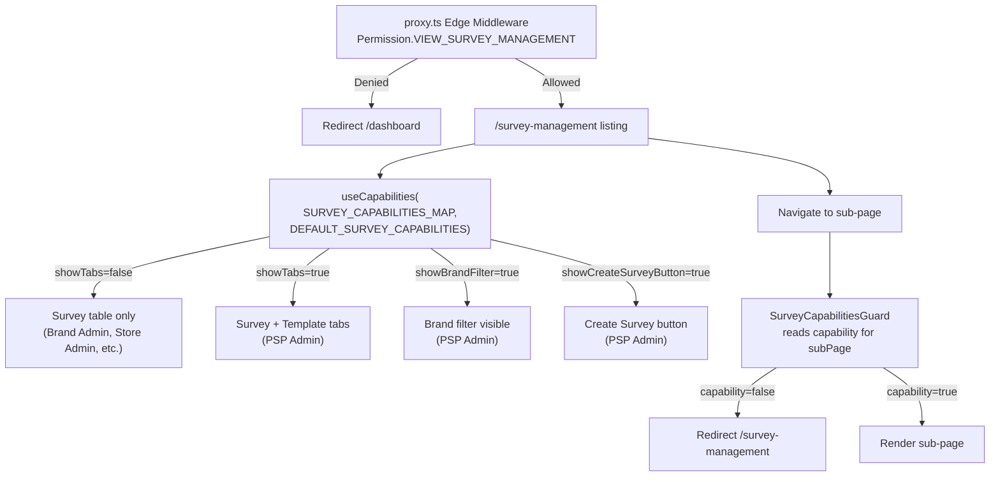

### Sub-page Guard Mapping

| Sub-page URL             | Guard `subPage` value | Required Capability          | Roles with access           |
| ------------------------ | --------------------- | ---------------------------- | --------------------------- |
| `/edit`                  | `'editSurvey'`        | `canAccessEditSurveyPage`    | PSP Admin                   |
| `/preview`               | `'previewSurvey'`     | `canAccessPreviewSurveyPage` | PSP Admin, Brand Admin      |
| `/assign-brand`          | `'assignBrand'`       | `canAccessAssignBrandPage`   | PSP Admin                   |
| `/assign-store`          | `'assignStore'`       | `canAccessAssignStorePage`   | Brand Admin                 |
| `/add-response`          | `'addResponse'`       | `canAccessAddResponsePage`   | Store Admin, Store Operator |
| `/template/create`       | `'templates'`         | `canAccessTemplates`         | PSP Admin                   |
| `/template/[id]/edit`    | `'templates'`         | `canAccessTemplates`         | PSP Admin                   |
| `/template/[id]/preview` | `'templates'`         | `canAccessTemplates`         | PSP Admin                   |

---

## Survey Question System

Surveys use a **schema-based question system** where the `schemaJson` field stores the question definitions as a JSON string. The question builder is powered by the `SurveyCreatorProvider` / `useSurveyCreator` hook (a survey creator library wrapper).

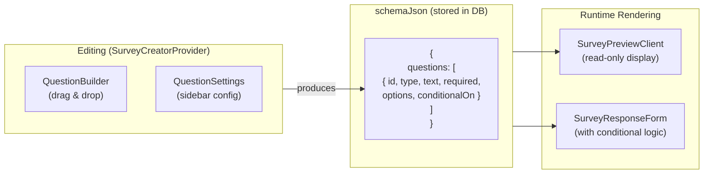

**Supported question types** (from the response form rendering):

- Text / Long text
- Single-choice (radio)
- Multi-choice (checkbox)
- Date
- Rating / Scale
- Conditional questions (shown only when a parent question answer matches a trigger value)

---

## Component Inventory

### Listing Page Components (`(components)/`)

| Component                 | Type   | Purpose                                                         |
| ------------------------- | ------ | --------------------------------------------------------------- |
| `SurveyManagementHeader`  | Client | Page title, create buttons (capability-gated)                   |
| `SurveyManagementTabs`    | Client | Survey/Template tab switcher, renders active table              |
| `SurveyFilters`           | Client | Search, status, brand filters                                   |
| `SurveyStatCards`         | Client | Total/Active/Closed summary cards                               |
| `SurveyStatCards.loading` | Server | Skeleton for stat cards                                         |
| `SurveyTable`             | Client | Server-side paginated survey listing                            |
| `SurveyTable.loading`     | Server | Skeleton for survey table                                       |
| `SurveyTableColumns`      | —      | Column definitions (name, status, brand, store, response count) |
| `SurveyActionCell`        | Client | Per-row action menu (preview/edit/delete/assign/response)       |
| `TemplateTable`           | Client | Server-side paginated template listing                          |
| `TemplateTable.loading`   | Server | Skeleton for template table                                     |
| `TemplateTableColumns`    | —      | Column definitions (name, survey count, created date)           |
| `TemplateActionCell`      | Client | Per-row actions (view/edit/delete)                              |
| `CreateSurveyDialog`      | Client | Create survey modal with name/description/template fields       |
| `DeleteSurveyDialog`      | Client | Delete confirmation modal                                       |
| `DeleteTemplateDialog`    | Client | Template delete confirmation modal                              |
| `ViewResponseDialog`      | Client | View submitted survey response                                  |

### Survey Detail Components (`[surveyId]/(components)/`)

| Component                         | Type   | Purpose                                             |
| --------------------------------- | ------ | --------------------------------------------------- |
| `SurveyDetailClient`              | Client | Survey detail orchestrator (fetch + layout)         |
| `SurveyDetails`                   | Client | Name + description form inputs (edit mode)          |
| `BrandStoreTable`                 | Client | Brand accordion → stores table with response status |
| `TemplateDetails`                 | Client | Template name input (used in template create/edit)  |
| `TemplateHeader`                  | Client | Template page header with save button               |
| `TemplateQuestionsSettingSection` | Client | Sticky question settings sidebar                    |

---

## Current Implementation

| File                                                                           | Purpose                               |
| ------------------------------------------------------------------------------ | ------------------------------------- |
| `src/app/(protected)/survey-management/page.tsx`                               | Main listing page (Server Component)  |
| `src/app/(protected)/survey-management/loading.tsx`                            | Page loading skeleton                 |
| `src/app/(protected)/survey-management/context/SurveyManagementContext.tsx`    | Context provider                      |
| `src/app/(protected)/survey-management/context/useSurveyManagementContext.ts`  | State management hook                 |
| `src/app/(protected)/survey-management/(components)/survey-management-header/` | Page header component                 |
| `src/app/(protected)/survey-management/(components)/survey-management-tabs/`   | Tab switcher                          |
| `src/app/(protected)/survey-management/(components)/survey-filters/`           | Listing filters                       |
| `src/app/(protected)/survey-management/(components)/survey-stat-cards/`        | Stat summary cards                    |
| `src/app/(protected)/survey-management/(components)/survey-table/`             | Survey table (columns + actions)      |
| `src/app/(protected)/survey-management/(components)/template-table/`           | Template table (columns + actions)    |
| `src/app/(protected)/survey-management/(components)/dialog/`                   | Create/Delete/ViewResponse dialogs    |
| `src/app/(protected)/survey-management/[surveyId]/page.tsx`                    | Survey detail page (Server Component) |
| `src/app/(protected)/survey-management/[surveyId]/(components)/`               | Detail page components                |
| `src/app/(protected)/survey-management/[surveyId]/edit/`                       | Edit survey sub-page                  |
| `src/app/(protected)/survey-management/[surveyId]/preview/`                    | Preview survey sub-page               |
| `src/app/(protected)/survey-management/[surveyId]/assign-brand/`               | Brand assignment sub-page             |
| `src/app/(protected)/survey-management/[surveyId]/assign-store/`               | Store assignment sub-page             |
| `src/app/(protected)/survey-management/[surveyId]/add-response/`               | Response submission sub-page          |
| `src/app/(protected)/survey-management/template/create/`                       | Template creation page                |
| `src/app/(protected)/survey-management/template/[templateId]/edit/`            | Template edit page                    |
| `src/app/(protected)/survey-management/template/[templateId]/preview/`         | Template preview page                 |
| `src/lib/permissions/capabilities/survey.capabilities.ts`                      | Role-based capability definitions     |
| `src/components/guards/SurveyCapabilitiesGuard.tsx`                            | Sub-page access guard                 |
| `src/graphql/queries/survey/survey.queries.ts`                                 | All survey-related GraphQL queries    |
| `src/graphql/mutations/survey/survey.mutations.ts`                             | All survey-related GraphQL mutations  |
| `src/graphql/fragments/survey.fragments.ts`                                    | Reusable GraphQL fragments            |

---

## Security Considerations

- **Page-level gate:** `Permission.VIEW_SURVEY_MANAGEMENT` in `proxy.ts` blocks unauthenticated or unauthorized users from the entire `/survey-management` route tree before any component renders.
- **Sub-page gates:** Every capability-restricted sub-page (edit, preview, assign-brand, assign-store, add-response, template pages) is wrapped in `SurveyCapabilitiesGuard`, which redirects to `/survey-management` when the user's role lacks the required capability.
- **Action-level gating:** `SurveyActionCell` and `SurveyManagementHeader` use `useCapabilities()` to show/hide action buttons — a user without `canEditSurvey` never sees the Edit button.
- **Backend enforcement:** All GraphQL mutations are independently authorized by the FastAPI backend. Frontend gating is defense-in-depth, not the sole protection.
- **ID encoding:** Survey IDs are encoded/decoded via `src/lib/id-encoder.ts` when passed through URL params.
- **Store scoping:** The `/assign-store` page scopes unassigned stores to `selectedBrandId` from `GlobalProtectedContext`, preventing cross-brand store exposure.

---

## Future Implementation (TODO)

- [ ] Notifications/alerts when a store submits a response
- [ ] Bulk survey operations (bulk close, bulk delete)
- [ ] Response analytics dashboard (charts, trend data)
- [ ] Survey response export to CSV/Excel
- [ ] Survey duplication / clone flow
- [ ] Campaign Manager view of survey results scoped to their campaign

---

## Related Documentation

- [Access Control Architecture](../access-control/access-control.architecture.md) — how `SurveyCapabilitiesGuard` and `useCapabilities` work
- [Campaign Management](../campaign-management/) — shares similar brand/store assignment pattern
- [Hooks README](../../../src/hooks/README.md) — `useCapabilities` hook documentation
- [Components README](../../../src/components/README.md) — `SurveyCapabilitiesGuard` export
