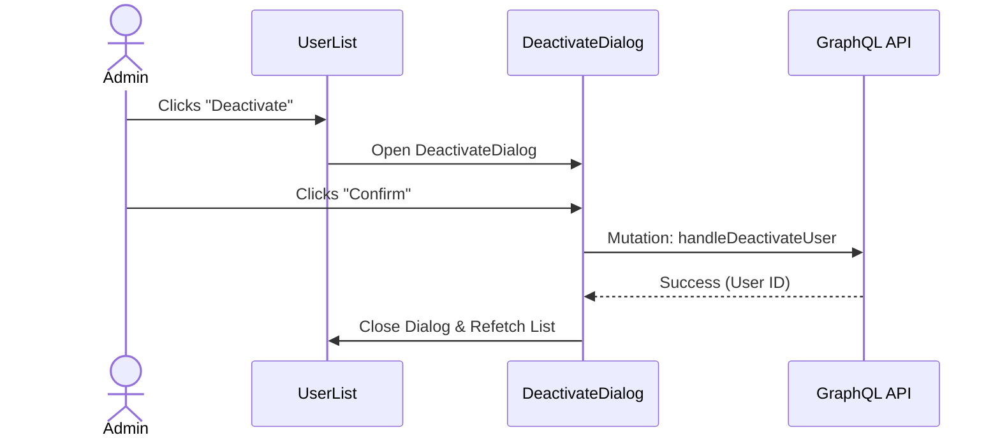

# User Activation/Deactivation

The Activate/Deactivate feature allows administrators to manage user access status. This includes activating, deactivating, and impersonating users.

## Workflow Diagram

## Components

### ActivateUserDialog

Located: `src/app/(protected)/user-management/(components)/activate-deactivate-user/activate-user-dialog.tsx`

Allows users to re-enable a deactivated account.

**Props:**

- `user`: The user object to activate.
- `onClose`: Function to close the dialog.

### DeactivateUserDialog

Located: `src/app/(protected)/user-management/(components)/activate-deactivate-user/deactivate-user-dialog.tsx`

Allows users to disable an account, preventing login.

**Behavior:**

- **Trigger**: Click "Deactivate" on an active user row.
- **Confirmation**: Dialog explains the user will lose access immediately.
- **Dependencies**: No specific checks (unlike Brands/PSPs checking for campaigns). Deactivation is immediate.

**Props:**

- `user`: The user object to deactivate.
- `onClose`: Function to close the dialog.

### ImpersonateUser

Located: `src/app/(protected)/user-management/(components)/impersonate-user/impersonate-user-dialog.tsx`

**Permissions**: Only accessible to **Super Platform Admin** (conceptually, or specific high-level roles).

- Allows an admin to log in _as_ another user to troubleshoot or verify permissions.
- In implementations, this typically sets a temporary session token or cookie.

### ResendInvitationDialog

Located: `src/app/(protected)/user-management/(components)/resend-invitation-dialog/resend-invitation-dialog.tsx`

If a user is in `PENDING` status (invited but hasn't set password), an admin can resend the invitation email.

### DeleteUserDialog

Located: `src/app/(protected)/user-management/(components)/delete-user/delete-user-dialog.tsx`

Allows true removal from the system using the `DELETE_USER` GraphQL mutation, but also acts as an intercept, highly recommending the user to just **deactivate** instead. Contains two call-to-actions.

## Data Flow (State Management)

Both dialogs use `UserManagementContext` to:

- Access status update mutations: `handleActivateUser`, `handleDeactivateUser`, `handleImpersonateUser`.
- Access loading state: `isUpdatingStatus` (disables interactions while mutation is pending).

## Accessibility

- **Dialog**: Uses standard accessible dialog patterns (focus trap, ARIA modal).
- **Icons**: Decorative icons are hidden (`aria-hidden="true"`).
- **Loading State**: Buttons show loading indicators and disable interaction during processing.

---

Last Update:- 11/05/2026
Agent name:- doc-updater
Author:- Vishav Ranta
