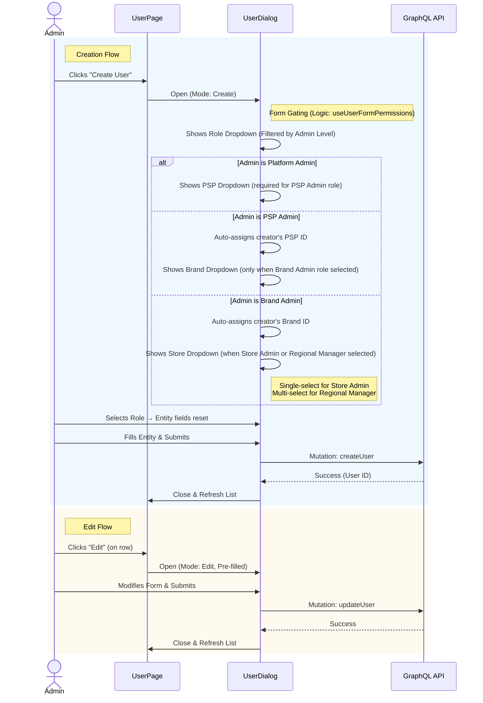

# User Creation and Editing

The User Creation and Editing feature allows users to add new users and modify existing ones via a shared modal dialog (`src/components/dialog/user-dialog/user-dialog.tsx`). This dialog handles complex permission rules for assigning roles and entities (PSPs, Brands, Stores).

## Workflow Diagram

## Shared Component: UserDialog

The dialog is shared between:

1.  **User Management Page**: The primary entry point.
2.  **PSP Creation Flow**: When creating a PSP, the success step triggers a user creation modal for the initial PSP Admin, pre-locking the `role` and `pspId`.

## Components

### CreateUserButton

Located: `src/app/(protected)/user-management/(components)/create-user-button/create-user-button.tsx`

Opens the `UserDialog` in `mode="create"`.

### UserDialog

Located: `src/components/dialog/user-dialog/user-dialog.tsx`

Handles the creation and edit logic. Uses `useUserFormPermissions` to determine which fields to show.

### Role & Entity Gating (Creation Rules)

**Key Function**: `useUserFormPermissions` (`src/components/dialog/user-dialog/useUserFormPermissions.ts`)

| Logged-in Role     | Allowed Creatable Roles                                      | Entity Dropdown    | Logic                                                                                                                                                                                                 |
| :----------------- | :----------------------------------------------------------- | :----------------- | :---------------------------------------------------------------------------------------------------------------------------------------------------------------------------------------------------- |
| **Platform Admin** | Platform Admin, PSP Admin                                    | **PSP Dropdown**   | Can create any Platform Admin. Can create PSP Admin associated with ANY PSP (shows dropdown).                                                                                                         |
| **PSP Admin**      | PSP Admin, Production Operator, Brand Admin                  | **Brand Dropdown** | Auto-assigns new user to logged-in admin's PSP (injected silently). Shows Brand dropdown only when creating a _Brand Admin_.                                                                          |
| **Brand Admin**    | Brand Admin, Campaign Manager, Regional Manager, Store Admin | **Store Dropdown** | Auto-assigns new user to logged-in admin's Brand (injected silently). No entity dropdown for Brand Admin or Campaign Manager. Single-select store for Store Admin; multi-select for Regional Manager. |

### Entity Dropdown Visibility Matrix

| Creator Role   | Selected Role       | Entity Dropdown Shown | Select Type  |
| :------------- | :------------------ | :-------------------- | :----------- |
| Platform Admin | Platform Admin      | None                  | —            |
| Platform Admin | PSP Admin           | PSP                   | Single       |
| PSP Admin      | PSP Admin           | None (auto-assign)    | —            |
| PSP Admin      | Production Operator | None (auto-assign)    | —            |
| PSP Admin      | Brand Admin         | Brand                 | Single       |
| Brand Admin    | Brand Admin         | None (auto-assign)    | —            |
| Brand Admin    | Campaign Manager    | None (auto-assign)    | —            |
| Brand Admin    | Store Admin         | Store                 | Single       |
| Brand Admin    | Regional Manager    | Stores                | Multi-select |

### Entity Field Reset on Role Change

Whenever the **Role** dropdown value changes, the entity fields (`pspId`, `brandId`, `storeIds`) are immediately reset to their empty defaults. This is wired directly into the role `Select`'s `onValueChange` handler (no `useEffect`) to prevent stale entity values from a previous role selection leaking into the form payload.

### Store Dropdown (Brand Admin)

- **Data source**: `GET_STORES` query with `pageSize: -1` to fetch all stores, filtered by the Brand Admin's `selectedBrandId`.
- **Store Admin** (single-select): stores `storeIds` as a one-element array `[selectedId]`. Uses a standard `Select` component.

- **Regional Manager** (multi-select): stores `storeIds` as a full array. Uses the `Combobox` component with `ComboboxChips` for chip-based multi-selection.

## Form Data Validation

- **Email Validation**: Required, valid email format.
- **Role Validation**: Must be one of the `allowedRoles`.
- **Entity Validation**:
  - `pspId` is required when role is **PSP Admin** and creator is Platform Admin.
  - `brandId` is required when role is **Brand Admin** and creator is PSP Admin.
  - `storeIds` (min 1 item) is required when role is **Store Admin** or **Regional Manager** and creator is Brand Admin.

## Auto-Assignment Logic

| Creator Role | Auto-Assigned Field | Behaviour                                                                 |
| :----------- | :------------------ | :------------------------------------------------------------------------ |
| PSP Admin    | `pspIds`            | Always injected with the creator's `selectedPspId`; PSP dropdown hidden.  |
| Brand Admin  | `brandIds`          | Always injected with the creator's `selectedBrandId`; Brand field hidden. |

## Accessibility

- **Focus Management**: Focus trapped in dialog.
- **Labels**: Form fields use `<label>` associations.
- **Dropdowns**: Accessible via keyboard navigation.
- **Multi-select Chips**: Each chip renders a remove button for keyboard/screen-reader access.

---

Last Update:- 11/05/2026
Agent name:- doc-updater
Author:- Vishav Ranta
