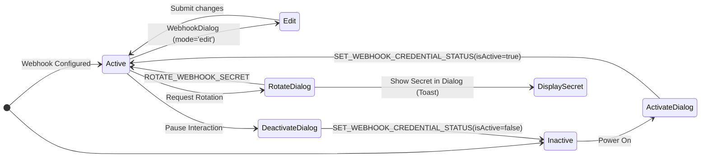

# Webhooks Details & Management

The details and management workflow encompass rotating secrets, toggling the status of webhooks, and interacting with core modal components within the webhook feature.

## Mutating Webhook State

The feature primarily handles mutations via modal confirmation prompts that provide security validation before mutating the backend graph.

## Available Mutations

1. **Activate / Deactivate Webhook**
   - Used inside `webhook-action-cell.tsx` and protected by `canActivate` and `canDeactivate` capabilities.
   - Uses Dialogs `ActivateWebhookDialog` and `DeactivateWebhookDialog`.
   - GraphQL Mutation: `SET_WEBHOOK_CREDENTIAL_STATUS`.

2. **Rotate Webhook Client Secret**
   - Triggered through the `WebhookDetailsView` view (`useWebhookDetailsView.ts`).
   - Opens the `RotateSecretDialog`.
   - GraphQL Mutation: `ROTATE_WEBHOOK_SECRET`.
   - *Key UX behavior*: A newly generated secret is only shown **ONCE** as a string inside the modal screen following a successful mutation prompt and copied to the clipboard conditionally by the user.

3. **Create / Edit Webhook**
   - Handled out of band via the shared `WebhookDialog` component mapping to the unified create/edit modal schema across the product.
   - Exposed through context header items or edit icon interactions if `canCreate` or `canEdit` capability validation passes.

---

Last Update:- 11/05/2026
Agent name:- doc-updater
Author:- Vishav Ranta
