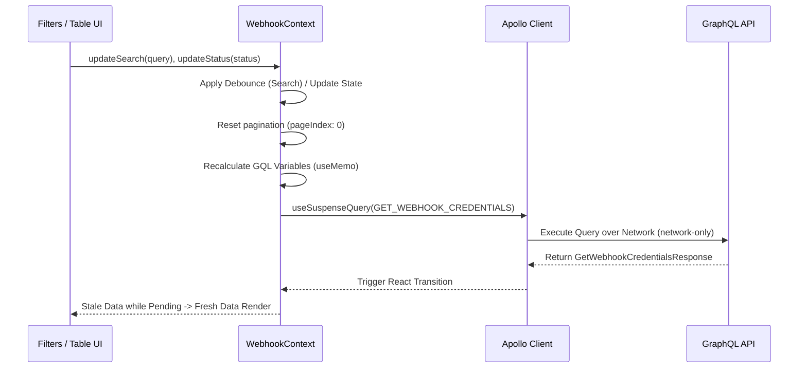

# Webhooks Listing & Filtering

This guide provides an overview of how the listing and filtering mechanics apply within the Webhook Management flow.

## Listing Architecture

The `WebhookProvider` manages listing data centrally to ensure synchronization across filters, pagination, and sorting interactions.

## Filter Mechanics

The listing components include several filter controls:

1. **Search (Debounced)**
   - Managed locally in the context with `useDebounce(filterState.search, SEARCH_DEBOUNCE_MS)`.
   - Sends query dynamically.
2. **Status Filter**
   - Controlled by the `updateStatus` method in the context.
   - Sent to GraphQL `isActive` flag natively as pure boolean or omitted if `ALL_STATUSES` sentinel is used.
3. **PSP Filter** *(Platform Admin Only)*
   - Queries available PSPs using `GET_PSPS` with `useSuspenseQuery`.
   - Used specifically to view credentials cross-tenant when acting as a Platform Admin.

## TanStack Table Setup

The UI employs `@tanstack/react-table` for highly responsive local manipulation of API driven data.

- **Pagination**: Initialized to `INITIAL_PAGE_INDEX` and `DEFAULT_PAGE_SIZE`.
- **Sorting**: Mapped securely from standard column-ids to backend GraphQL enums through an explicit dictionary mapping (`COLUMN_SORT_MAP`).
- **Transitions**: React `useTransition` ensures that pending updates don't abruptly destroy UI state during refetching, enabling smooth UX.

---

Last Update:- 11/05/2026
Agent name:- doc-updater
Author:- Vishav Ranta
