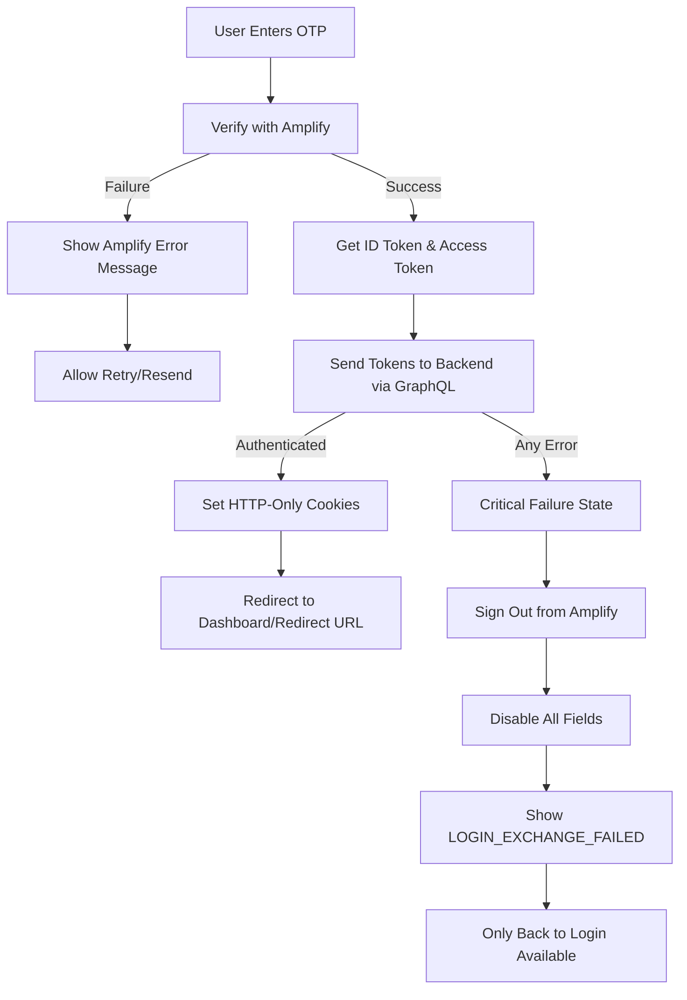

# Authentication Routes

This directory contains all authentication-related pages and layouts for the application.

<!-- Add info about this route group only opens up if the access_token cookies is not present and we check that under proxy.ts -->

⚠️ **Note:** This route group is controlled by a check in `proxy.ts` that verifies the presence of the `access_token` cookie. If the cookie is not present, then only the routes in this group will be accessible. This ensures that authenticated users are redirected away from auth pages, while unauthenticated users can access them.

## Directory Structure

```
(auth)/
├── layout.tsx                  # Shared layout for all auth pages
├── README.md                   # This file
├── login/
    ├── page.tsx                # Login page (Client Component)
    └── (components)/
        ├── auth.schema.ts      # Zod schema for auth forms
        ├── loginForm/
        |   └── LoginForm.tsx   # Login form component
        └── verificationForm/
            ├── VerificationForm.tsx   # OTP verification form
            └── useVerificationForm.ts # Verification form hook

```

## Route Group Pattern

The `(auth)` folder uses Next.js **Route Groups** (denoted by parentheses). This means:

- ✅ All pages share a common layout ([layout.tsx](layout.tsx))
- ✅ The folder name `(auth)` does NOT appear in the URL

## Routes

| Route    | File                             | Purpose                                 |
| -------- | -------------------------------- | --------------------------------------- |
| `/login` | [login/page.tsx](login/page.tsx) | Passwordless authentication (email OTP) |

## Layout

### [layout.tsx](layout.tsx)

The auth layout wraps all authentication pages with a branded, responsive structure featuring:

## Authentication Flow

### 1. Login Step

- User enters email in the LoginForm
- Triggers Amplify Auth `signIn` API
- OTP is sent to user's email via AWS Cognito

### 2. Verification Step

- User enters OTP code in VerificationForm
- Triggers Amplify Auth `confirmSignIn` API
- Upon successful verification, Amplify returns tokens

### 3. Token Exchange

- Frontend obtains `idToken` and `accessToken` from Amplify session
- Tokens are sent to backend via GraphQL `Login` mutation
- Backend validates tokens and sets HTTP-only cookies (`access_token`)

### 4. Error Handling Architecture

The authentication flow uses **Apollo Client 4+ best practices** for comprehensive error handling:



#### Error Types Handled

1. **GraphQL Errors** (`CombinedGraphQLErrors`)
   - Business logic errors from backend
   - Example: Invalid credentials, user not found
2. **Server Errors** (`ServerError`)
   - HTTP errors (500, 503, etc.)
   - Example: Server crash, service unavailable
3. **Parse Errors** (`ServerParseError`)
   - Invalid JSON responses from server
   - Example: Server returns HTML instead of JSON
4. **Network Errors**
   - Connection failures, timeouts, offline state
   - Example: No internet, DNS failures, CORS errors

#### Critical Error Scenario: Login Exchange Failure

When OTP verification succeeds but the backend token exchange fails:

1. **Sign out from Amplify** - Clears any conflicting session state
2. **Disable all form fields** - Prevents further authentication attempts (`isAllFieldsDisabled = true`)
3. **Show `LOGIN_EXCHANGE_FAILED` error** - User-friendly error message
4. **Allow only "Back to Login"** - Forces user to restart the flow

**Why this approach?**

- OTP was correct (Amplify verified it), but backend couldn't authenticate
- User is in a partial authentication state (authenticated with Amplify, but not with backend)
- Allowing retry could create session conflicts or repeated failures
- Clean restart ensures consistent state between frontend and backend

**Error types that trigger this flow:**

- All Apollo Client errors (GraphQL, Server, Parse, Network) during token exchange

#### Error Codes

All authentication error codes are defined in [`src/constant/enums/auth-error.enum.ts`](../../../constant/enums/auth-error.enum.ts) and map to translation keys under the `auth.layout.errors` namespace:

- `INCOMPLETE_CODE` - OTP code is not complete (client-side validation)
- `VERIFICATION_FAILED` - OTP verification failed with Amplify
- `LOGIN_EXCHANGE_FAILED` - Backend token exchange failed (critical error)
- `RESEND_FAILED` - Failed to resend OTP code
- `UNEXPECTED_ERROR` - Network or parse errors

### Key Components

- **LoginForm**: Handles email input and sign-in logic.
- **VerificationForm**: Handles OTP code input and verification logic.
  - `useVerificationForm` hook manages form state and Amplify interactions. This hook encapsulates the logic for **VerificationForm**, including:
    - Form state management (OTP input, loading, errors)
    - Amplify Auth interactions (verify OTP, resend code)
    - Apollo Client mutation for token exchange
    - Comprehensive error handling with type-specific responses
    - Field disabling on critical errors

### Component Type

- `layout.tsx` is a **Server Component** because it only contains shared, server-generated HTML and does not rely on client state or browser APIs. Keeping it server-side helps reduce client bundle size and improves performance.

- `login/page.tsx` is a **Client Component** because it manages shared state (`email`) required across multiple auth steps. Since both Login and Verification components need access to this data, the state is lifted to their nearest common parent (the page).

- `LoginForm` and `VerificationForm` are **Client Components** because they handle:
  - Form state & input interactions
  - Validation (Zod/forms)
  - Amplify Auth calls
  - OTP handling & verification flows
  - Loading/error UI states

- In summary, only the layout remains server-side, while the page and its child components are client-side to support shared state and interactive authentication flows.

## Technical Implementation Details

### Apollo Client Error Handling Pattern

The authentication flow uses **try-catch blocks** instead of deprecated `onError` callbacks (Apollo Client 4+ migration):

**Why try-catch?**

- ✅ `onError` callbacks are deprecated in Apollo Client 4+
- ✅ Better error stack traces (points to actual error, not wrapped `ApolloError`)
- ✅ Type-safe error checking with `.is()` methods
- ✅ More control over error flow and state management
- ✅ Easier to test and debug

**Implementation:**

```typescript
try {
  const mutationResult = await loginMutation({
    variables: { input: { idToken, accessToken } },
  });
  // Handle success...
} catch (apolloError: unknown) {
  // Check error types in order of specificity
  if (CombinedGraphQLErrors.is(apolloError)) {
    // Handle GraphQL errors (business logic)
  } else if (ServerError.is(apolloError)) {
    // Handle HTTP server errors (500, 503)
  } else if (ServerParseError.is(apolloError)) {
    // Handle JSON parse errors
  } else {
    // Handle network errors (timeout, offline, connection failure)
  }
}
```

### State Management in useVerificationForm

Key state variables:

- `otpValue` - User input for OTP code
- `error` - Error code for translation lookup
- `successMessage` - Success message code for translation
- `isLoading` - Combined loading state (local + mutation)
- `isResending` - Resend operation in progress
- `resendCooldown` - Countdown timer (60 seconds)
- `isAllFieldsDisabled` - Disables all fields on critical exchange failure

### Resend Code Flow

- User can resend OTP after 60-second cooldown
- Cooldown timer managed via `useEffect` with interval
- Previous OTP input is cleared on successful resend
- Resend button is disabled during cooldown and resend operation

## Related

- [GraphQL & Apollo Client](../../../.github/instructions/graphql-apollo.instructions.md) - Detailed GraphQL patterns and error handling
- [Internationalization](../../../docs/features/i18n/internationalization.architecture.md) - Multi-language support
- [UI Components](../../components/README.md) - Reusable component library
- [GraphQL Queries & Mutations](../../graphql/README.md) - API integration patterns
